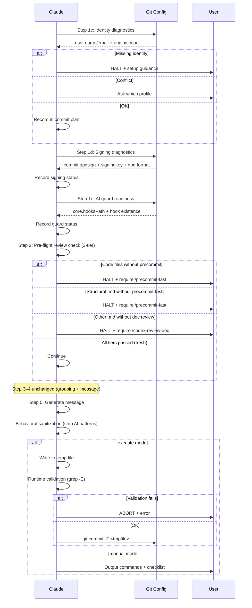

# Smart Commit Hardening — Technical Spec

## 1. Requirement Summary

- **Problem**: `/smart-commit` 存在三個使用者回報的問題：(1) Git identity 未驗證，多 profile 環境下身份混亂；(2) AI attribution 洩漏（Co-Authored-By Claude 殘留）；(3) Commit 簽名設定不一致，混合簽名/未簽名。
- **Goals**: 在 `/smart-commit` workflow 中加入 identity diagnostics、AI runtime validation、signing diagnostics 三項 pre-flight 檢查，消除上述三類問題。
- **Scope**: 修改 `skills/smart-commit/SKILL.md`、`commands/smart-commit.md`、`scripts/commit-msg-guard.sh`；新增測試。
- **Origin**: Best Practices Audit（Debate threadId: `019cb7cb-f464-75b2-ba9b-231ecded04d8`）

## 2. Existing Code Analysis

### Related Modules

| Module | 可復用部分 |
| ------ | ---------- |
| `skills/smart-commit/SKILL.md` | 現有 Step 1–6 workflow、AI trailer sanitization regex（行 147–157） |
| `scripts/commit-msg-guard.sh` | Forbidden pattern regex（BRE 格式）、`ALLOW_AI_COAUTHOR` bypass |
| `commands/smart-commit.md` | Context block（status/log/branch） |
| `rules/git-workflow.md` | Claude git 操作權限定義 |
| `CLAUDE.md:115` | Author attribution 政策、forbidden patterns |

### Files Requiring Changes

| File | Action | Description |
| ---- | ------ | ----------- |
| `skills/smart-commit/SKILL.md` | Modify | 新增 Step 1c/1d/1e + runtime validation |
| `commands/smart-commit.md` | Modify | Context block 加入 identity/signing 資訊 |
| `scripts/commit-msg-guard.sh` | Modify | Regex 正規化為 POSIX ERE |
| `test/scripts/smart-commit.test.js` | New | Identity/AI guard/signing pre-flight 測試 |

## 3. Technical Solution

### 3.1 Architecture Design



### 3.2 Step 1c: Identity Diagnostics（新增）

**位置**: Step 1a/1b 之後，Step 2 之前

**指令**:

```bash
# 讀取有效 identity + 來源
git config --show-origin --show-scope --get-all user.name
git config --show-origin --show-scope --get-all user.email
# 檢查環境變數覆寫
printf "GIT_AUTHOR_NAME=%s\nGIT_AUTHOR_EMAIL=%s\nGIT_COMMITTER_NAME=%s\nGIT_COMMITTER_EMAIL=%s\n" \
  "${GIT_AUTHOR_NAME:-}" "${GIT_AUTHOR_EMAIL:-}" \
  "${GIT_COMMITTER_NAME:-}" "${GIT_COMMITTER_EMAIL:-}"
```

**決策邏輯**:

| 情境 | 判定條件 | 行為 |
|------|---------|------|
| 正常 | `user.name` 和 `user.email` 各解析為單一值 | 靜默繼續，commit plan 顯示 identity |
| 缺失 | `git config --get user.name` 無結果 | **HALT**，輸出 `git config --local user.name "..."` 設定指引 |
| 環境變數覆寫 | `GIT_AUTHOR_*` 或 `GIT_COMMITTER_*` 非空 | ⚠️ 告知使用者 env var 將覆寫 config |
| 衝突 | `--get-all` 返回多個值且解析值不同 | **AskUserQuestion**：列出候選 profile，使用者選擇一次 |
| 衝突（CI/headless） | 衝突 + `CI=true` 環境變數 | **HALT**（fail-closed），輸出修復指引，不靜默繼承 |

**設計原則**:
- **診斷式，非覆寫式**：不使用 `git -c user.name=...` 覆寫，尊重 `includeIf` 設定
- **僅異常時中斷**：正常 identity 解析不產生任何提示
- **衝突 ≠ 多來源**：`includeIf` 產生多個 config 來源但解析為同一值 = 正常

### 3.3 Step 1d: Signing Diagnostics（新增）

**位置**: Step 1c 之後

**指令**:

```bash
git config --show-origin --get commit.gpgsign 2>/dev/null || echo "unset"
git config --show-origin --get user.signingkey 2>/dev/null || echo "unset"
git config --show-origin --get gpg.format 2>/dev/null || echo "gpg"
```

**決策邏輯**:

| 情境 | 行為 |
|------|------|
| `commit.gpgsign=true` + key 存在 | 顯示 `Signing: enabled (<gpg.format>)` |
| `commit.gpgsign=true` + key 缺失 | ⚠️ 警告：signing 已啟用但 key 未設定 |
| `commit.gpgsign` 未設定 | 顯示 `Signing: not configured (inherit)` |
| `--execute` 模式簽名失敗 | **立即停止**，輸出修復步驟 |

**新增 flags**:

| Flag | 行為 | 預設 |
|------|------|------|
| `--sign` | 本次 batch 強制 `-S` | — |
| `--no-sign` | 本次 batch 強制 `--no-gpg-sign` | — |
| （無 flag） | 繼承現有 git config | ✅ |

**安全措施**: `--sign` / `--no-sign` 使用時需 AskUserQuestion 確認，並警告可能與 branch protection/CI 政策衝突。

**Post-commit 可見性**（`--execute` 模式）:

```bash
git log -1 --format='%G?' # N=unsigned, G=good, U=good-untrusted, etc.
```

### 3.4 Step 1e: AI Guard Readiness（新增）

**位置**: Step 1d 之後

**指令**:

```bash
# 偵測有效 hook 路徑（使用 git rev-parse --git-path 處理相對路徑和 worktree）
HOOK_FILE=$(git rev-parse --git-path hooks/commit-msg 2>/dev/null)
# 若 core.hooksPath 已設定，優先使用
CUSTOM_HOOKS=$(git config --get core.hooksPath 2>/dev/null)
[ -n "$CUSTOM_HOOKS" ] && HOOK_FILE="${CUSTOM_HOOKS}/commit-msg"
# 檢查 commit-msg hook
test -x "$HOOK_FILE" && echo "guard:installed" || echo "guard:missing"
```

**決策邏輯**:

| 情境 | 行為 |
|------|------|
| Hook 已安裝 + 可執行 | 顯示 `AI guard: active` |
| Hook 未安裝 | ⚠️ 建議安裝（非阻擋）：`/install-scripts commit-msg-guard` |
| Hook 存在但不可執行 | ⚠️ 建議 `chmod +x` |

**重要**：hook 安裝不是 `--execute` 模式的 blocker。runtime validation 提供獨立防線。

### 3.5 Step 2: Pre-flight Review Check（3-tier 策略）

**位置**: Step 1e 之後、分組/訊息生成之前

**目的**: `/smart-commit` 是 commit 前最後一道關卡，pre-flight 確認所有變更已通過對應的 review/precommit 檢查。

**3-tier 分類**:

| Tier | 檔案類型 | 必須通過的檢查 | 說明 |
|------|---------|---------------|------|
| 1 — Code | 程式碼檔案（`.js`, `.ts`, `.sh` 等） | `/precommit` 或 `/precommit-fast` | 包含 lint + test |
| 2 — Structural `.md` | `skills/**/*.md`, `commands/**/*.md` | `/precommit-fast` | 結構性文件影響 skill 行為 |
| 3 — Other `.md` | 其他 `.md`（docs, README 等） | `/codex-review-doc`（per CLAUDE.md） | 文件品質檢查 |
| — | Comments / trivial | 跳過 | 無需檢查 |

**Freshness 條件**: 檢查必須在**當前 session 中、最後一次編輯之後**通過。過期的檢查結果不計入。

**決策邏輯**:

| 情境 | 行為 |
|------|------|
| 所有 tier 對應檢查皆已通過（fresh） | 靜默繼續 |
| Code 檔案未通過 precommit | **HALT**：要求先執行 `/precommit-fast` |
| Structural `.md` 未通過 precommit-fast | **HALT**：要求先執行 `/precommit-fast` |
| Other `.md` 未通過 doc review | **HALT**：要求先執行 `/codex-review-doc` |
| 混合變更（code + docs） | 各 tier 獨立檢查，全部通過才繼續 |

**Policy note**: 此策略刻意比 `auto-loop.md` baseline 更嚴格。`/smart-commit` 作為 commit 前最後關卡，不允許跳過任何 tier 的檢查。auto-loop 在開發迴圈中容許部分寬鬆（例如 Nit exemption），但 `/smart-commit` 不繼承這些豁免。

### 3.6 Runtime Validation（Execute 模式增強）

**位置**: Step 5c，在 `git commit` 之前

**流程**:

```bash
# 1. 寫入 temp file
TMPFILE=$(mktemp "${TMPDIR:-/tmp}/smart-commit-msg.XXXXXX")
trap 'rm -f "$TMPFILE"' EXIT

# 2. 寫入行為層 sanitization 後的訊息
cat <<'EOF' > "$TMPFILE"
<sanitized commit message>
EOF

# 3. Runtime validation（POSIX ERE, all use grep -Ei）
AI_CO_AUTHOR="${AI_CO_AUTHOR:-0}"  # set to 1 when --ai-co-author passed

validate_msg() {
  local tmpfile="$1"
  # \b 字界避免裸 AI/GPT 在 -i 下誤中一般字詞（maintainer、domain）
  # Pattern 1: Co-Authored-By AI（若 --ai-co-author 啟用，僅允許精確格式）
  if [ "$AI_CO_AUTHOR" = "1" ]; then
    # 移除精確允許行後再檢查殘留 AI patterns
    grep -Eiv '^Co-Authored-By: Claude <noreply@anthropic\.com>$' "$tmpfile" | \
      grep -Ei 'Co-Authored-By:.*(Claude|Anthropic|\bGPT\b|OpenAI|Copilot|noreply@anthropic)' && return 1
  else
    grep -Ei 'Co-Authored-By:.*(Claude|Anthropic|\bGPT\b|OpenAI|Copilot|noreply@anthropic)' "$tmpfile" && return 1
  fi
  # Pattern 2: Generated-by tag（always blocked）
  grep -Ei 'Generated (by|with).*(Claude|\bAI\b|\bGPT\b|Copilot)' "$tmpfile" && return 1
  # Pattern 3: Emoji robot tag（always blocked）
  grep -Ei '🤖.*(Claude|\bAI\b|\bGPT\b)' "$tmpfile" && return 1
  return 0
}

if ! validate_msg "$TMPFILE"; then
  echo "❌ AI content detected after sanitization — aborting commit"
  rm -f "$TMPFILE"
  exit 1
fi

# 4. Commit
git commit -F "$TMPFILE"
rm -f "$TMPFILE"
```

**`--ai-co-author` 窄白名單**:

啟用 `--ai-co-author` 時，僅允許以下精確格式：

```
Co-Authored-By: Claude <noreply@anthropic.com>
```

其他 AI pattern（`Generated by`、`🤖`、其他 AI co-author 變體）仍然被 block。

**Post-commit 洩漏處理**（`--execute` 模式）:

```bash
# 每個 commit 後檢查
MSG=$(git log -1 --format='%B')
# 如果 forbidden pattern 出現
# → 立即停止所有剩餘 commit groups
# → 輸出 amend 指引
```

### 3.7 Regex 正規化

**現況問題**: `SKILL.md` 用 PCRE-style（`(?:...)`），`commit-msg-guard.sh` 用 BRE-style（`\(...\)`），產生方言不一致。

**統一為 POSIX ERE**（`grep -E`）:

| Pattern | 舊（混合） | 新（ERE + `\b` 字界, `grep -Ei`） |
|---------|-----------|----------------|
| Co-Authored-By AI | `Co-Authored-By:.*(?:Claude\|Anthropic\|...)` (PCRE) | `Co-Authored-By:.*(Claude\|Anthropic\|\bGPT\b\|OpenAI\|Copilot\|noreply@anthropic)` |
| Generated-by tag | `Generated (?:by\|with).*(?:Claude\|...)` (PCRE) | `Generated (by\|with).*(Claude\|\bAI\b\|\bGPT\b\|Copilot)` |
| Emoji robot tag | `🤖.*\(Claude\|AI\|GPT\)` (BRE) | `🤖.*(Claude\|\bAI\b\|\bGPT\b)` |

**注意**：ERE 中 `|` 和 `()` 不需要反斜線跳脫。上表「新」欄位中的 `\|` 為 Markdown 表格跳脫，實際 regex 為 `|`。所有 pattern 使用 `grep -Ei`（ERE + case-insensitive）。裸 `AI`/`GPT` 在 `-i` 下會誤中 "maintainer"、"domain" 等一般字詞，故加 `\b` 字界（BSD 與 GNU grep 皆支援；POSIX `[[:<:]]` 不可攜）。

**Canonical source**: `scripts/commit-msg-guard.sh` 為正規化後的唯一真實來源，SKILL.md 引用之。

### 3.8 Commit Plan 摘要（增強）

現有 commit plan 格式擴充：

```markdown
## Commit Plan

**Author**: Jane Doe <jane@company.com> (local config)
**Signing**: enabled (GPG, key: ABCD1234)
**AI guard**: active (commit-msg hook installed)

| # | Type | Files | Summary |
|---|------|-------|---------|
| 1 | fix  | 3     | Fix circuit breaker logic |
| 2 | test | 2     | Add RPC client unit tests |
```

## 4. Risks and Dependencies

| Risk | 影響 | 緩解策略 |
|------|------|---------|
| `--show-origin --get-all` 在舊版 Git (<2.8) 不支援 | Pre-flight 失敗 | 偵測 git 版本，fallback 到 `--get` |
| `includeIf` 解析複雜 | 誤判衝突 | 衝突定義 = 解析值不同，而非來源數不同 |
| Runtime validation temp file race condition | 訊息被修改 | `mktemp` + 立即使用 + `trap` cleanup |
| `gpg.format=ssh` signing key format 不同 | Key 存在性檢查邏輯不同 | 根據 `gpg.format` 調整 key 驗證邏輯 |
| Headless/CI 環境無法互動 | AskUserQuestion 阻塞 | 偵測 `CI` 環境變數，跳過互動提示 |
| ERE regex 在 macOS/Linux `grep` 行為差異 | 跨平台不一致 | 測試覆蓋 GNU grep 和 BSD grep |

## 5. Work Breakdown

| # | Task | 預估 | 依賴 |
|---|------|------|------|
| W1 | 修改 SKILL.md：新增 Step 1c Identity Diagnostics | S | — |
| W2 | 修改 SKILL.md：新增 Step 1d Signing Diagnostics | S | — |
| W3 | 修改 SKILL.md：新增 Step 1e AI Guard Readiness | S | — |
| W4 | 修改 SKILL.md：Step 5c Runtime Validation（temp-file + grep -E） | M | W3 |
| W5 | 修改 SKILL.md：Step 5b `--ai-co-author` 窄白名單 | S | W4 |
| W6 | 修改 SKILL.md：Post-commit 洩漏 hard stop | S | W4 |
| W7 | 修改 SKILL.md：Commit plan 摘要增強 | S | W1, W2, W3 |
| W8 | 正規化 `commit-msg-guard.sh` regex 為 POSIX ERE | S | — |
| W9 | 修改 `commands/smart-commit.md` context block | S | W1, W2 |
| W10 | 新增 `--sign` / `--no-sign` flags | S | W2 |
| W11 | 新增 `test/scripts/smart-commit.test.js` | M | W1–W10 |
| W12 | 更新 CLAUDE.md Command Quick Reference | S | W10 |

**Size**: S = ≤30 min, M = 30–60 min

## 6. Testing Strategy

### 6.1 Unit Tests（`test/scripts/smart-commit.test.js`）

| Test Case | 驗證目標 |
|-----------|---------|
| Identity: 正常解析（single source） | 靜默通過，commit plan 含 identity |
| Identity: 缺失 user.name | HALT 輸出 + setup 指引 |
| Identity: 多來源但值相同 | 視為正常（不誤判） |
| Identity: 衝突（不同值） | 觸發 AskUserQuestion |
| Identity: env var 覆寫 | 顯示 warning |
| AI guard: forbidden pattern 偵測 | `Co-Authored-By: Claude` → 被攔截 |
| AI guard: 合法 human Co-Authored-By | `Co-Authored-By: Jane <jane@co.com>` → 通過 |
| AI guard: `--ai-co-author` 白名單 | 僅精確格式通過 |
| AI guard: 其他 AI pattern + `--ai-co-author` | `Generated by Claude` → 仍被 block |
| Signing: enabled + key present | 顯示 enabled 狀態 |
| Signing: enabled + key missing | 顯示 warning |
| Signing: not configured | 顯示 inherit 狀態 |
| Regex: POSIX ERE 跨平台一致性 | GNU grep 和 BSD grep 相同結果 |
| Hook detection: `core.hooksPath` awareness | 非標準 hook 路徑正確偵測 |

### 6.2 Integration Tests

| Test Case | 驗證目標 |
|-----------|---------|
| `--execute` 模式 temp-file validation 攔截 AI 內容 | Commit 被 abort |
| `--execute` 模式簽名失敗 | 立即停止 + 修復指引 |
| Post-commit AI 洩漏偵測 → hard stop | 剩餘 groups 不執行 |

## 7. Open Questions

| # | 問題 | 建議 | 決策狀態 |
|---|------|------|---------|
| Q1 | CI/headless 環境 identity 衝突如何處理？ | **Fail-closed**：衝突時 HALT + 輸出修復指引，不靜默繼承錯誤 identity | ✅ 已確認 |
| Q2 | Git 版本最低要求？ | 建議 Git ≥ 2.13（`includeIf` 支援） | 待確認 |
| Q3 | `commit-msg-guard.sh` 是否改為 ERE 後仍向下相容？ | `grep -E` 在所有目標平台可用（需測試驗證） | 待測試驗證 |
| Q4 | 是否需要 `--profile <name>` flag 顯式選擇 profile？ | Phase 2 考慮，Phase 1 先用 diagnostics + AskUserQuestion | 延後 |
