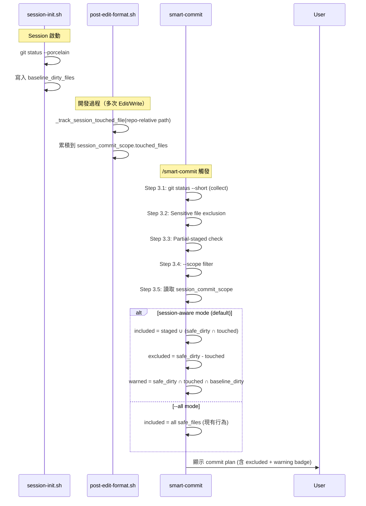

# Smart Commit Session-Aware Scope — Technical Spec

> **Status: Retired（2026-08-13，hook-lightweighting）** — 本機制隨強制層一併退役：
> `session_commit_scope` 的宿主 `.claude_review_state.json` 與寫入者 `session-init.sh`／
> `post-edit-format.sh` 的追蹤路徑已刪除，`scripts/lib/session-scope-resolver.js` 隨之移除。
> `/smart-commit` 的 commit 分組回到唯一來源 live `git status`（其既有路徑）。本文以下內容
> 描述的是已退役的設計，保留作歷史脈絡；勿依此實作。
> 決策與範圍：`docs/features/hook-lightweighting/2-tech-spec.md` § 3.3、§ 3.4。

## 1. Requirement Summary

- **Problem**: `/smart-commit` 目前用 `git status --short` 收集**所有**未提交變更，不區分「本次 session 修改的」和「session 開始前就存在的」。當使用者在 Claude session 外手動改了檔案、或是跨 session 累積了未提交的實驗性修改，smart-commit 會全部混在一起提交，違反使用者預期。
- **Goals**: 預設只 commit 本次 session 上下文中新增或修改的檔案；pre-existing 的未提交變更需使用者明確 opt-in 才包含。
- **Scope**: 修改 `hooks/session-init.sh`、`hooks/post-edit-format.sh`、`skills/smart-commit/SKILL.md`、`commands/smart-commit.md`；新增 `scripts/lib/session-scope-resolver.js` helper + 測試。
- **Origin**: Codex Brainstorm — Nash Equilibrium（本 session）

## 2. Existing Code Analysis

### Related Modules

| Module | 可復用部分 |
| ------ | ---------- |
| `.claude/hooks/session-init.sh` (→ `hooks/session-init.sh` via symlink) | Session 邊界偵測、state file 初始化、cumulative field 保留 |
| `.claude/hooks/post-edit-format.sh` (→ `hooks/post-edit-format.sh` via symlink) | `_track_changed_file()` 函式 pattern（注意：現有函式儲存絕對路徑，新函式需自行實作 repo-relative 正規化）、vendor path 過濾邏輯 |
| `.claude_review_state.json` | 已有 `session_id`、`changed_files_since_review`、schema_version 2 |
| `skills/smart-commit/SKILL.md` | Step 3 (Collect Changes)、Step 4 (Group) |

### 關鍵差異：`changed_files_since_review` vs 新的 `touched_files`

| 面向 | `changed_files_since_review` | 新 `session_commit_scope.touched_files` |
| ---- | ---------------------------- | ---------------------------------------- |
| 生命週期 | Review pass 後清空 | Session 結束才清空（跨 review 持續累積） |
| 路徑格式 | 絕對路徑（含 home-dir 的 plan 檔案） | Repo-relative 路徑（過濾非 repo 檔案） |
| 用途 | Delta review（哪些檔案需要 re-review） | Commit scope（哪些檔案該 commit） |

### Files Requiring Changes

| File | Action | Description |
| ---- | ------ | ----------- |
| `.claude/hooks/session-init.sh` | Modify | 新增 `session_commit_scope` 初始化 + baseline capture |
| `.claude/hooks/post-edit-format.sh` | Modify | 新增 `_track_session_touched_file()` 累積 |
| `skills/smart-commit/SKILL.md` | Modify | Step 3 新增 Selection Mode、Step 4 新增 Excluded 區塊、新增 `--all` flag |
| `test/hooks/session-init.test.js` | Modify | Baseline capture 測試 |
| `test/hooks/post-edit-format.test.js` | Modify | touched_files 累積測試 |
| `commands/smart-commit.md` | Modify | `argument-hint` + Arguments 區塊新增 `--all` flag |
| `scripts/lib/session-scope-resolver.js` | New | 可執行的 selection logic helper（從 state file + git status 計算 included/excluded/warned） |
| `test/scripts/smart-commit.test.js` | Modify | Selection logic 測試（透過 helper script） |

## 3. Technical Solution

### 3.1 Architecture Design



### 3.2 Data Model

#### State File Schema Extension

在 `.claude_review_state.json` 新增 `session_commit_scope` 區塊：

```json
{
  "session_commit_scope": {
    "session_id": "abc123",
    "baseline_dirty_files": ["path/a.ts", "path/b.md"],
    "touched_files": ["path/c.ts", "path/d.md"],
    "updated_at": "2026-04-03T10:00:00Z"
  }
}
```

| 欄位 | 型別 | 說明 |
| ---- | ---- | ---- |
| `session_id` | string | 與外層 `session_id` 一致，用於驗證 scope 有效性 |
| `baseline_dirty_files` | string[] | Session 啟動時 `git status --porcelain` 的 repo-relative 路徑集合 |
| `touched_files` | string[] | Session 內 Edit/Write 觸碰的 repo-relative 路徑（累積、dedup） |
| `updated_at` | string | 初始化時間（ISO 8601，session-init 設定，不隨每次 Edit 更新） |

#### Schema 設計原則

- **獨立 key**：`session_commit_scope` 與 `changed_files_since_review` 完全獨立，review pass 不影響 commit scope
- **Session 綁定**：session 變更時整個 block 重置（由 `session-init.sh` 處理）
- **Repo-relative only**：只儲存 repo-relative 路徑，過濾掉非 repo 檔案（如 `~/.claude/plans/...`）

### 3.3 Selection Pipeline（Core）

Session-aware filtering 是 Step 3 的最後一個階段，**不取代**既有的安全閘門。

#### Selection Pipeline 優先順序

| 階段 | 動作 | 來源 |
| ---- | ---- | ---- |
| 1. Collect | `git status --short` 收集全部變更 | 既有 Step 3 |
| 2. Sensitive exclusion | 排除 `.env*`、`*.pem`、`*.key` 等敏感檔案（即使 staged 或 touched） | 既有 SKILL.md 排除規則 |
| 3. Partial-staged check | `MM` 狀態的檔案 → 警告使用者先 resolve | 既有 SKILL.md |
| 4. `--scope` filter | 若有 `--scope <path>`，只保留該路徑下的檔案 | 既有 SKILL.md |
| 5. Session-aware filter | **本功能**：依下方邏輯分類 included / excluded / warned | 新增 |

**重要**：敏感檔案在階段 2 被排除後，即使在 `touched_files` 中也不會 include。Session-aware filter 只作用於通過階段 2-4 的檔案。

#### Selection Logic

```
# 輸入：通過階段 2-4 的 safe_files
staged         = safe_files ∩ git_staged
current_dirty  = safe_files ∩ git_unstaged_or_untracked
touched        = session_commit_scope.touched_files
baseline_dirty = session_commit_scope.baseline_dirty_files

# Default: session-aware mode
included = staged                                    # 已 staged → include（已通過安全檢查）
         ∪ (current_dirty ∩ touched)                 # Claude 改過 → include

excluded = current_dirty - touched                    # 不是 Claude 改的 → exclude

warned   = current_dirty ∩ touched ∩ baseline_dirty  # Claude 改過但 session 前就 dirty → warning

# --all mode: included = staged ∪ current_dirty（所有 safe_files，現有行為）
```

#### 檔案分類決策表

| 條件 | 結果 | 說明 |
| ---- | ---- | ---- |
| 敏感檔案（`.env*` 等） | **Exclude always** | 不受 session-aware 影響（階段 2 排除） |
| Partial-staged (`MM`) | **Warn + block** | 不受 session-aware 影響（階段 3 處理） |
| 已 staged + 通過安全檢查 | **Include** | 尊重使用者意圖 |
| Unstaged + touched + NOT baseline | **Include** | 本次 session 的新工作 |
| Unstaged + touched + baseline | **Include + Warning** | 混合了 pre-existing 變更 |
| Unstaged + NOT touched | **Exclude** | 非本次 session 的工作 |
| Untracked + touched | **Include** | Claude 建立的新檔案 |
| Untracked + NOT touched | **Exclude** | 非本次 session 的檔案 |

#### Helper Script: `scripts/lib/session-scope-resolver.js`

為使 selection logic 可獨立測試，抽取為 helper script：

```javascript
// scripts/lib/session-scope-resolver.js — Node.js module
// Usage: const { resolveSessionScope } = require('./session-scope-resolver');
// Input: reads .claude_review_state.json + git status --porcelain -z
// Output: { included: [], excluded: [], warned: [], mode: 'session-aware'|'all' }
function resolveSessionScope({ cwd, all = false, scope } = {}) {
  // ... (完整實作見 scripts/lib/session-scope-resolver.js)
}
module.exports = { resolveSessionScope };
```

**職責範圍**：此 helper 只負責 **階段 5（session-aware filter）**。它接收已通過階段 1-4 的檔案（透過 `git status` 當前狀態 + state file），輸出分類結果。階段 1-4 的邏輯仍由 SKILL.md 行為層（Claude）執行。

此 helper 讓 `test/scripts/smart-commit.test.js` 可以直接測試 selection logic，而不依賴 SKILL.md 的行為層。

### 3.4 Hook 修改

#### session-init.sh 修改

需處理兩個分支：**session 變更**（既有 state file）和 **首次啟動**（無 state file）。

##### Baseline Capture Helper（共用）

使用 `git status --porcelain -z`（NUL-delimited）確保檔名含空格、引號、特殊字元時正確解析：

```bash
# _capture_baseline — 共用 helper，回傳 JSON array
# 解析 git status --porcelain -z 的 NUL-delimited 格式
# 格式說明：
#   普通: XY<space>path<NUL>
#   Rename/Copy: XY<space>dest<NUL>src<NUL>  (注意：-z 格式 dest 在前、src 在後)
_capture_baseline() {
  if ! git rev-parse --git-dir &>/dev/null; then
    echo "null"  # 非 git repo → null baseline
    return 0
  fi
  git status --porcelain -z 2>/dev/null | perl -e '
    use strict;
    local $/;
    my $input = <STDIN>;
    my @paths;
    my $i = 0;
    while ($i < length($input)) {
      # 找到下一個 NUL
      my $nul = index($input, "\0", $i);
      last if $nul < 0;
      my $entry = substr($input, $i, $nul - $i);
      $i = $nul + 1;

      # 取 XY status code 和路徑
      my $xy = substr($entry, 0, 2);
      my $path = substr($entry, 3);  # skip "XY "

      # Rename/Copy: 下一個 NUL-delimited field 是 src path（跳過）
      if ($xy =~ /^[RC]/) {
        # $path 是 dest（我們要的）；src 在下一個 NUL field 中
        my $nul2 = index($input, "\0", $i);
        $i = ($nul2 >= 0) ? $nul2 + 1 : length($input);  # skip src
      }

      push @paths, $path if length($path);
    }
    # 輸出每行一個路徑（供 jq 消費）
    print "$_\n" for @paths;
  ' | jq -R . | jq -s 'unique'
}
```

**解析邏輯說明**：

| `git status -z` 格式 | 記錄結構 | 取出路徑 |
| -------------------- | -------- | -------- |
| `M  src/a.ts<NUL>` | 單 entry | `src/a.ts` |
| `?? new.ts<NUL>` | 單 entry | `new.ts` |
| `R  dest.ts<NUL>src.ts<NUL>` | 雙 entry（dest + src） | `dest.ts`（取 dest，跳 src） |
| `C  copy.ts<NUL>orig.ts<NUL>` | 雙 entry（dest + src） | `copy.ts`（取 dest，跳 src） |

##### 分支 1: Session 變更（既有 state file）

```bash
# 在既有 jq reset 之後新增
BASELINE=$(_capture_baseline)
TMP_SCOPE=$(mktemp)
if jq --argjson bl "$BASELINE" --arg sid "$NEW_SESSION_ID" --arg now "$NOW" '
  .session_commit_scope = {
    "session_id": $sid,
    "baseline_dirty_files": $bl,
    "touched_files": [],
    "updated_at": $now
  }
' "$STATE_FILE" > "$TMP_SCOPE" 2>/dev/null && [[ -s "$TMP_SCOPE" ]]; then
  mv "$TMP_SCOPE" "$STATE_FILE"
else
  rm -f "$TMP_SCOPE" 2>/dev/null
fi
```

##### 分支 2: 首次啟動（無 state file）

現有程式碼只寫入 `{"schema_version":2,"session_id":"..."}` 的 minimal state。需同時初始化 `session_commit_scope`：

```bash
# 取代現有的 echo 一行
BASELINE=$(_capture_baseline)
NOW=$(date -u +"%Y-%m-%dT%H:%M:%SZ")
jq -n --arg sid "$NEW_SESSION_ID" --arg now "$NOW" --argjson bl "$BASELINE" '{
  "schema_version": 2,
  "session_id": $sid,
  "session_commit_scope": {
    "session_id": $sid,
    "baseline_dirty_files": $bl,
    "touched_files": [],
    "updated_at": $now
  }
}' > "$STATE_FILE"
```

##### Fallback 行為

| 條件 | `baseline_dirty_files` 值 | smart-commit 行為 |
| ---- | ------------------------- | ----------------- |
| 正常 git repo | `["file1", "file2"]` | Session-aware filtering |
| 空 repo（無 dirty files） | `[]` | Session-aware（所有 dirty files 都是新的） |
| 非 git repo | `null` | Fallback to `--all` + 警告 |
| `session_commit_scope` block 遺失 | N/A | Fallback to `--all` + 警告 |
| `session_commit_scope.session_id` ≠ 外層 `session_id` | N/A | Fallback to `--all` + 警告（stale scope） |

#### post-edit-format.sh 修改

新增 `_track_session_touched_file()` 函式，在既有 `_track_changed_file()` 旁邊：

```bash
# Track file for session commit scope (never reset on review pass)
_track_session_touched_file() {
  local file_path="$1"
  [[ ! -f "$STATE_FILE" ]] && return 0

  # Guard: only append when session_commit_scope is valid
  # (session_id matches and baseline_dirty_files is present)
  local scope_valid
  scope_valid=$(jq -r '
    if (.session_commit_scope.session_id == .session_id) and
       (.session_commit_scope.baseline_dirty_files != null)
    then "yes" else "no" end
  ' "$STATE_FILE" 2>/dev/null) || return 0
  [[ "$scope_valid" != "yes" ]] && return 0

  # Normalize to repo-relative path
  local rel_path="$file_path"
  if [[ "$file_path" = /* ]]; then
    local repo_root
    repo_root=$(git rev-parse --show-toplevel 2>/dev/null) || return 0
    repo_root="${repo_root%/}/"
    if [[ "$file_path" = "$repo_root"* ]]; then
      rel_path="${file_path#"$repo_root"}"
    else
      return 0  # 非 repo 內檔案，忽略
    fi
  fi

  local tmp _before_size _after_size
  _before_size=$(wc -c < "$STATE_FILE" 2>/dev/null || echo 0)
  tmp=$(mktemp)
  if jq --arg f "$rel_path" '
    .session_commit_scope.touched_files = (
      (.session_commit_scope.touched_files // []) + [$f] | unique
    )
  ' "$STATE_FILE" > "$tmp" 2>/dev/null; then
    _after_size=$(wc -c < "$tmp" 2>/dev/null || echo 0)
    if [[ "$_after_size" -ge "$_before_size" ]]; then
      mv "$tmp" "$STATE_FILE"
    else
      rm -f "$tmp" 2>/dev/null
    fi
  else
    rm -f "$tmp" 2>/dev/null
  fi
  return 0
}
```

**呼叫位置**：在 code change 和 doc change 兩個區塊中，`_track_changed_file` 之後加入 `_track_session_touched_file`：

```bash
# 在 code change 區塊 (line ~261)
_track_changed_file "$file_path" || true
_track_session_touched_file "$file_path" || true

# 在 doc change 區塊 (line ~304)
_track_changed_file "$file_path"
_track_session_touched_file "$file_path"
```

### 3.5 SKILL.md 修改

#### Step 3 新增 Selection Mode 子步驟

在「Classify changes」之後、「If no changes」之前插入：

```markdown
**Selection Mode** (session-aware by default):

1. 讀取 `.claude_review_state.json` 的 `session_commit_scope`
2. 驗證 `session_commit_scope.session_id` 與當前 session 一致
3. 若 `--all` flag 或 scope 不可用 → 使用全部變更（legacy behavior）
4. 否則，依 Selection Logic 分類 included / excluded / warned
```

#### Step 4 Commit Plan 新增區塊

```markdown
## Commit Plan

**Selection mode**: session-aware (default)
**Author**: Jane Doe <jane@company.com> (local config)
**Signing**: enabled (GPG)
**AI guard**: active

### Included (6 files)
| # | Type | Files | Summary |
|---|------|-------|---------|
| 1 | feat | 3     | Add auth middleware |
| 2 | test | 2     | Add auth unit tests |
| 3 | docs | 1     | Update auth docs |

### Excluded — pre-existing uncommitted (3 files)
| File | Status | Reason |
|------|--------|--------|
| src/legacy.ts | M | Not touched in this session |
| config/dev.json | M | Not touched in this session |
| scratch/notes.md | ?? | Untracked, not created in this session |

⚠️ Warning: `src/config.ts` was already dirty before this session and was edited during this session. Pre-existing changes will be included in the commit.

> To include all uncommitted changes: rerun with `--all`
```

#### 新增 `--all` Flag

在 SKILL.md Step 3 的 Selection Mode 小節中說明，並在 `commands/smart-commit.md` 的 Arguments 區塊新增：

**SKILL.md（Step 3 內）**：

```markdown
| Flag | Effect |
|------|--------|
| `--all` | 停用 session-aware filtering，包含所有未提交變更（legacy behavior） |
```

**commands/smart-commit.md（Arguments 表格 + argument-hint）**：

```markdown
argument-hint: "[--execute] [--scope <path>] [--all] [--type <type>] [--ai-co-author] [--sign|--no-sign]"
```

```markdown
| `--all` | Include all uncommitted changes (disable session-aware filtering) |
```

#### 新增 Prohibited 項目

```markdown
- **No silent inclusion of pre-existing changes**: 在無 `--all` 的情況下，不得靜默包含 session 前就存在的未 touch 變更
```

## 4. Risks and Dependencies

| Risk | 嚴重度 | 緩解策略 |
| ---- | ------ | -------- |
| Bash 觸發的檔案變更（build、test snapshot）不被 hook 追蹤 | Medium | v1: 依賴 staged 信號 + `--all`。v2: 擴充 Bash PostToolUse hook 追蹤 |
| `git status --porcelain` 在大型 repo 的效能成本 | Low | 只在 session 啟動時執行一次；git status 本身有 index cache |
| session-init.sh 中 baseline capture 失敗 | Low | Fallback: `baseline_dirty_files: null` → smart-commit 退回 `--all` + 警告 |
| Pre-existing + touched 的 hunk 混合問題 | Medium | Warning badge 讓使用者知情；v2 可考慮 hunk-level snapshot |
| State file 膨脹（大量 touched_files） | Low | 使用 `unique` dedup；session 變更時完整重置 |
| `post-edit-format.sh` 中 `git rev-parse --show-toplevel` 額外呼叫 | Low | 可快取 repo root（同一 hook 執行內） |

### Dependencies

| 依賴 | 狀態 |
| ---- | ---- |
| `.claude_review_state.json` schema v2 | 已存在 |
| `session-init.sh` session 邊界偵測 | 已存在 |
| `post-edit-format.sh` `_track_changed_file()` pattern | 已存在，可參考 |
| `jq` CLI | 已有 guard（hook 開頭 `command -v jq` 檢查） |

## 5. Work Breakdown

| ID | 工作項目 | 預估改動 | 依賴 |
| -- | -------- | -------- | ---- |
| W1 | `session-init.sh` baseline capture | ~25 行新增 | — |
| W2 | `post-edit-format.sh` `_track_session_touched_file()` | ~30 行新增 | — |
| W3 | `post-edit-format.sh` 呼叫整合（code + doc 區塊） | ~4 行新增 | W2 |
| W4 | `SKILL.md` Step 3 Selection Mode | ~30 行新增 | W1, W2 |
| W5 | `SKILL.md` Step 4 Commit Plan display | ~25 行新增 | W4 |
| W6 | `SKILL.md` `--all` flag + Prohibited | ~10 行新增 | W4 |
| W7 | `test/hooks/session-init.test.js` baseline 測試 | ~60 行新增 | W1 |
| W8 | `test/hooks/post-edit-format.test.js` touched_files 測試 | ~80 行新增 | W2, W3 |
| W9 | `test/scripts/smart-commit.test.js` selection logic 測試（透過 helper） | ~100 行新增 | W10 |
| W10 | `scripts/lib/session-scope-resolver.js` selection logic helper | ~60 行新增 | W1, W2 |
| W11 | `commands/smart-commit.md` 更新 `argument-hint` + Arguments | ~10 行修改 | W6 |

### 建議實施順序

```
W1 + W2 (parallel) → W3 → W10 → W7 + W8 + W9 (parallel) → W4 → W5 + W6 → W11
```

## 6. Testing Strategy

### Unit Tests

| 測試 | 覆蓋場景 |
| ---- | -------- |
| session-init baseline capture | 正常 capture、空 repo、大量 dirty files、非 git repo fallback、含空格/引號的檔名、rename/copy 雙 entry 解析（取 dest path） |
| session-init session 變更 | 新 session 重置 scope、同 session 保留 scope |
| session-init 首次啟動 | 無 state file → 建立 minimal state + baseline capture |
| session-init 舊 state 升級 | 既有 state 無 `session_commit_scope` → session 變更時自動補建 |
| touched_files 累積 | Edit 觸發追加、重複 dedup、非 repo 路徑過濾、vendor 路徑排除、scope 無效時 no-op |
| repo-relative 正規化 | 絕對路徑 → relative、macOS symlink（`/var` → `/private/var`） |
| Selection logic | 4 種檔案分類 × 2 mode (session-aware / `--all`) |
| Warning badge | pre-existing + touched 的 badge 產生 |
| Fallback | baseline `null` 時退回 `--all` |

### Integration Tests

| 測試 | 覆蓋場景 |
| ---- | -------- |
| 完整 session 流程 | session-init → 多次 Edit → smart-commit → 驗證 included/excluded 正確 |
| `--all` override | session-aware + `--all` → 包含全部 |
| `--scope` + session-aware 交叉 | 雙重過濾正確運作 |

### Edge Case Coverage

| 邊界 | 預期行為 |
| ---- | -------- |
| Session 內未 Edit 任何檔案 | included = staged only；若無 staged → "No session changes to commit" |
| 所有 dirty files 都是 pre-existing + NOT touched | included = staged only；warn "All uncommitted changes are pre-existing" |
| `.claude_review_state.json` 不存在 | Fallback to `--all` behavior + 警告 |
| `session_commit_scope` block 遺失 | Fallback to `--all` behavior + 警告 |
| 檔案在 session 中被刪除（`git rm`） | 若 Claude 執行了 `git rm` → 不在 Edit hook 追蹤範圍；依賴 staged 信號 |
| Rename（`R` status） | baseline capture 用 `git status -z` + perl 解析取 new path；touched_files 追蹤 new path |

## 7. Open Questions

| # | 問題 | 影響 | 建議 |
| - | ---- | ---- | ---- |
| Q1 | Bash 執行的 `git rm` / `git mv` 是否該追蹤？ | v1 不追蹤（PostToolUse:Bash hook 目前不走 post-edit-format） | v2 擴充 |
| Q2 | `--scope` 和 session-aware 的優先順序？ | `--scope` 先過濾路徑，再套用 session-aware filter | 雙重過濾 |
| Q3 | 跨 session 持續開發同一功能時，baseline 是否應該記住上次 commit 點？ | 目前每次 session 重新 capture baseline | 使用者用 `--all` 處理；v2 可考慮 git ref 追蹤 |
| Q4 | `--session-only` 顯式 alias 是否需要？ | 與 `--all` 對稱，但 v1 可能過度設計 | v1 省略，視使用者回饋決定 |
