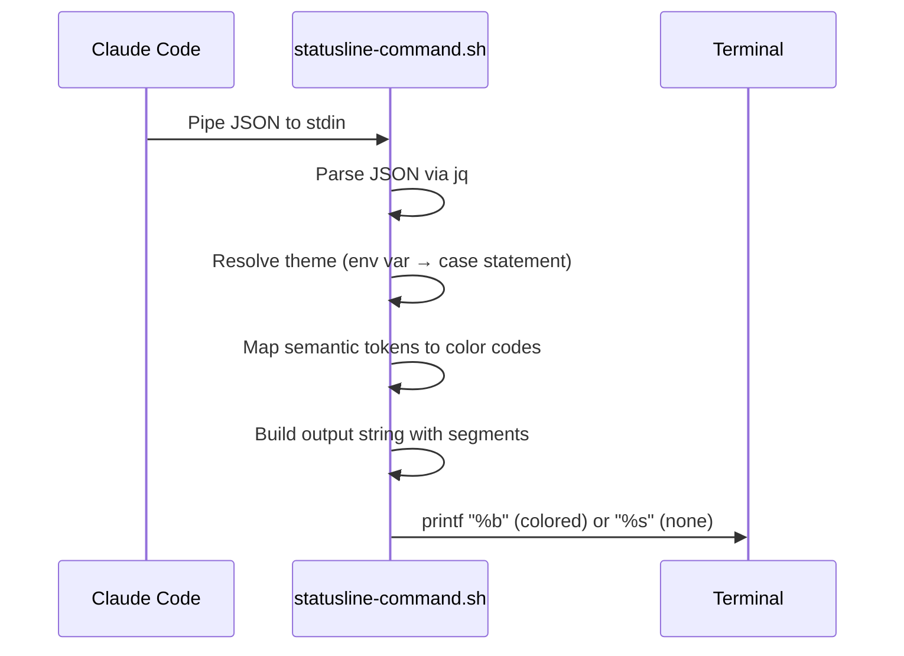

# StatusLine Config — Technical Specification

## Executive Summary

| Field | Value |
|-------|-------|
| Skill Name | `statusline-config` |
| Status | Implemented (stable) |
| Standalone Install | `npx skills add sd0xdev/sd0x-dev-flow --skill statusline-config` |
| Output | `~/.claude/statusline-command.sh` (POSIX shell script) |
| Dependencies | `jq` (required), `git` (optional, for branch segment) |
| Claude Code Version | 2.1+ |

## 1. Overview

### Problem

Claude Code supports custom statusline scripts via `~/.claude/statusline-command.sh`, but writing a correct POSIX script that parses JSON stdin, handles color themes, and respects accessibility standards requires specialized knowledge.

### Solution

`/statusline-config` generates a production-ready statusline script with:

- 6 configurable segments (directory, git branch, model, context %, cost, >200k alert)
- 5 color themes with semantic token architecture
- WCAG AA contrast compliance (best-effort)
- `NO_COLOR` standard support

### Design Philosophy

| Principle | Implementation |
|-----------|---------------|
| POSIX portable | `#!/bin/sh` — no bash-isms, works on macOS/Linux |
| Semantic colors | 12 named tokens (`C_CWD`, `C_BRANCH`, ...) instead of hardcoded escape codes |
| Accessibility first | `NO_COLOR` env var disables all colors; bold provides non-color differentiation |
| Zero config viable | No arguments = best-practice defaults applied |

## 2. Standalone Installation

This skill can be installed independently — the full sd0x-dev-flow plugin is **not** required.

```bash
npx skills add sd0xdev/sd0x-dev-flow --skill statusline-config
```

After installation, the skill files are located at:

```
.claude/skills/statusline-config/
├── SKILL.md              # Skill knowledge base
├── references/
│   ├── json-schema.md    # Claude Code JSON stdin schema
│   └── themes.md         # Theme token definitions
.claude/commands/
└── statusline-config.md  # Command entry point (auto-installed)
```

The command `/statusline-config` becomes available immediately.

## 3. Usage

```bash
# Apply best-practice defaults (all segments ON, ansi-default theme)
/statusline-config

# Switch to a specific theme
/statusline-config catppuccin-mocha

# Add or remove segments
/statusline-config remove cost
/statusline-config "add git, remove cost, use dracula"
```

### Arguments

| Argument | Description | Default |
|----------|-------------|---------|
| `<theme-name>` | Theme to apply: `catppuccin-mocha` (or `catppuccin`), `dracula`, `nord`, `ansi-default`, `none` | `ansi-default` |
| `add/remove <segment>` | Enable or disable a specific segment | — |
| (no args) | Apply best-practice defaults | All ON + `ansi-default` |

## 4. Segments

| Segment | JSON Field | Default | Notes |
|---------|------------|---------|-------|
| Directory | `workspace.current_dir` | ON | Truncate deep paths: `~/.../last-dir` |
| Git branch | shell `git` | ON | `--no-optional-locks`, cache 5s |
| Model | `model.display_name` | ON | — |
| Context % | `context_window.remaining_percentage` | ON | Green >40%, Yellow 20–40%, Red <=20% |
| Cost | `cost.total_cost_usd` | ON | Show when >= $0.005, `est $X.XX` |
| >200k alert | `exceeds_200k_tokens` | ON | Show only when `true` |

## 5. Theme System

### 5.1 Available Themes

| Theme | Type | Default | Notes |
|-------|------|---------|-------|
| `ansi-default` | ANSI 16 | Yes | Safe fallback, works everywhere |
| `catppuccin-mocha` | TrueColor | — | Recommended — pastel, WCAG AA >=4.5:1 |
| `dracula` | TrueColor | — | Vibrant purple/pink accents |
| `nord` | TrueColor | — | Arctic blue, muted tones |
| `none` | — | — | No colors (`NO_COLOR` auto-triggers) |

### 5.2 Semantic Tokens

Scripts use semantic tokens instead of hardcoded colors. Each theme maps these 12 tokens to its palette:

| Token | Role | Example Colors |
|-------|------|---------------|
| `C_CWD` | Directory path | blue / sapphire |
| `C_BRANCH` | Git branch name | magenta / mauve |
| `C_MODEL` | Model display name | cyan / teal |
| `C_CTX_OK` | Context >= 41% | green |
| `C_CTX_WARN` | Context 21–40% | yellow |
| `C_CTX_BAD` | Context <= 20% | red |
| `C_COST` | Cost display | muted text |
| `C_ALERT` | >200k token warning | orange/peach + bold |
| `C_SEP` | Pipe separator `\|` | dim/overlay |
| `C_MUTED` | Secondary info | subtext |
| `C_TEXT` | General text | foreground |
| `C_RESET` | Reset all formatting | `\033[0m` |

### 5.3 Theme Switching

Switch themes at runtime via environment variable:

```bash
export CLAUDE_STATUSLINE_THEME=catppuccin-mocha
```

The script reads this on every invocation. Invalid theme names fall back to `ansi-default`. The alias `catppuccin` resolves to `catppuccin-mocha`.

## 6. Architecture



### Script Rules

| Rule | Implementation |
|------|---------------|
| Shebang | `#!/bin/sh` (POSIX) |
| JSON parsing | `jq -r '.field // fallback'` |
| Theme resolution | `CLAUDE_STATUSLINE_THEME` env var → `case` statement |
| NO\_COLOR | `[ -n "${NO_COLOR:-}" ] && theme="none"` |
| TrueColor format | `\033[38;2;R;G;Bm` (24-bit foreground) |
| Git invocation | `git --no-optional-locks -C "$dir"` |
| Git cache | `/tmp/claude-statusline-git-cache-$(id -u)`, 5s TTL |
| CWD truncation | Depth >2 → `~/.../basename` |
| Cost display | Only when >= 0.005, format `est $X.XX` |
| Alert style | `C_ALERT` + bold (`\033[1m`) to distinguish from `C_CTX_BAD` |
| Color output | `printf "%b"` for ANSI/TrueColor, `printf "%s"` for none |

## 7. JSON Schema

> **Source of truth**: `skills/statusline-config/references/json-schema.md`. The table below is reproduced for self-contained reading.

Claude Code pipes this JSON to the script's stdin on every update:

| Field | Type | Description |
|-------|------|-------------|
| `model.id` | string | `claude-opus-4-6` |
| `model.display_name` | string | `Opus` |
| `workspace.current_dir` | string | Current working directory |
| `workspace.project_dir` | string | Directory at session start |
| `context_window.used_percentage` | number \| null | Pre-calculated context used % |
| `context_window.remaining_percentage` | number \| null | Pre-calculated context remaining % |
| `context_window.context_window_size` | number | Total context window tokens |
| `cost.total_cost_usd` | number | Session cumulative cost (USD) |
| `cost.total_duration_ms` | number | Wall-clock time (ms) |
| `cost.total_api_duration_ms` | number | API wait time (ms) |
| `cost.total_lines_added` | number | Lines added this session |
| `cost.total_lines_removed` | number | Lines removed this session |
| `session_id` | string | Unique session identifier |
| `version` | string | Claude Code version |
| `vim.mode` | string \| undefined | `NORMAL`/`INSERT` (only when vim enabled) |
| `exceeds_200k_tokens` | boolean | Whether input exceeds 200k threshold |
| `output_style.name` | string | Current output style |

### Null Handling

These fields may be `null` before the first API call:

- `context_window.used_percentage`
- `context_window.remaining_percentage`

Always use jq fallback: `jq -r '.field // 0'`

## 8. Output Examples

```
~/.../my-project | feat/auth | Opus 4.6 | ctx 48% left · est $0.12
```

```
~/.../my-project | main | Opus 4.6 | ctx 18% left · est $1.23 · >200k
```

With `NO_COLOR=1`:

```
~/.../my-project | main | Opus 4.6 | ctx 55% left · est $0.42
```

## 9. Accessibility

| Feature | Standard | Implementation |
|---------|----------|---------------|
| Color contrast | WCAG AA >= 4.5:1 | TrueColor themes target this against their dark backgrounds |
| No-color mode | [no-color.org](https://no-color.org/) | `NO_COLOR` env var → all `C_*` tokens become empty strings |
| Non-color differentiation | — | `C_ALERT` uses bold to distinguish from `C_CTX_BAD` |
| ANSI fallback | — | `ansi-default` theme uses standard 16-color codes for maximum compatibility |

Decorative tokens (`C_SEP`, `C_MUTED`, `C_COST`) may fall below 4.5:1 intentionally — they convey secondary information.

## 10. File Structure

```
skills/statusline-config/
├── SKILL.md                        # Skill knowledge base + workflow
├── references/
│   ├── json-schema.md              # Claude Code JSON stdin schema
│   └── themes.md                   # Theme token-to-color definitions
commands/
└── statusline-config.md            # Command entry point
```
