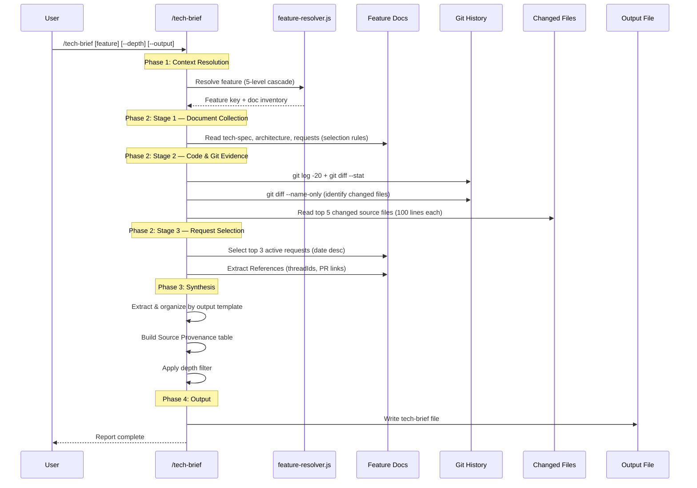

# tech-brief Technical Spec

> **Feature**: `tech-brief`
> **Status**: Active
> **Date**: 2026-04-07
> **Source**: 開發完成後需要對技術同事分享成果，發現 `/project-brief`（PM/CTO 導向）和 `/tech-spec`（設計階段規格書）都無法滿足需求

## 1. Requirement Summary

### Problem

開發完成後，工程師想跟技術同事分享：
- **做了什麼**（背景、問題描述）
- **為什麼這樣做**（設計決策、trade-off）
- **怎麼做的**（關鍵源碼位置、核心變更）
- **有什麼限制**（已知問題、未來改進）
- **相關討論在哪**（PR、review threadId、外部連結）

現有 skill 無一覆蓋此情境：

| Skill | 問題 |
|-------|------|
| `/project-brief` | 刻意移除技術細節，面向 PM/CTO |
| `/fp-brief` | 聚焦第一性原理推導鏈，缺少源碼位置和討論連結 |
| `/tech-spec` | 設計階段文件，不是事後分享 |
| `/deep-analyze` | 深入分析產物，非分享用途 |

### Goals

1. 提供面向技術同事的分享文件，保留完整技術深度
2. 自動從多來源整合資訊（feature docs、git history、review metadata）
3. 支援深度分級（brief/normal/deep）
4. 複用現有基礎設施（feature-resolver、doc-classifier）

### Scope

| In Scope | Out of Scope |
|----------|-------------|
| Skill 定義（SKILL.md） | 新 agent 定義（v1 inline 執行） |
| Output template + depth matrix | 自動偵測「何時該產 tech-brief」 |
| Depth 分級（brief/normal/deep，三級全實作） | 外部發佈（blog post 等） |
| Feature context auto-detection | |
| `/tmp/` 輸出支援 | |
| 路徑驗證 + secret redaction | |

## 2. Existing Code Analysis

### Related Modules

| Module | Role | Reuse |
|--------|------|-------|
| `scripts/lib/feature-resolver.js` | Feature context resolution (5-level cascade) | 直接複用 — 自動偵測 feature |
| `scripts/lib/doc-classifier.js` | Document type classification | 直接複用 — 找到 tech-spec、architecture 等 |
| `skills/project-brief/SKILL.md` | PM/CTO brief skill | 參考 Agent dispatch pattern |
| `agents/brief-writer.md` | PM/CTO brief agent (sonnet) | 參考 agent 結構，但不複用 |
| `skills/fp-brief/SKILL.md` | First-principles brief | 參考 depth 分級、output template pattern |
| `skills/fp-brief/references/output-template.md` | FP-brief output template | 參考 depth matrix pattern |
| `skills/tech-spec/references/feature-context-resolution.md` | Feature resolution cascade | 直接複用 |

### Files Requiring Changes

| File | Change | Type |
|------|--------|------|
| `skills/tech-brief/SKILL.md` | 新建 — skill 定義 | New |
| `skills/tech-brief/references/output-template.md` | 新建 — output template + depth matrix | New |
| `skills/tech-brief/references/source-guide.md` | 新建 — 多來源整合策略 | New |
| `scripts/config/doc-taxonomy.json` | 新增 `tech-brief` ancillary type + tech-spec exclude pattern | Update |
| `CLAUDE.md` | 新增 `/tech-brief` 到 Command Quick Reference | Update |
| `.claude/CLAUDE.md` | 同步新增 `/tech-brief` | Update |
| `test/skills/tech-brief.test.js` | 新建 — skill 測試 | New |
| `test/scripts/doc-classifier.test.js` | 新增 tech-brief classification test cases | Update |

## 3. Technical Solution

### 3.1 Architecture Design



### 3.2 Command Signature

```
/tech-brief [<feature-key>|<docs-path>] [--depth brief|normal|deep] [--output <path>] [--no-save]
```

| Flag | Default | Description |
|------|---------|-------------|
| `<feature-key>` | Auto-detect | Feature key 或 docs 路徑 |
| `--depth` | `normal` | 輸出深度（brief/normal/deep 三級全支援） |
| `--output` | `docs/features/<key>/5-tech-brief.md` | 自訂輸出路徑 |
| `--no-save` | false | 只輸出不存檔 |

#### Input Resolution Table

| Input Type | Example | Feature Resolution | Default Output Path |
|-----------|---------|-------------------|-------------------|
| Feature key | `tech-brief fp-brief` | Pass `--feature fp-brief` to resolver | `docs/features/fp-brief/5-tech-brief.md` |
| Feature dir path | `tech-brief docs/features/fp-brief/` | Extract key from path | `docs/features/fp-brief/5-tech-brief.md` |
| Feature doc path | `tech-brief docs/features/fp-brief/2-tech-spec.md` | Extract key from parent path | `docs/features/fp-brief/5-tech-brief.md` |
| Non-feature path | `tech-brief /tmp/notes.md` | No feature context | Gate: require `--output` |
| No argument | `tech-brief` | Auto-detect via 5-level cascade | Based on resolved feature |

#### Path Security

參考 `/fp-brief` 的安全機制（`skills/fp-brief/SKILL.md:72-74`）：

1. **Path normalization**: 解析 `..`、symlink，確認最終路徑在 repo boundary 內
2. **Traversal rejection**: 輸入包含 `..` → reject
3. **Output path validation**: `--output` 允許 repo 外路徑（如 `/tmp/`），但明確警告 "writing outside repo"
4. **Secret redaction**: 讀取來源文件前掃描高信心 secret patterns（API keys、private keys）→ 高信心 abort，中信心 mask `[REDACTED]`

### 3.3 Multi-Source Collection Strategy

新 skill 的核心挑戰是**多來源整合**。分為三個階段：

#### Stage 1: Document Collection

| Source | How to Access | Extract What | Required |
|--------|--------------|-------------|----------|
| `2-tech-spec.md` | Read via `canonical_docs.tech_spec` | Problem, Goals, Architecture, Design Decisions, Risks | Optional |
| `3-architecture.md` | Read via `canonical_docs.architecture` | Architecture diagram, AD-N decisions, Trade-offs | Optional |
| `4-implementation.md` | Discover via `doc_inventory` (type=`implementation`) | Implementation notes, lessons learned | Optional |
| `0-feasibility-study/` | Read via `canonical_docs.feasibility` | Alternative comparison, Rejection reasons | Optional |
| `requests/*.md` | Glob + request selection rules (see Stage 3) | AC status, Progress, References (threadIds) | Optional |

**Note**: `canonical_docs` only covers `tech_spec`, `architecture`, `feasibility`, `requirements` four roles. `4-implementation.md` is discovered via `doc_inventory` array (filter by `type === 'implementation'`), not `canonical_docs`.

#### Stage 2: Code & Git Evidence Collection

| Source | Command | Extract What | Cap |
|--------|---------|-------------|-----|
| Git log | `git log --oneline -20 -- docs/features/<key>/ skills/<key>/ scripts/` | Commit history, change timeline | 20 commits |
| Git diff stat | `git diff --stat HEAD~20..HEAD -- <feature-related-paths>` | File-level change magnitude | Summary only |
| Changed file reading | For top 5 changed files: `Read <file>` targeted sections | `file:line` locations, code context for Implementation Highlights | 5 files, 100 lines each |
| Review metadata | Extract from request doc `## References` section | Codex threadIds, PR links (optional — not all requests have these) | — |

**Changed file identification**: 從 git diff `--name-only` 取得變更檔案清單，排除 docs/test/config，取前 5 個 source files，讀取相關 hunks 以產出 `file:line` 引用。

#### Stage 3: Request Selection Rules

| Condition | Action |
|-----------|--------|
| 0 active requests | Skip — `[Source unavailable — no active request docs]` |
| 1 active request | Use it |
| 2-3 active requests | Use all, sorted by date desc |
| >3 active requests | Use top 3 by date desc, note `[N additional requests omitted]` |

**Active request**: Status not in `[Completed, Done, Superseded, Archived]`（與 `feature-context-resolution.md:82` 一致）。

**PR links fallback order**: request doc `## References` → git log `Merge pull request` patterns → `[No PR links found]`。

**Missing source handling**: 任何來源不存在時，該區塊輸出 `[Source unavailable — no <type> found for this feature]`，不捏造內容。

### 3.4 Output Template Structure

```markdown
# Tech Brief: <Feature Title>

> Feature: <key> | Depth: <level> | Generated: <timestamp>
> Sources: <list of docs actually read>

## Source Provenance

| Section | Source Files | Confidence |
|---------|------------|------------|
| Background | <paths> | High/Medium/Low |
| Design Decisions | <paths> | ... |
| Implementation | <paths + git> | ... |
| ... | ... | ... |

## 1. Background & Problem
<問題描述、影響範圍、觸發事件>

## 2. Design Decisions & Trade-offs
<關鍵設計決策，每個決策包含：選擇、理由、trade-off>

## 3. Implementation Highlights
<關鍵源碼位置（file:line）、核心變更、架構圖>

## 4. Limitations & Known Issues
<已知限制、未解決問題、technical debt>

## 5. Discussion & References
<PR links（optional）、Codex review threadIds、external references>

## 6. Next Steps
<後續計畫、待辦、Phase 2/3 roadmap>
```

**Section source mapping**:

| Section | Primary Sources | Fallback |
|---------|----------------|----------|
| 1. Background | tech-spec §1 + request doc | Git log first commit message |
| 2. Design Decisions | tech-spec §3 + architecture AD-N + feasibility | tech-spec §3 only |
| 3. Implementation | Changed files (Read) + git diff + tech-spec §2 | Git log + diff stat only |
| 4. Limitations | tech-spec §4 + §7 + request AC unchecked | tech-spec §7 only |
| 5. Discussion | request `## References` → git merge commits → `[No links found]` | — |
| 6. Next Steps | request `## Progress` + tech-spec §5 | `[No roadmap available]` |

### 3.5 Depth Matrix

| # | Section | brief | normal | deep |
|---|---------|:-----:|:------:|:----:|
| 1 | Background & Problem | 2-3 句摘要 | 完整描述 | 完整 + 時間線 |
| 2 | Design Decisions | 關鍵 1-2 個 | 全部決策 | 全部 + 替代方案比較（from feasibility） |
| 3 | Implementation Highlights | file list only（from git diff --name-only） | file:line + 說明（from changed file reading） | file:line + code snippet（from file reading, ≤30 lines per snippet） |
| 4 | Limitations & Known Issues | Top 3 | 完整列表 | 完整 + severity + workaround |
| 5 | Discussion & References | Links only | Links + one-line context | Links + context |
| 6 | Next Steps | Bullet list | Phase breakdown | Phase + dependencies + timeline |

**Source provenance table**: 所有 depth level 都包含（可審計每個 section 的來源）。

**Length policy**: brief ~500 words, normal ~1500 words, deep ~3000 words（上限，非目標）。來源不足時輸出更短，遵循 Evidence Insufficient Rule。

### 3.6 Save Behavior

| Condition | Output Path |
|-----------|------------|
| Default (feature context resolved) | `docs/features/<key>/5-tech-brief.md` |
| `--output <path>` | 指定路徑（如 `/tmp/xxx-tech-brief.md`） |
| `--no-save` | stdout only |
| No feature context + no `--output` | Gate: Need Human |

**Preferred canonical name**: `5-tech-brief.md`。理由：
- tech-brief 是事後產物，phase 5 是約定俗成的「附加文件」位置
- 若 `5-` prefix 已被佔用（如 `5-implementation-notes.md`），fallback 為下一個可用編號的 ancillary doc（e.g. `6-tech-brief.md`）
- 不使用 suffix pattern（如 `2-tech-spec-tech-brief.md`），避免被 doc-taxonomy `tech-spec` variant pattern `^2-tech-spec` 誤分類

**Taxonomy update**: 需在 `scripts/config/doc-taxonomy.json` 新增：
1. `tech-spec` type 的 `exclude_pattern` 加入 `-tech-brief\\.md$`
2. 新增 `tech-brief` ancillary type：

```json
{
  "id": "tech-brief",
  "namespace": "ancillary",
  "semantic_pattern": "-tech-brief\\.md$|^5-tech-brief",
  "heading_signals": ["Tech Brief", "技術簡報"],
  "sync_handler": null
}
```

### 3.7 Implementation Approach: Inline vs Agent

| Approach | Pros | Cons |
|----------|------|------|
| **Inline（v1 選擇）** | 簡單、不需新 agent、容易 debug | 所有邏輯在 SKILL.md |
| Agent dispatch | 可用 sonnet 降低成本、隔離 context | 需新 agent 定義、多一層間接 |

**決策**：v1 使用 inline 執行（參考 `/fp-brief` pattern）。原因：
1. Skill 主要工作是「讀取 + 整合 + 格式化」，不需要獨立推理能力
2. 需要完整的 feature-resolver 整合，inline 更直接
3. `/fp-brief` 已驗證 inline 模式對此類 skill 可行

如果未來需要支援更複雜的整合（如自動從 Slack/Jira 拉取討論），可升級為 agent dispatch。

## 4. Risks and Dependencies

| Risk | Impact | Mitigation |
|------|--------|------------|
| Feature docs 不完整（缺少 tech-spec 或 architecture） | Medium — 輸出品質下降 | Missing source handling：明確標示缺少哪些來源；Source Provenance table 顯示 confidence |
| Git history 過長導致 context 膨脹 | Low — 有硬上限 | `git log` 限 20 commits；changed file reading 限 5 files × 100 lines |
| Review threadId 格式不一致 | Low — 已有既有慣例 | 用 regex 掃描 UUID pattern；PR links 為 optional fallback |
| 與 `/fp-brief` 定位重疊 | Medium — 使用者困惑 | SKILL.md When NOT to Use 明確區分：fp-brief = 推理鏈，tech-brief = 實作分享 |
| doc-taxonomy 分類衝突 | Low — 需同步更新 | 新增 `tech-brief` ancillary type + tech-spec exclude pattern |
| 多 active requests 的 feature 扇入過大 | Low | Request selection rules：max 3, date desc |

### Dependencies

| Dependency | Type | Status |
|------------|------|--------|
| `scripts/lib/feature-resolver.js` | Code | Exists |
| `scripts/lib/doc-classifier.js` | Code | Exists |
| `scripts/config/doc-taxonomy.json` | Config | Exists — 需更新 |
| Feature docs structure (`docs/features/`) | Convention | Established |
| Request doc `## References` section | Convention | Established（optional，非所有 request 都有） |

## 5. Work Breakdown

| # | Task | Files | Est. |
|---|------|-------|------|
| 1 | 建立 `skills/tech-brief/SKILL.md` | 1 new | Medium |
| 2 | 建立 `skills/tech-brief/references/output-template.md` | 1 new | Small |
| 3 | 建立 `skills/tech-brief/references/source-guide.md` | 1 new | Small |
| 4 | 更新 `scripts/config/doc-taxonomy.json` | 1 update | Small |
| 5 | 更新 `CLAUDE.md` + `.claude/CLAUDE.md` command table | 2 update | Small |
| 6 | 建立 `test/skills/tech-brief.test.js` | 1 new | Medium |
| 7 | 更新 `test/scripts/doc-classifier.test.js`（tech-brief classification） | 1 update | Small |
| 8 | 用 `seek-verdict` feature 做 pilot 測試（有 tech-spec + requests） | — | Medium |
| 9 | 調整 output 品質（iterative） | Update | Small |

## 6. Testing Strategy

### Pilot Feature

使用兩個 pilot feature 覆蓋不同路徑：

| Pilot | Feature | 覆蓋路徑 | 理由 |
|-------|---------|----------|------|
| Primary | `seek-verdict` | tech-spec + completed request + git history | 適中複雜度；request 已 Completed，測試 missing active request marker |
| Secondary | `auto-loop-evolution` | tech-spec + 多個 active requests | 驗證 Stage 3 request selection rules（>3 active → top 3 by date） |

### Test Plan

| Type | Method | What to Verify |
|------|--------|---------------|
| Functional (primary) | 對 `seek-verdict` feature 執行 `/tech-brief` | 輸出包含 6 個 section + Source Provenance；request 區塊顯示 missing active marker |
| Functional (secondary) | 對 `auto-loop-evolution` 執行 `/tech-brief` | 驗證 request selection（>3 active → top 3 by date）、References 提取 |
| Source provenance | 驗證 provenance table 中每個 source path 實際存在 | file paths 與 `canonical_docs` 一致 |
| Missing source | 對 `create-pr-ai-sanitization`（僅有部分 docs）測試 | Missing source markers 正確顯示 |
| Output path | `--output /tmp/test.md` | 檔案正確寫入指定路徑 |
| No-save | `--no-save` | 無檔案產生，只有 stdout |
| Depth brief | `--depth brief` | ~500 words, Design Decisions 只有 1-2 個, Implementation 只有 file list |
| Depth deep | `--depth deep` | ~3000 words, 含替代方案比較, code snippets |
| Request selection | 對有多個 requests 的 feature（如 `auto-loop-evolution`）測試 | 只取 top 3 by date |
| Path security | 輸入包含 `..` 的路徑 | Reject with error message |
| doc-classifier | `5-tech-brief.md` 被分類為 `tech-brief` ancillary type | Classification 正確，不被誤判為 tech-spec |

### Automated Tests (`test/skills/tech-brief.test.js`)

| Test Case | Assert |
|-----------|--------|
| Feature resolver integration | Resolved feature key matches expected |
| Output template sections | Output contains all 6 `##` headings |
| Source provenance table | Output contains `Source Provenance` table |
| Missing source markers | Contains `[Source unavailable` when source absent |
| Depth filtering | brief output word count < normal < deep |
| Path traversal rejection | `..` in input → error |

## 7. Open Questions

| # | Question | Impact | Proposed Answer |
|---|----------|--------|-----------------|
| Q1 | Skill 名稱用 `tech-brief` 還是 `tech-memo`？ | Naming — 影響 trigger keywords | **Decided**: `tech-brief` — 與 `project-brief` 對稱 |
| Q2 | 是否需要 `--verify codex` 選項（如 `/fp-brief`）？ | Quality — 影響 allowed-tools | v1 不需要 — tech-brief 是整合文件，非推理產物 |
| Q3 | 如何處理 feature 無 git history（新 feature 尚未 commit）？ | Edge case | git 區塊輸出 `[No commits found for this feature]` |
| Q4 | 輸出語言？ | i18n | 遵循 session 語言（`@rules/docs-writing.md` locale-aware convention），不硬編碼 zh-TW |
