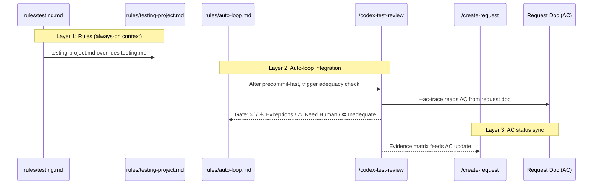

# Testing Rules Enrichment — Technical Spec

## 1. Requirement Summary

- **Problem**: `rules/testing.md` 僅 12 行速查表，缺乏撰寫慣例（AAA、naming、assertion）、evidence model、AC traceability。6 個 test-related skills 各自獨立，無統一規則串連。插件使用者無法客製化測試規範（不像 `auto-loop` 有 `auto-loop-project.md`）。
- **Goals**:
  1. 擴充 `testing.md` 為 behavioral contract（~50-60 行）
  2. 新增 `testing-project.md` override（mirror auto-loop-project.md pattern）
  3. 建立 Evidence Model（2 types + 1 verified exception）
  4. 擴充 `/codex-test-review` 加入 `--ac-trace` mode（AC-to-test traceability）
  5. 在 auto-loop 中加入 adequacy check 步驟（advisory default）
- **Scope**: v1 — rules + override + ac-trace mode。v2 — shared AC parser、hook enforcement、cross-skill evidence binding。
- **Source**: `/best-practices` audit + `/codex-brainstorm` Nash Equilibrium (threadId: `019cfee9-f2ad-7ed1-b6f9-35d573b84fd1`)

## 2. Existing Code Analysis

### Related Modules

| Module | 關聯 | 可重用 |
|--------|------|--------|
| `rules/testing.md` | 現有 testing rule（12 行） | 改寫 |
| `rules/auto-loop.md` | Auto-loop 整合點（precommit → doc sync 間） | 插入 adequacy gate |
| `rules/auto-loop-project.md` | Override pattern 模板 | 複製 pattern |
| `skills/test-review/SKILL.md` | Test review skill（Codex 5-dimension） | 擴充 ac-trace mode |
| `skills/create-request/SKILL.md` | AC 管理 + update 模式 | AC 讀取來源 |
| `commands/codex-test-review.md` | Test review command | 加入 `--ac-trace` arg |
| `commands/check-coverage.md` | Coverage 分析 | 去除 hardcode 路徑 |
| `commands/install-rules.md` | Rule 安裝 + customize flow | Extension target: 擴充 override template map 加入 testing（目前僅支援 auto-loop） |

### Reusable Patterns

| Pattern | Source | Reuse |
|---------|--------|-------|
| Override precedence | `auto-loop-project.md` 的 heading-match + full-section 覆蓋 | 直接複製 |
| `/install-rules --customize` | `commands/install-rules.md` override template map | 擴充 map 加入 testing |
| Codex review + gate sentinel | `skills/test-review/SKILL.md` | 加入 adequacy sentinel |
| AC checkbox parse | `skills/create-request/SKILL.md` update mode | 共用 AC 讀取邏輯 |

## 3. Technical Solution

### 3.1 Architecture Overview



### 3.2 `rules/testing.md` Redesign

**Target**: ~50-60 lines, behavioral contract（不是教學文件）。

```markdown
# Testing Rules

## Test Pyramid

| Type | Directory | Mock Policy | When |
|------|-----------|-------------|------|
| Unit | `test/unit/` (or project convention) | ✅ Any | Isolated logic |
| Integration | `test/integration/` (or project convention) | ⚠️ External only | Cross-module |
| E2E | `test/e2e/` (or project convention) | ❌ Forbidden | Full system |

## Conventions

| Convention | Rule |
|-----------|------|
| Structure | AAA (Arrange → Act → Assert) per test case |
| Naming | `'<unit> <condition> → <expected>'` or `'when <X> then <Y>'` |
| Assertion | `assert/strict` (or ecosystem equivalent); no empty assertions |
| Size | ≤ 7 assertions per test case |
| Data | Realistic inputs; no `"test"`, `"foo"`, `123` without justification |

## Evidence Model

Every non-quality-gate AC must map to evidence.

| Evidence Type | Priority | Requirement |
|--------------|----------|-------------|
| Automated test | 1 (preferred) | Test file + assertion covering AC behavior |
| Runtime verification | 2 | `/feature-verify` result at L3+ confidence |
| Manual exception | 3 (verified only) | See Exception Rules below |

### Exception Rules (v1: 3-gate)

| Gate | Requirement |
|------|-------------|
| Reason class | Closed enum only: `ENV_UNAVAILABLE` / `UNSAFE_TO_AUTOMATE` / `ONE_TIME_MIGRATION`. No `OTHER` — if none fit, the AC must be automated or split. |
| Codex verification | `/codex-test-review --ac-trace` must emit `VALID_EXCEPTION` (Codex independently confirms the AC is genuinely hard to automate) |
| Expiry | Required (ISO 8601); default +14d; expired = ⛔ in strict mode, ⚠️ in advisory |

| AC Count | Max Exceptions | Rationale |
|----------|---------------|-----------|
| 1-8 (standard) | 1 | Single exception tolerance |
| 9-12 (legacy/oversized) | 2 | ≤15% rounded up |
| 13+ (should split) | 2 (hard cap) | Granularity warning emitted |

| Prohibited Domain | Exception Allowed? |
|-------------------|-------------------|
| Security AC | ❌ Never |
| Data-integrity AC | ❌ Never |
| Regression AC (bug fix) | ❌ Never |
| All others | ✅ Within cap |

## Adequacy Gate Sentinels

| Sentinel | Meaning | Parsed by |
|----------|---------|-----------|
| `✅ Adequate` | All ACs covered by automated/runtime evidence | Behavior-layer |
| `⚠️ Adequate with exceptions` | Validated exceptions within cap (normal operation) | Behavior-layer |
| `⚠️ Need Human` | Codex unavailable or verification inconclusive (degraded) | Behavior-layer |
| `⛔ Inadequate` | Unverified exception, cap breach, or prohibited-domain exception | Behavior-layer |

## Execution

| Trigger | Command |
|---------|---------|
| Pre-PR required | `{LINT_FIX_COMMAND} && {TEST_COMMAND}` |
| Failure report | `Command: <cmd> \| Error: <cause> \| Fix: <fix>` |

## Project Customization

Project-specific overrides belong in `testing-project.md` (not this file).
See `@rules/testing-project.md` for your project's custom testing conventions.
```

### 3.3 `rules/testing-project.md` Template

Mirror `auto-loop-project.md` pattern：

> **Superseded by R8** — the precedence line is now live text and tier-scoped. Canonical shape:
> `rules/testing-project.md` and `rules/testing.md` § Project Customization.

```markdown
# Testing Project Overrides

Precedence: an active (non-comment) ## section in this file customizes testing.md — for
Default- and Guidance-tier instructions only. Anchor-tier rows (security / data-integrity /
regression "❌ Never") cannot be overridden here.

<!-- Based on: testing.md @ <hash> (<date>) -->
<!-- Generated by: /install-rules -->

<!--
This file is user-owned and NOT managed by the plugin's smart merge.

To override a section from testing.md:
1. Copy the exact ## heading
2. Restate the FULL section content here
3. Your version wins within the precedence stated above — Default/Guidance tiers only;
   Anchor-tier rows stay binding and a conflict is reported (R8)
-->

<!-- ## Test Pyramid

| Type | Directory | Mock Policy | When |
|------|-----------|-------------|------|
| Unit | `test/` | ✅ Any | Isolated logic |
| Integration | `test/integration/` | ⚠️ External only | Cross-module |
| E2E | `test/e2e/` | ❌ Forbidden | Full system |

-->

<!-- ## Adequacy Mode

| Setting | Value |
|---------|-------|
| Mode | advisory (advisory/strict/off) |
| Coverage threshold | (not enforced in v1) |

-->
```

### 3.4 `/codex-test-review --ac-trace` Mode

擴充現有 `/codex-test-review` skill，加入 AC traceability 模式。

**Input resolution**:

| Input | Behavior |
|-------|----------|
| `--ac-trace <request-path>` | 讀取指定 request doc 的 AC |
| `--ac-trace` (no path) | Auto-detect: `docs/features/*/requests/*.md` from git diff context |
| No `--ac-trace` | 現有行為不變（5-dimension coverage review） |

**Execution**:

1. 讀取 request doc，解析 `## Acceptance Criteria` 下的 `- [ ]` / `- [x]` 條目
2. 排除 quality-gate AC（matching: `/codex-review-fast`, `/codex-review-doc`, `/codex-review`, `/precommit`, `/precommit-fast`, `/pr-review`）
3. 對每個 non-quality-gate AC：
   - 搜尋 Related Files 中的 test files
   - 嘗試 match AC 文字 → test assertion
   - 評估 evidence type（automated test / runtime / manual exception）
4. 呼叫 Codex（fresh thread）獨立驗證 evidence mapping 品質
   - **Cache**: 以 `request-path + git diff hash` 為 key，同 session 內相同 key 跳過 re-verify（使用前次結果）
   - **Budget**: Codex call timeout 30s；超時 → fallback to Claude-only assessment + `⚠️ Inconclusive` for unverified items
   - **Fallback**: Codex 不可用時，所有 items 標為 `⚠️ Inconclusive`。Advisory mode: gate 降級為 `⚠️ Adequate with exceptions`（不阻塞）。Strict mode: gate 為 `⚠️ Need Human`（blocking — 嚴格模式不允許未驗證通過）
5. 輸出 AC-to-evidence matrix + adequacy gate

**Output format**:

```markdown
## AC Traceability Report

### Request: <path>

| # | AC | Evidence Type | Evidence Location | Confidence | Status |
|---|-----|--------------|-------------------|------------|--------|
| 1 | User login returns JWT | Automated test | test/auth.test.js:42 | High | ✅ |
| 2 | Rate limit at 100 req/min | Runtime verification | /feature-verify L3 | Medium | ✅ |
| 3 | Migration rollback safe | Manual exception | ENV_UNAVAILABLE, expires 2026-04-01 | — | ⚠️ |
| 4 | XSS sanitization | (none) | — | — | ⛔ |

### Gate: ✅ Adequate / ⚠️ Adequate with exceptions / ⚠️ Need Human / ⛔ Inadequate (N gaps)
```

### 3.5 Auto-Loop Integration

在 `auto-loop.md` 的 Auto-Trigger table 加入新步驟：

```
code files → precommit Pass → [NEW] adequacy check → Doc Sync
```

**觸發條件**:

| Condition | Adequacy Check |
|-----------|---------------|
| Request doc with `## Acceptance Criteria` detected | ON (advisory) |
| No request doc | OFF (skip) |
| `testing-project.md` `## Adequacy Mode` table has `Mode = strict` | STRICT |
| `testing-project.md` `## Adequacy Mode` table has `Mode = off` | OFF |

**Gate behavior**:

| Mode | ✅ Adequate | ⚠️ With exceptions | ⚠️ Need Human | ⛔ Inadequate |
|------|------------|--------------------|--------------| --------------|
| advisory | Continue | Continue + log | Warn + continue | Warn + continue |
| strict | Continue | Continue + log | **Stop** (blocking) | Re-enter fix loop |

**Auto-loop 文字變更**（behavior-layer only, 不加 hook）:

```markdown
### Adequacy Gate (behavior-layer, request-doc-aware)

After precommit Pass, if a request doc with Acceptance Criteria is detected:

| Step | Action |
|------|--------|
| 1 | Auto-detect request doc (3-level fallback, same as doc sync) |
| 2 | `/codex-test-review --ac-trace <request-path>` |
| 3 | Evaluate gate |
| 4a | Advisory mode: log result, continue to doc sync |
| 4b | Strict mode: ⛔ → fix loop; `⚠️ Need Human` → stop (blocking); ✅/`⚠️ With exceptions` → continue |
```

## 4. Risks and Dependencies

| Risk | Impact | Mitigation |
|------|--------|------------|
| AC 解析 heuristic 不準 | False positive/negative in adequacy gate | Support optional AC tags in test names; Codex independent verify |
| 多 skill 各自解析 AC（parser drift） | 不一致的 AC 狀態 | v1 接受；v2 shared AC parser module + contract tests |
| Adequacy gate 增加 loop friction | 開發者嫌煩關掉 | Advisory default；strict opt-in |
| Request doc 定位模糊（多個 request） | 選錯 request | 使用 doc sync 同款 3-level fallback；ambiguous → `⚠️ Need Human` |
| Exception expiry 未被 gate 重新檢查 | Stale exceptions 累積 | Gate 每次 run 重新評估 expiry |
| Hook enforcement 不含 adequacy | Strict mode 可被跳過 | v1 behavior-layer only；v2 加 hook state |

## 5. Work Breakdown

| # | Task | Effort | Dependency | Files |
|---|------|--------|------------|-------|
| 1 | 改寫 `rules/testing.md` | S | — | `rules/testing.md` |
| 2 | 新增 `rules/testing-project.md` template | S | #1 | `rules/testing-project.md` |
| 3 | 同步 `.claude/rules/testing.md` + `.claude/rules/testing-project.md` | S | #1, #2 | `.claude/rules/` |
| 4 | 更新 `CLAUDE.md` + `.claude/CLAUDE.md` Rules 段落 | S | #2 | `CLAUDE.md` |
| 5 | 擴充 `commands/install-rules.md` override template map | S | #2 | `commands/install-rules.md` |
| 6 | 擴充 `skills/test-review/SKILL.md` ac-trace mode | M | #1 | `skills/test-review/SKILL.md` |
| 7 | 擴充 `commands/codex-test-review.md` argument | S | #6 | `commands/codex-test-review.md` |
| 8 | 更新 `rules/auto-loop.md` Adequacy Gate section | S | #1, #6 | `rules/auto-loop.md` |
| 9 | 同步 `.claude/rules/auto-loop.md` | S | #8 | `.claude/rules/auto-loop.md` |
| 10 | 更新 `references/verdict-triage-prompt.md` (if ac-trace Codex prompt needed) | S | #6 | `skills/test-review/references/` |
| 11 | Tests: testing.md content assertions + testing-project.md schema | S | #1, #2 | `test/commands/` |
| 12 | Doc review: `/codex-review-doc` on all changed .md | S | #1-#10 | — |

**Total**: 12 tasks (9S + 1M + 2S verification) — estimated 1 session

### Implementation Order

```
Phase A (Rules): #1 → #2 → #3 → #4 → #5
Phase B (Skill): #6 → #7 → #10
Phase C (Auto-loop): #8 → #9
Phase D (Verify): #11 → #12
```

## 6. Testing Strategy

| Type | Target | Coverage |
|------|--------|----------|
| Unit (content assertion) | `testing.md` 必須包含 AAA、naming、evidence model | `test/commands/testing-rules.test.js` |
| Unit (schema) | `testing-project.md` precedence header 存在 | Same file |
| Unit (CLAUDE.md) | `@rules/testing-project.md` reference 存在 | Same file |
| Manual | `/codex-test-review --ac-trace` on a real request doc | Session test |
| Manual | Auto-loop adequacy gate trigger on precommit pass | Session test |

## 7. Open Questions

| # | Question | Impact | Suggested Resolution |
|---|----------|--------|---------------------|
| 1 | AC 文字 → test assertion 的 match 精確度如何保證？ | 可能 false positive | v1: Codex verify; v2: explicit AC tags in test names |
| 2 | `/check-coverage` 是否也需要 ac-trace mode？ | 功能重疊 | v1: 只擴充 `/codex-test-review`；v2 統一 |
| 3 | Exception expiry 格式？ | Parser 一致性 | ISO 8601 date string in AC comment: `<!-- expires: 2026-04-01 -->` |
| 4 | Strict mode 的 ⛔ 是否需要 hook enforcement？ | 可被忽略 | v1: behavior-layer only; v2: hook state |
| 5 | 是否與 `test-deep` feature 衝突？ | 功能重疊 | 不衝突：test-deep = execution orchestration；本 spec = rules + AC traceability |

## 8. Relationship to Other Features

| Feature | Relationship |
|---------|-------------|
| `test-deep` | 互補：test-deep 處理 test execution 智慧化；本 spec 處理 test rules + AC adequacy |
| `plugin-testing-generalization` | 基礎設施：已提供 `node:test` runner、schema tests；本 spec 在此基礎上加 rules |
| `request-granularity` | AC 格式相依：本 spec 的 AC parser 依賴 request doc 的 `## Acceptance Criteria` 格式 |
| `dual-reviewer-loop-enforcement` | Auto-loop 整合：adequacy gate 插入 precommit → doc sync 之間，同一 loop 架構 |
