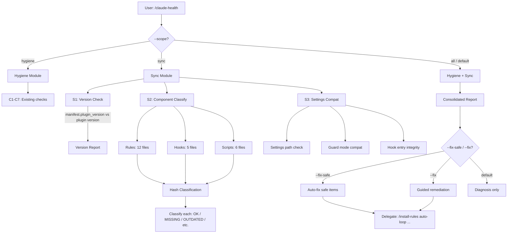
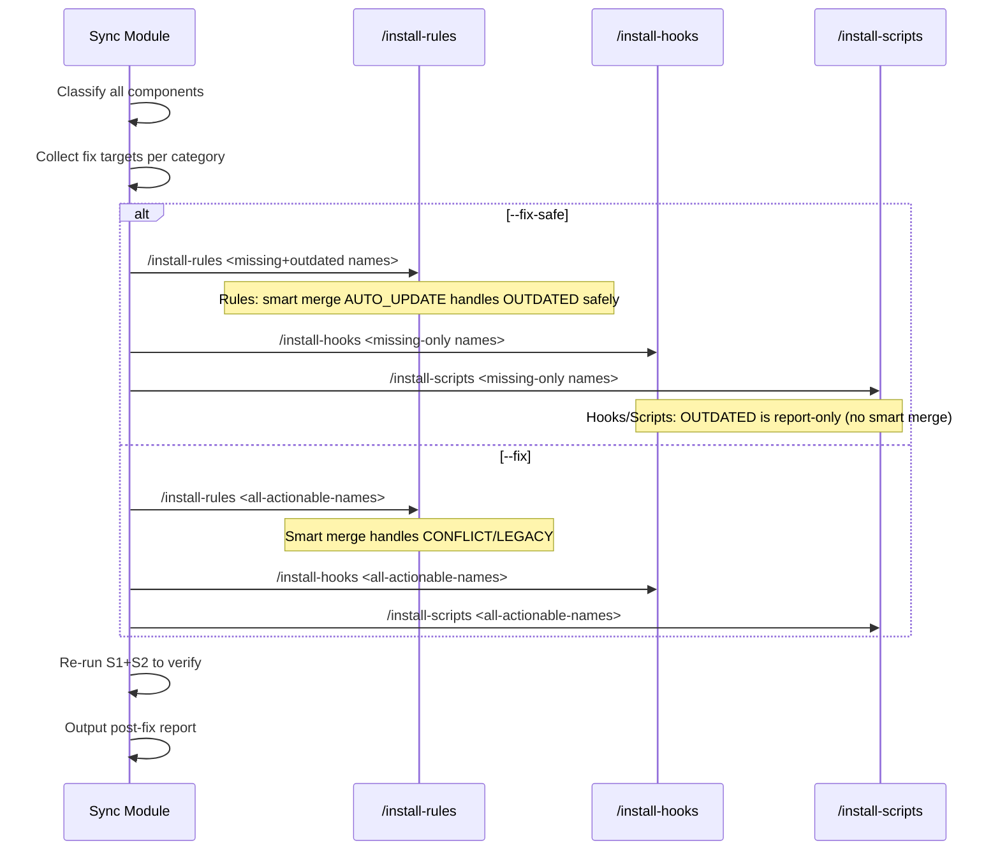

# Upgrade Doctor Technical Spec — `/claude-health` Sync Module

## 1. Requirement Summary

- **Problem**: Plugin 版本更新後，host project 的 installed assets（rules, hooks, scripts）不會自動同步。用戶必須「知道要跑」`/install-rules` 等指令，否則行為偏移（例如 auto-loop.md 缺少 Dual Review Mode 規則，late P0/P1 不會觸發 re-review loop）。現有 `/claude-health` 只檢查結構衛生，不檢查版本 drift。
- **Goals**:
  1. 主動偵測 plugin version drift（manifest vs plugin version）
  2. Per-component hash classification（OK / MISSING / OUTDATED / LOCAL_MODIFIED / CONFLICT / LEGACY / MANIFEST_GAP）
  3. Settings semantic migration detection（legacy paths, guard mode compatibility）
  4. Tiered fix strategy（report-only → `--fix-safe` → `--fix`）
  5. SessionStart lightweight warning（<50ms, version stamp only）
- **Scope**:
  - v1: sync module in `/claude-health` + SessionStart hint
  - v2 (deferred): `--json` machine-readable output, CI integration, skill script tracking

## 2. Existing Code Analysis

### Related Modules

| Module | 關聯 | 可重用 |
|--------|------|--------|
| `skills/claude-health/SKILL.md` | 現有 7 checks + P0/P1/P2 framework | **擴展目標** — 加 sync module |
| `commands/claude-health.md` | Command entry, `--fix` argument | 需擴展 `--scope`, `--fix-safe` |
| `commands/install-rules.md` | Smart merge 7-state classification | Classification 邏輯參考 + 修復委派目標 |
| `commands/install-hooks.md` | Hook scripts + settings merge | 修復委派目標 + settings compat 參考 |
| `commands/install-scripts.md` | Core + skill scripts install | 修復委派目標 |
| `.claude/.sd0x-install-state.json` | Manifest with version + hashes | **核心資料來源** |
| `scripts/namespace-hint.sh` | SessionStart hook | 擴展加 drift sentinel |
| `hooks/hooks.json` | Plugin hook registry | SessionStart hook 定義 |

### Current Manifest State (at proposal time, 2026-03-14)

```json
{
  "schema_version": 1,
  "plugin_version": "1.8.12",    // ← stale at proposal time
  "rules": { "auto-loop.md": { "hash": "5de88f8..." }, ... }
  // ← missing: hook_scripts, scripts (at proposal time)
}
```

At proposal time, plugin version was `2.0.3` — manifest had major version drift（1.x → 2.x）and only tracked rules; hook_scripts and scripts keys were missing. This motivated the upgrade-doctor feature.

### Drift Surface

| Category | File Count | Manifest Tracked |
|----------|-----------|-----------------|
| Rules | 12 | ✅ Yes |
| Hook scripts | 5 | ❌ Missing key |
| Core scripts | 6 | ❌ Missing key |
| Skill scripts | 18 | ❌ Not tracked |
| **Total core** | **23** | **12 / 23 (52%)** |

### Files to Modify

| File | Change |
|------|--------|
| `skills/claude-health/SKILL.md` | 加 sync module（S1-S3 checks）|
| `commands/claude-health.md` | 加 `--scope`, `--fix-safe` arguments, 擴展 `allowed-tools` |
| `scripts/namespace-hint.sh` | 加 drift sentinel（version stamp 比對）|
| `hooks/hooks.json` | 無需修改（SessionStart 已指向 namespace-hint.sh）|
| `CLAUDE.md` / `.claude/CLAUDE.md` | Command Quick Reference 更新 `/claude-health` 描述 |

## 3. Technical Solution

### 3.1 Architecture Design



### 3.2 Sync Module Checks

#### S1: Version Check

| Check | Method | Severity |
|-------|--------|----------|
| Manifest exists | Read `.claude/.sd0x-install-state.json` | Missing → P1 |
| Manifest parseable | JSON.parse | Parse error → P1 |
| `schema_version` current | `== 1` | Mismatch → P2 (future schema migration) |
| `plugin_version` matches | manifest vs `.claude-plugin/plugin.json` or `package.json` | Mismatch → P1 |
| Manifest completeness | Has `rules` + `hook_scripts` + `scripts` keys | Missing key → P2 (`MANIFEST_GAP`) |

**Plugin version resolution** (same as install-* commands):

```
.claude-plugin/plugin.json → package.json → "unknown"
```

#### S2: Component Classification

For each managed component (rules, hooks, scripts), compute 3 hashes and classify:

```bash
manifest_hash  = manifest[category][filename].hash    # null if missing
local_hash     = git hash-object --no-filters <local-path>  # null if file missing
plugin_hash    = git hash-object --no-filters <plugin-path>  # source of truth
```

**Classification table** (read-only diagnostic; maps to install-rules states for delegation):

| Doctor State | Condition | Severity | install-rules Equivalent | Description |
|-------|-----------|----------|--------------------------|-------------|
| `OK` | local == manifest == plugin | ✅ | `SKIP` | In sync |
| `MISSING` | local_hash is null, plugin exists | P1 | `FRESH_INSTALL` | Not installed |
| `OUTDATED` | local == manifest, plugin != manifest | P1 | `AUTO_UPDATE` | Plugin updated, no local edits — safe to update |
| `LOCAL_MODIFIED` | local != manifest, plugin == manifest | ✅ | `KEEP_LOCAL` | User edited, plugin unchanged — keep |
| `CONFLICT` | local != manifest, plugin != manifest | P2 | `CONFLICT` | Both changed — needs resolution |
| `LEGACY` | manifest_hash is null, local exists | P2 | `LEGACY` | Pre-manifest file — needs migration |
| `MANIFEST_GAP` | manifest category key missing | P2 | N/A | Category not tracked in manifest |
| `TOMBSTONED` | manifest `deleted: true`, local missing | ✅ | `SKIP_DELETED` | User previously deleted — respect tombstone |

**Delegation rule**: Doctor classifies → maps to install-rules equivalent → delegates to `/install-*` with appropriate arguments. Doctor never performs file writes itself.

**Inventory sources** (declarative, hardcoded in v1; v2 may derive from install command metadata):

| Category | Expected Files | Plugin Source |
|----------|---------------|---------------|
| Rules | `auto-loop.md`, `codex-invocation.md`, `fix-all-issues.md`, `framework.md`, `testing.md`, `security.md`, `git-workflow.md`, `logging.md`, `docs-writing.md`, `docs-numbering.md`, `self-improvement.md`, `context-management.md` | `rules/*.md` |
| Hooks | `pre-edit-guard.sh`, `post-edit-format.sh`, `post-tool-review-state.sh`, `stop-guard.sh`, `post-compact-auto-loop.sh` | `hooks/*.sh` |
| Scripts | `precommit-runner.js`, `verify-runner.js`, `dep-audit.sh`, `commit-msg-guard.sh`, `pre-push-gate.sh`, `lib/utils.js` | `scripts/` |

#### S3: Settings Compatibility

| Check | Method | Severity |
|-------|--------|----------|
| Legacy hook paths | Grep `settings.json` for bare `.claude/hooks/` without `$CLAUDE_PROJECT_DIR` | Found → P2 |
| `STOP_GUARD_MODE` present | Read `env.STOP_GUARD_MODE` (also check legacy `hooks_config.stop_guard_mode`) | **Inverted since hook-lightweighting（2026-08-13）**: the setting is retired dead config — found in either → P2 (recommend removal; the migration script deregisters it). Absent → ✅. |
| Hook entry integrity | Each installed hook script has matching settings entry | Missing entry → P1 |
| Orphan hook entries | Settings references script that doesn't exist on disk | Orphan → P2 |

**Legacy path detection regex**:

```
"\.claude/hooks/[^"]+\.sh"  (without leading "$CLAUDE_PROJECT_DIR")
```

### 3.3 SessionStart Drift Sentinel

擴展現有 `scripts/namespace-hint.sh`，加入 lightweight version check：

```bash
#!/usr/bin/env bash
# SessionStart hook: namespace guidance + drift sentinel

echo "Plugin sd0x-dev-flow: all /command references should be invoked as /sd0x-dev-flow:command"
echo "Plugin scripts: use 'bash scripts/run-skill.sh <skill> <script> [args]' for execution"

# --- Drift sentinel (< 50ms budget) ---
REPO_ROOT=$(git rev-parse --show-toplevel 2>/dev/null) || exit 0
MANIFEST="$REPO_ROOT/.claude/.sd0x-install-state.json"

# Skip if no manifest (first-time user, or plugin source repo)
[ -f "$MANIFEST" ] || exit 0

# Extract manifest plugin_version (no jq dependency — use grep+sed)
MANIFEST_VER=$(grep -o '"plugin_version"[[:space:]]*:[[:space:]]*"[^"]*"' "$MANIFEST" \
  | sed 's/.*"plugin_version"[[:space:]]*:[[:space:]]*"\([^"]*\)".*/\1/')

# Resolve current plugin version
# Priority: CLAUDE_PLUGIN_ROOT (set by Claude runtime) → script's own directory
SCRIPT_DIR="$(cd "$(dirname "$0")" && pwd)"
PLUGIN_ROOT="${CLAUDE_PLUGIN_ROOT:-$(cd "$SCRIPT_DIR/.." && pwd)}"
PLUGIN_JSON="$PLUGIN_ROOT/.claude-plugin/plugin.json"
PKG_JSON="$PLUGIN_ROOT/package.json"
if [ -f "$PLUGIN_JSON" ]; then
  CURRENT_VER=$(grep -o '"version"[[:space:]]*:[[:space:]]*"[^"]*"' "$PLUGIN_JSON" \
    | head -1 | sed 's/.*"\([0-9][^"]*\)".*/\1/')
elif [ -f "$PKG_JSON" ]; then
  CURRENT_VER=$(grep -o '"version"[[:space:]]*:[[:space:]]*"[^"]*"' "$PKG_JSON" \
    | head -1 | sed 's/.*"\([0-9][^"]*\)".*/\1/')
fi

[ -z "$CURRENT_VER" ] && exit 0
[ "$MANIFEST_VER" = "$CURRENT_VER" ] && exit 0

# Version mismatch — emit warning
echo ""
echo "SessionStart hook additional context: ⚠️ Plugin updated ($MANIFEST_VER → $CURRENT_VER). Installed rules/hooks may be outdated. Run \`/sd0x-dev-flow:claude-health --scope sync\` to check."
```

**Performance budget**: 3 file reads (manifest, plugin.json, package.json) + grep/sed. No hash computation. Target < 50ms.

**Self-detection**: 在 plugin source repo 中，`.claude/.sd0x-install-state.json` 的 version 可能故意 lag（用於測試 smart merge）。Sentinel 在 plugin source repo 中仍然會輸出 warning，這是可接受的（開發者 knows）。

### 3.4 `--fix-safe` and `--fix` Tiers

#### Fix Tiers

| Tier | Flag | Auto-applies to | Excludes | Requires confirm |
|------|------|-----------------|----------|------------------|
| Report | (default) | — | — | — |
| Safe | `--fix-safe` | `MISSING`, `OUTDATED` (proven local==manifest only) | `MANIFEST_GAP`, `CONFLICT`, `LEGACY`, `TOMBSTONED` | No |
| Guided | `--fix` | All actionable states including `CONFLICT`, `LEGACY`, `MANIFEST_GAP` | `TOMBSTONED` (respect user deletion) | Yes (per-file) |

**Safety invariant**: `--fix-safe` never uses `--force` on files where local hash differs from manifest hash.

**Category-specific delegation**:

| Category | `OUTDATED` safe fix | `MISSING` safe fix | Rationale |
|----------|--------------------|--------------------|-----------|
| Rules | `/install-rules <names>` (no `--force`; smart merge `AUTO_UPDATE` path handles safely) | `/install-rules <names>` (smart merge `FRESH_INSTALL` path) | install-rules has full smart merge with manifest-aware classification |
| Hooks | Report only → suggest `/install-hooks <names> --force` | `/install-hooks <names>` | install-hooks skips differing content without `--force`; safe tier cannot guarantee safety without manifest-aware merge |
| Scripts | Report only → suggest `/install-scripts <names> --force` | `/install-scripts <names>` | install-scripts skips differing content without `--force`; same limitation |

> **Why hooks/scripts OUTDATED is report-only in safe tier**: `/install-hooks` and `/install-scripts` use simple skip/force semantics (no manifest-aware smart merge like `/install-rules`). Passing `--force` could overwrite local modifications. Only `/install-rules` has the 7-state classification to safely auto-update. Until hooks/scripts gain smart merge, `OUTDATED` in those categories requires user confirmation (`--fix` tier).

#### Fix Delegation

Sync module 不重複 smart merge 邏輯。Fixes 委派給現有 install commands：



**Targeted delegation**（非 `--all`）：只傳入需要修復的檔案名稱，避免不必要的 churn。

#### Settings Compat Fix

S3 settings compatibility issues 全部委派給 `/install-hooks`（避免 sync module 直接操作 JSON）：

| Issue | Fix Action | Delegation |
|-------|-----------|------------|
| Legacy hook paths | Path migration to `$CLAUDE_PROJECT_DIR` format | `/install-hooks --all`（內建 legacy migration 邏輯） |
| Leftover `STOP_GUARD_MODE` | Remove retired env var (hook-lightweighting) | `node scripts/migrate-hook-lightweighting.js --repo <root>` |
| Orphan hook entries | Report only（不自動刪除，可能是用戶自訂）| 無（diagnosis only）|
| Missing hook entries | Add settings entry for installed script | `/install-hooks <missing-names>` |

**Design principle**: Sync module 是純診斷層，所有 file mutation 委派給 install-* commands。這確保 JSON merge 邏輯只有一個 authoritative 實作。

### 3.5 Command Contract

```
/claude-health [--scope hygiene|sync|all] [--fix] [--fix-safe]
```

| Argument | Description | Default |
|----------|-------------|---------|
| `--scope hygiene` | Only run C1-C7 hygiene checks | — |
| `--scope sync` | Only run S1-S3 sync checks | — |
| `--scope all` | Run both modules | **default** |
| `--fix` | Auto-fix P1 hygiene + guided sync remediation | — |
| `--fix-safe` | Auto-fix P1 hygiene + safe sync fixes only. Rules: MISSING + OUTDATED; Hooks/Scripts: MISSING only (OUTDATED reported with suggested command) | — |

**Argument conflict rule**: `--fix` and `--fix-safe` are mutually exclusive. If both specified, error with guidance.

**Reserved (v2)**: `--json` for machine-readable output (not implemented in v1).

**Backward compatibility**: 原本 `--fix` 只修 hygiene P1。擴展後 `--fix` 同時包含 sync guided remediation。這不是 breaking change — 原本 sync module 不存在，所以新行為是純增量。

### 3.6 `allowed-tools` Expansion

現有 `/claude-health` command:

```
allowed-tools: Read, Grep, Glob, Bash(ls:*), Bash(find:*), Bash(wc:*), Bash(du:*), Bash(rm:*)
```

Sync module 需要：

| New Tool | Purpose |
|----------|---------|
| `Bash(git:*)` | `git hash-object --no-filters`, `git rev-parse` |

**Both command AND skill need update**:

Command (`commands/claude-health.md`):

```
allowed-tools: Read, Grep, Glob, Bash(ls:*), Bash(find:*), Bash(wc:*), Bash(du:*), Bash(rm:*), Bash(git:*)
```

Skill (`skills/claude-health/SKILL.md`):

```
allowed-tools: Read, Grep, Glob, Bash(ls:*), Bash(find:*), Bash(wc:*), Bash(du:*), Bash(git:*)
```

> Note: Skill `allowed-tools` is the effective constraint when loaded via `@skills/`. Command `allowed-tools` applies when invoked as `/claude-health`. Both must include `Bash(git:*)`.

Fix delegation 不需要額外 tools — 委派透過 Skill tool 調用 `/install-*`，Skill tool 是 always-available。

## 4. Risks and Dependencies

| Risk | Impact | Mitigation |
|------|--------|------------|
| Hash computation adds latency | `/claude-health --scope all` 可能需 1-2s（23 files × `git hash-object`）| `--scope sync` 專用旗標讓用戶控制；SessionStart 不做 hash |
| Plugin source repo 誤報 | 在 sd0x-dev-flow 開發環境，manifest version 故意 lag | 可接受 — 開發者理解。可加 `DOCTOR_SKIP=1` env var |
| `--fix-safe` 覆蓋用戶有意刪除的檔案 | `MISSING` 分類可能包含用戶故意刪除的 rule | 檢查 manifest tombstone（`deleted: true`）— `TOMBSTONED` 狀態被 `--fix-safe` 排除 |
| Skill tool delegation chain | `/claude-health` → Skill(`/install-rules`) 可能需要多層確認 | `--fix-safe` 對 rules 委派不帶 `--force`（依賴 smart merge AUTO_UPDATE）；hooks/scripts OUTDATED 為 report-only，不委派 |
| Sentinel version resolution | 若 `CLAUDE_PLUGIN_ROOT` 未設且 script 位置不正確，可能讀到 host project 的 package.json | Sentinel 從 `dirname "$0"` 推導 plugin root，`CLAUDE_PLUGIN_ROOT` 作為 override |

## 5. Work Breakdown

| # | Task | Effort | Dependencies |
|---|------|--------|-------------|
| 1 | `namespace-hint.sh` 加 drift sentinel | S | 無 |
| 2 | `SKILL.md` 加 sync module S1 (version check) | S | 無 |
| 3 | `SKILL.md` 加 sync module S2 (component classify) | M | Task 2 |
| 4 | `SKILL.md` 加 sync module S3 (settings compat) | S | Task 2 |
| 5 | `commands/claude-health.md` 擴展 arguments + allowed-tools | S | Task 2-4 |
| 6 | Consolidated report template（merge hygiene + sync） | S | Task 5 |
| 7 | `--fix-safe` delegation logic | M | Task 3, 5 |
| 8 | `--fix` guided remediation flow | M | Task 7 |
| 9 | CLAUDE.md command description update | S | Task 5 |
| 10 | Tests for sync module checks | M | Task 3 |

Effort: S = small (< 30 min), M = medium (30-60 min)

## 6. Testing Strategy

| Test Type | Coverage |
|-----------|----------|
| Unit | S1: version mismatch detection (mock manifest + plugin.json) |
| Unit | S2: classification logic for each of 8 states (including TOMBSTONED) |
| Unit | S3: legacy path regex, orphan entry detection |
| Integration | SessionStart sentinel output with various manifest states |
| Integration | `--fix-safe` delegation produces correct `/install-*` invocations |
| Edge | Missing manifest → all `MISSING` or `MANIFEST_GAP` |
| Edge | Corrupt manifest (invalid JSON) → fallback to full scan |
| Edge | Plugin source repo (`.claude/` is symlink) → graceful handling |

## 7. Open Questions

| # | Question | Impact | Proposed Answer |
|---|----------|--------|-----------------|
| 1 | Skill scripts (18 files) 是否納入 S2 tracking? | Scope expansion | v1 不追蹤，v2 加入（需先讓 install-scripts 追蹤 skill scripts in manifest） |
| 2 | `--json` output 格式？ | CI integration | v2 deferred — 需要定義 JSON schema |
| 3 | SessionStart sentinel 在 plugin source repo 要不要 suppress？ | DX | 不 suppress — 開發者理解 manifest 故意 lag |
| 4 | `--fix` 委派失敗時的 rollback 策略？ | 安全性 | v1 不 rollback — 各 install-* command 已有自己的衝突處理 |
