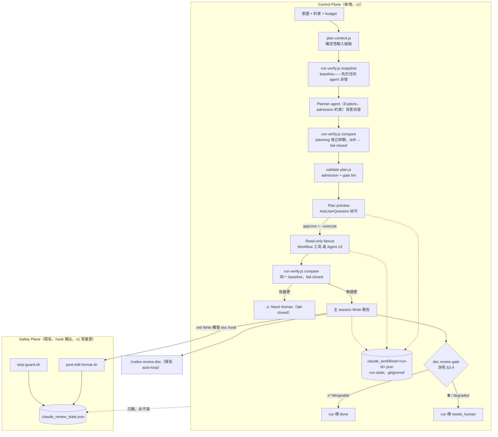
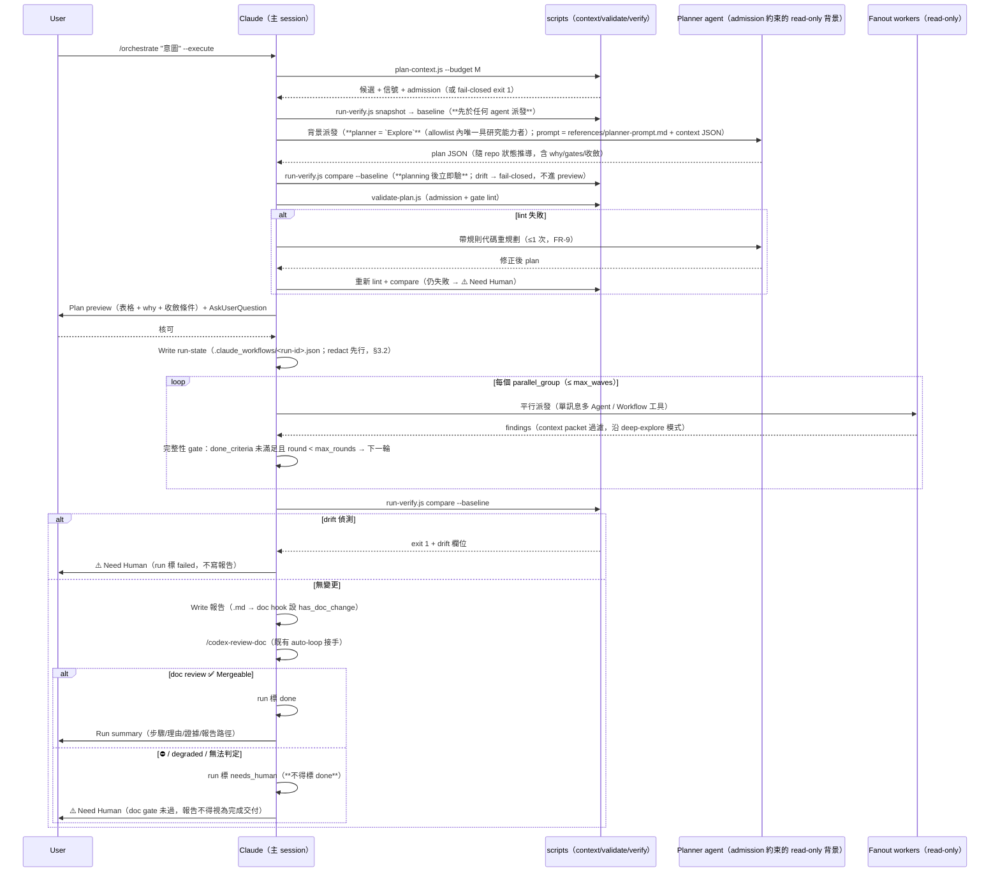

# Tech Spec: Workflow Orchestration v1 — Report-only `/orchestrate`（Option C 兩平面）

> **Doc class**: Lifecycle — Phase 2 tech spec（依 `@rules/docs-numbering.md`）。
> **Created**: 2026-06-12
> **Requirements**: [1-requirements.md](./1-requirements.md)
> **Feasibility**: [0-feasibility-study.md](./0-feasibility-study.md)（Option C two-plane 決策，v1 report-only）

## 1. Requirement Summary

### 1.1 Problem

近百個 skill（執行期以 `docs/skill-catalog.yml` 為準，as-built 98 筆 command entries，含 `/orchestrate` 自身）的編排決策 100% 人工（人腦 + `CLAUDE.md` 流程表）。需要「宣告意圖 → agent 自動推導計畫 → 預覽 → 受控執行」的能力，**且不可繞過 hook 強制的安全 gate**（feasibility §1 核心張力）。

### 1.2 Goals（v1）

| # | Goal | 來源 |
|---|------|------|
| G1 | `/orchestrate` skill：意圖 + 約束 + budget + 完成定義 → planner agent 產出**隨 repo 狀態變動**的 workflow 計畫 | FR-1/FR-2、SC-1 |
| G2 | 計畫可預覽（plan preview）；執行前經人核可（human gate） | FR-3、NFR-1 |
| G3 | **Report-only 執行**：fanout worker 一律 read-only（deny-by-default admission）；唯一 **user-facing repo 內容 mutation** = 主 session `Write` 報告（走既有 doc hook + `/codex-review-doc`）。control-plane run-state 寫入為 gitignored bookkeeping、對 safety plane 惰性（§3.2） | FR-4、NFR-1、feasibility §7 |
| G4 | 兩平面分離：control-plane run-state（`.claude_workflows/<run-id>.json`）獨立於 hook 獨佔的 safety plane（`.claude_review_state.json`，orchestrator 只讀不寫） | feasibility Option C |
| G5 | Pre/post 無變更驗證（HEAD/branch/worktree/porcelain+content hash），任一變動 → fail-closed | SC-2 |
| G6 | 新 skill 進 `docs/skill-catalog.yml` 即自動成為規劃候選，不改編排核心 | FR-11、SC-5 |
| G7 | 三種編排形狀：循序 / 平行 / 重複直到收斂（wave + 完整性 gate） | FR-5 |

### 1.3 Non-Goals（v1 明確排除）

| 排除 | 理由 / 去處 |
|------|------------|
| Mutation 編排（worker 改檔） | 護欄未齊（strict preflight、Bash mutation detector、tamper protection、Spike 2/3）——見 feasibility §7 護欄 (1)-(7)、§7 OQ |
| 為全部 catalog skills + agents 補 `mutation:` metadata | Spike 3（~2-3 人日），v2 前置 |
| Hook 端強制（orchestrate 專屬 hook / sentinel 解析） | v1 純行為層 + scripted lint；不動任何 hook（SC-4 零回歸的最強保證） |
| 跨 session 編排 / 多人協作 | requirements Non-Goals |
| `safety_epoch` + CAS | feasibility §8 OQ，v2 |

## 2. Existing Code Analysis

### 2.1 Related Modules

| Module | 角色 | 證據 |
|--------|------|------|
| `docs/skill-catalog.yml` | 規劃候選的單一來源（as-built 98 筆 command entries；欄位 `command`/`category`/`featured`/`public`，**`use_when` 為選填**——目前僅 19 筆有）。候選描述不足時以 SKILL.md frontmatter `description` 補（同 `scripts/generate-readme-catalog.js` 的讀取模式）；**數字以執行期讀取為準，本表僅 snapshot** | 檔案本身；`/update-readme` 由它產 README catalog |
| `agents/*.md`（15 個） | fanout worker 候選；frontmatter `tools:` 為 admission 訊號之一（**不可單獨信任**，見 feasibility §3.3） | `agents/performance-optimizer.md:4`（純 `Read,Grep,Glob`）等 |
| `skills/deep-explore/SKILL.md` | 可重用 fanout 模式：wave（2-3 agent × ≤2-3 wave）、80/20 contract、context packet、完整性 gate | `SKILL.md` Wave 1/Inter-Wave 區段 |
| `skills/next-step/scripts/analyze.js` | repo 狀態信號（phase + findings）——planner 輸入的現成來源 | `analyze.js`（17 條 findings 規則） |
| `hooks/post-edit-format.sh` | Safety plane 寫入者。**關鍵事實**：change-flag 分類 regex——code 副檔名集（ts/tsx/js/…/sh/bash/zsh）與 doc 副檔名集（md/mdx）——**`.json`/`.yml` 皆不在內**，故 run-state 檔經 `Write` 寫入不觸發任何 flag | `post-edit-format.sh`（code/doc 分類 regex；引用符號語意非行號） |
| `hooks/stop-guard.sh` | 單向 true→false reconciliation（`-uall`）：**untracked 且未 gitignore 的檔會讓 worktree 永不乾淨** → run-state 目錄必須 gitignore | `stop-guard.sh`「Stale-state git check」 |
| `scripts/run-skill.sh` + `test/scripts/next-step-analyze.test.js` | skill script 執行與測試慣例（`skills/<name>/scripts/*.js` → `test/scripts/<name>-<script>.test.js`） | 檔案本身 |

### 2.2 可重用 / 需新建

| 資產 | 動作 | 用途 |
|------|------|------|
| `skills/orchestrate/SKILL.md` + `references/` | **New** | 編排主流程 + planner prompt 模板 + plan schema + 執行政策 |
| `skills/orchestrate/scripts/plan-context.js` | **New** | 確定性組裝 planner 輸入（catalog + agents + repo 信號 + admission + budget fail-closed） |
| `skills/orchestrate/scripts/validate-plan.js` | **New** | Plan lint = v1 admission controller（deny-by-default + gate 完備性 + why 必填 + v1 禁 mutating 執行） |
| `skills/orchestrate/scripts/run-verify.js` | **New** | pre/post 無變更驗證（snapshot / compare） |
| `skills/orchestrate/references/admission-allowlist.json` | **New** | Fanout-eligible 名單（curated，deny-by-default） |
| `.gitignore` | **Modify** | 加 `.claude_workflows/` |
| `docs/skill-catalog.yml` / CLAUDE quick-ref ×3 | **Modify** | `/orchestrate` 登錄（planning category） |
| `test/scripts/orchestrate-*.test.js` + `test/skills/orchestrate.test.js` | **New** | §6 測試映射 |
| Hooks（全部） | **不動** | v1 零 hook 變更（SC-4） |

### 2.3 既有約束（已驗證，from feasibility）

| 約束 | 對設計的影響 |
|------|-------------|
| `allowed-tools` 不可信任為 read-only 判據 | admission 用 curated allowlist（明確列舉 + 理由），非 frontmatter 推導 |
| `Bash` 改檔不設 change flag | fanout worker 即使 allowlisted 仍可能經 Bash 改檔 → **pre/post 驗證是硬後盾**（雙層防禦） |
| stop-guard 預設 warn | v1 report-only 不依賴 strict；mutating 編排（v2）才需 strict preflight |
| DW（`Workflow` 工具）為付費 research preview | DW 為可選 backend；不可用時退回 background `Agent`（≤3 並行），admission 同一套 |
| compaction 後 `post-compact-auto-loop.sh` 不知 workflow 狀態 | run-state 落盤 + `--resume <run-id>`；hook 整合列 v2 OQ |

### 2.4 已驗證事實（撰寫時 spot-check，引用符號語意為準）

| 主張 | 狀態 |
|------|------|
| `post-edit-format.sh` code 分類 regex 不含 `.json`/`.yml`；doc 分類僅 `.md`/`.mdx` | ✅ 已驗證（兩段分類 regex） |
| `stop-guard.sh` reconciliation 用 bounded `-uall`（untracked 未 gitignore 會讓 worktree 永不乾淨） | ✅ 已驗證 |
| `agents/performance-optimizer.md` `tools: Read, Grep, Glob`；`coverage-analyst` 含 `Bash(find:*)`；`git-investigator` 含 `Bash(git:*)` | ✅ 已驗證（frontmatter） |
| `.gitignore` 目前**無** `.claude_workflows/`（W4.4 為 hard precondition） | ✅ 已驗證 |
| skill script 測試慣例 `test/scripts/<skill>-<script>.test.js` | ✅ 已驗證（`next-step-analyze.test.js`） |

## 3. Technical Solution

### 3.1 Architecture（兩平面）



**平面互動規則**（NFR-4 / SC-4 的設計核心）：

| 規則 | 說明 |
|------|------|
| Orchestrator 對 safety plane **只讀** | 不寫 `.claude_review_state.json`、不偽造 `has_*_change` / `*.passed`、不 emit 任何 hook-parsed sentinel |
| 唯一進入 safety plane 的路徑 = 主 session `Write` 報告 | `.md` Write → `post-edit-format.sh` 設 `has_doc_change` → 既有 `/codex-review-doc` auto-loop 接手（**刻意重用，不是繞過**） |
| run-state 不污染 safety plane | `.json` 不在 code/doc 分類 regex 內（§2.1 已驗證）→ `Write` run-state 不設任何 flag；目錄 gitignore → `-uall` reconciliation 看不到 |
| v1 不動任何 hook | Signal 4（零回歸）由「無 diff」保證，而非「diff 後測試通過」 |

### 3.2 Data Model — run-state（control plane 獨有）

**檔案**：`.claude_workflows/<run-id>.json`（gitignored；`run-id` = `<UTC yyyymmdd-HHMMSS>-<intent-slug>`，主 session 產生）

```jsonc
{
  "schema_version": 1,
  "run_id": "20260612-093000-audit-hook-failopen",
  "created_at": "2026-06-12T09:30:00Z",
  "updated_at": "2026-06-12T09:42:10Z",
  "intent": "audit 全 repo hook 的 fail-open 路徑",
  "done_definition": "報告涵蓋全部 7 個 state-touching hook，每項判定附 file:line 證據",
  "budget_tier": "M",                          // S | M | L（§3.3 T1）
  "status": "reporting",                        // planning | awaiting_approval | executing | verifying | reporting | done | needs_human | failed | aborted
                                                // done 的唯一路徑：報告之 /codex-review-doc 回 ✅ Mergeable；
                                                // ⛔ / degraded / 無法判定 → needs_human（不得標 done）
  "baseline": {                                 // run-verify.js snapshot 輸出（欄位集 = T3 檢查項，缺一不可）
    "head": "3be3372…", "branch": "main",
    "porcelain_sha256": "ab12…",                // git status --porcelain -uall 的 hash（狀態+路徑面）
    "tracked_diff_sha256": "9a8b…",             // git diff HEAD --binary 的 hash（已 dirty tracked 檔的內容面）
    "untracked_content_sha256": "7c6d…",        // untracked（--exclude-standard）檔案 path+blob hash 的 hash（內容面）
    "refs_sha256": "cd34…",                     // git for-each-ref 全 refs 的 hash（tag/ref 面）
    "local_config_sha256": "ef56…",             // git config --list --local 的 hash
    "worktrees": ["/Users/…/sd0x-dev-flow"],
    "stash_count": 0
  },
  "plan": { "steps": [ /* §3.3 T2 plan schema */ ] },
  "steps_status": { "s1": "done", "s2": "running", "s3": "pending" },
  "replan_count": 0,                            // FR-9：上限 1（v1）
  "evidence": [ { "step": "s1", "summary": "…", "refs": ["hooks/stop-guard.sh:147"] } ],
  "report_path": null                           // 完成後填報告路徑
}
```

| 設計點 | 理由 |
|--------|------|
| `Write` 工具寫入（非 Bash heredoc） | `.json` 不觸發 change flag（§2.1 驗證）；保留 transcript 可見性；不違 Bash-mutation 顧慮（這是主 session 受監看的工具呼叫） |
| 一 run 一檔，FIFO 保留最近 10 個 run 檔 | 可重入（NFR-6）；舊 run 可查（NFR-2）；skill 負責清理（超過 10 個刪最舊） |
| 落盤前過 `security-redact.js` **完整 contract**：`scanHighConfidence` truthy → **abort fail-closed**（不落盤、run 標 `needs_human`、提示改寫意圖）；medium → mask 後落盤 | 意圖/完成定義為自由文字，可能含貼上的 secret（R8）；沿 plan-review 既有 redaction 語意，禁用 medium-mask-only 弱化版 |
| `steps_status` 與 `plan` 分離 | resume 時 plan 不可變、status 可變——重跑冪等（read-only worker 無副作用） |
| 無任何 safety 欄位 | 兩平面分離的 schema 級保證——review/precommit 狀態**只**存在 safety plane |

### 3.3 API Design（3 個 scripts + 1 個 skill）

#### T1 — `plan-context.js`（確定性輸入組裝，Signal 1/5 的自動化錨點）

```
node skills/orchestrate/scripts/plan-context.js [--budget S|M|L] [--catalog <path>] [--agents-dir <path>] [--allowlist <path>]
```

| 輸出欄位（stdout JSON） | 內容 | 來源 |
|------------------------|------|------|
| `skill_candidates[]` | `{command, category, featured, public, use_when?, description}` 全 catalog 條目；`use_when` 選填，缺漏時以 SKILL.md frontmatter `description` 補位（同 `generate-readme-catalog.js` 讀取模式） | `docs/skill-catalog.yml` + `skills/*/SKILL.md`（**執行期讀取** → 新 skill 自動納入，FR-11/SC-5） |
| `agent_candidates[]` | `{name, tools, fanout_eligible, deny_reason?}` | `agents/*.md` frontmatter + allowlist 比對 |
| `repo_signals` | `{branch, head, dirty_files_count, features[]（docs/features/ 目錄列表 + 各自有哪些 lifecycle docs）}` | `git` + `fs`（Signal 1：計畫隨現況變動的素材） |
| `budget` | `{tier, max_workers, max_waves, max_plan_steps, max_context_bytes}` | tier 表（下） |
| `admission` | `{mode: "deny-by-default", allowlist: [...]}` | `references/admission-allowlist.json` |

| Budget tier | max_workers | max_waves | max_plan_steps | max_context_bytes |
|------------|:-----------:|:---------:|:--------------:|:-----------------:|
| S | 2 | 1 | 8 | 64 KiB |
| M | 3 | 2 | 15 | 128 KiB |
| L | 4 | 3 | 25 | 256 KiB |

**Fail-closed（NFR-3）**：組裝後輸出若超過 `max_context_bytes` → **exit 1 + 明確錯誤**（列出超量來源，建議升 tier 或縮範圍），絕不靜默截斷。catalog/agents 目錄缺失、YAML/frontmatter 解析失敗、**或 admission allowlist 檔缺失/解析失敗 → 一律 exit 1**（不產生部分候選；缺 allowlist 是設定錯誤，不以「全拒但繼續」弱化——單一 fail-closed contract）。

#### T2 — Plan schema + `validate-plan.js`（v1 admission controller）

Planner agent 輸出的計畫必須符合此 schema（`references/plan-schema.md` 為正典，此處節錄）：

```jsonc
{
  "intent": "…", "done_definition": "…",
  "steps": [{
    "id": "s1",
    "kind": "fanout | main-skill | verify | gate | proposed-manual",
    "target": "Explore | performance-optimizer | /codex-review-doc | …",
    "why": "必填（NFR-2/Signal 6）：為何選此 skill/agent",
    "parallel_group": "w1",                  // 同 group = 平行（FR-5 平行）
    "depends_on": ["s0"],                    // 循序（FR-5 循序）
    "converge": { "max_rounds": 2, "until": "completeness gate 描述" },  // FR-5 收斂（選填）
    "preconditions": ["docs/features/x/2-tech-spec.md 存在"],            // FR-6
    "done_criteria": "…",                                                // FR-6
    "mutating": false                        // planner 自評；validate-plan.js 複核 kind 一致性
  }],
  "stop_conditions": ["budget 用盡", "post-verify 偵測變更"],
  "required_gates": ["doc-review"]           // change-type → gate 映射結果
}
```

```
node skills/orchestrate/scripts/validate-plan.js --plan <path|stdin> --context <plan-context 輸出>
```

| Lint 規則（全部 fail-closed，違反 → exit 1 + 規則代碼） | 對應需求 |
|--------------------------------------------------------|---------|
| A1 `kind: fanout` 的 `target` 必須在 `admission.allowlist`（**deny-by-default**：不在名單 = 拒絕，不論宣告） | FR-4、feasibility admission |
| A2 `kind: fanout` 且 `mutating: true` → 拒絕（矛盾宣告） | NFR-1 |
| A3 v1 任何 `mutating: true` 步驟的 `kind` 必須是 `proposed-manual`（列入計畫、**絕不執行**，交人走正常流程） | v1 report-only |
| A4 `kind: main-skill` 的 `target` 必須存在於 plan-context `skill_candidates`（反幻覺——planner 只能選真實 skill；context 缺 `skill_candidates` 亦拒，fail-closed） | Signal 1、NFR-3 |
| G1 計畫含 code 變更類 `proposed-manual` 步驟 → `required_gates` 須含 `code-review` + `precommit`；含 `.md` 產出 → 須含 `doc-review` | Signal 2 |
| G2 v1 執行面唯一 mutation = 報告 `Write` → `required_gates` 至少含 `doc-review` | Signal 2 |
| O1 每步 `why` 非空 | Signal 6 |
| B1 `steps.length ≤ max_plan_steps`；fanout 同 group 數 ≤ `max_workers`；`converge.max_rounds ≤ max_waves`（非數值亦拒） | NFR-3 |
| S1 計畫 JSON 不含 hook-parsed sentinel 字串（`## Gate:`、bare `✅ Ready`/`✅ Mergeable`/`⛔ Blocked`/`✅ All Pass`） | 兩平面隔離 |
| SCHEMA 結構完整性：`intent`/`done_definition` 非空、`steps` 為陣列、`kind` 已知、step `id` 必填且唯一、`depends_on` 為陣列且引用存在的 id | NFR-3 |

#### T3 — `run-verify.js`（無變更驗證，SC-2 硬後盾）

```
node skills/orchestrate/scripts/run-verify.js snapshot            # stdout: baseline JSON
node skills/orchestrate/scripts/run-verify.js compare --baseline <path|stdin>   # exit 0 = 無變更；exit 1 = 列出 drift 欄位
```

| 檢查項 | 抓得到的 bypass | 超越 `git status --porcelain` 之處 |
|--------|----------------|-----------------------------------|
| `HEAD` sha | worker 偷 commit（worktree 仍乾淨） | porcelain 抓不到 |
| branch ref | `git checkout -b` | porcelain 抓不到 |
| `git status --porcelain -uall` SHA-256 | 改檔 / 新增 untracked（含 Bash 改檔——change flag 抓不到的那類） | 含 untracked（鏡射 stop-guard `-uall` 修復的教訓） |
| `git diff HEAD --binary` SHA-256 | **再改已 dirty tracked 檔的內容**（porcelain 行維持 `M file` 不變） | porcelain 只記狀態+路徑，不記內容 |
| untracked（`ls-files --others --exclude-standard`）path+blob hash SHA-256 | **再改既有 untracked 檔的內容**（porcelain 行維持 `?? file` 不變）；gitignored 檔（如 run-state）合法寫入不觸發 | porcelain 只記狀態+路徑，不記內容 |
| `git for-each-ref --format='%(refname)%(objectname)'` SHA-256 | **tag / branch ref / 其他 ref 的新建或移動**（HEAD/branch 檢查蓋不到的 ref 面） | porcelain 抓不到 |
| `git config --list --local` SHA-256 | **改 local git config**（含 `core.hooksPath` 竄改） | porcelain 抓不到 |
| `git worktree list --porcelain` | worker 偷開 worktree | 新攻擊面 |
| `git stash list` count | `git stash`（把變更藏起來讓 porcelain 變乾淨；stash ref 亦被 for-each-ref 覆蓋——雙重） | porcelain 抓不到 |

**Dirty-baseline 政策**：v1 **支援 dirty 起點**（本 repo 常態為開發中 dirty）——比對語意是「**無新 drift**」（snapshot 時的 porcelain/content/refs/config hash 與 compare 時逐項相等），非「必須 clean start」。既有 dirty 檔不阻擋 run；任何**新增**變化（hash 改變，含已 dirty 檔的內容再變動）即 fail-closed。

Compare 失敗（任一 drift）→ skill 標 run `failed` + 輸出 `⚠️ Need Human`（附 drift 欄位與修復指引），**不寫報告、不嘗試自動回復**（回復本身是 mutation）。宣告式外部副作用（如 Jira）：v1 fanout worker 名單無外部寫入工具，故「宣告外部副作用 = ∅」即為驗證（名單變更時須重審此假設——寫入 allowlist 檔的 review 義務）。**已知不在 v1 驗證範圍**：repo 之外的檔案系統寫入（如 `~/.claude/`）——由 allowlist 縮窄 + worker prompt 契約管理，正面偵測列 v2 OQ。

#### T4 — `/orchestrate` skill 介面

```
/orchestrate "<意圖>" [--budget S|M|L] [--dry-run] [--execute] [--resume <run-id>] [--backend dw|agent]
```

| Flag | 行為 |
|------|------|
| （無 flag）/ `--dry-run` | 規劃 + 預覽即止（plan preview = 預設交付物，FR-3） |
| `--execute` | 預覽 + **AskUserQuestion 核可後**執行 read-only fanout → verify → 報告（NFR-1 human gate；核可不可被 session 快取假定） |
| `--resume <run-id>` | 讀 run-state → 以**原 baseline** compare：無 drift → 續跑 `pending` 步驟（read-only 冪等，NFR-6）；**有 drift → run 標 `needs_human` 並停**（fail-closed——中斷期間的變化無法歸因，不得重拍 baseline 洗白；要繼續只能開新 run = 新 baseline + 新核可） |
| `--backend` | 強制 fanout 後端；預設 auto（`Workflow` 工具可用則用，否則 background `Agent` ≤3 並行——admission 同一套，feasibility「所有後端一律 deny-by-default」） |

**Plan preview 範例**（兩種任務形狀的對照）：

| 意圖 | 計畫骨架（節錄） |
|------|----------------|
| 「audit 全 repo hook 的 fail-open 路徑」（UC-2，可執行） | s1-s3 `fanout`×3（Explore，shard = hooks 三組，why=「7 個 state-touching hook 依寫入路徑分群」）→ s4 `verify`（完整性 gate，converge max 2）→ s5 報告 `Write` → s6 `gate`（doc-review）。全步可執行 |
| 「完成 feature X 並確保品質」（UC-1，plan-only） | s1 `main-skill` `/tech-spec`（why=「2-tech-spec.md 不存在」）→ s2 `proposed-manual`（實作，mutating=true，**不執行**）→ s3-s4 `gate`（code-review + precommit，G1 強制入計畫）→ s5 `proposed-manual` doc sync。mutating 步驟交人走正常流程 |

### 3.4 Core Logic（執行流程）



**Baseline 時序不變量**（🔴 教訓固化）：`run-verify.js snapshot` 必須**先於任何 agent 派發**（含 planner）——否則 planner 期間的 mutation 會被併入 baseline，report-only 證明失效。planner 與 fanout worker 受**同一** admission allowlist 約束；planning 結束、preview 之前須先 compare 一次（早期攔截），execute 結束後再 compare 一次（最終攔截）。同一 baseline 全程沿用。

**Planner prompt 契約**（`references/planner-prompt.md`，遵 `rules/codex-invocation.md` 精神）：

| 規則 | 內容 |
|------|------|
| 輸入 | plan-context JSON（候選 + 信號）+ 意圖 + plan schema。**不含**Claude 預擬的步驟（planner 獨立推導，否則 FR-2 的「agent 動態推導」變 rubber stamp） |
| 輸出 | 純 plan JSON（schema §3.3 T2），每步附 `why` |
| 狀態感知要求 | 必須引用 `repo_signals` 解釋取捨（如「`2-tech-spec.md` 已存在 → 跳過 `/tech-spec`」）——Signal 1 的可追溯證據 |
| 邊界 | 不得規劃 allowlist 外的 fanout；mutating 構想一律 `proposed-manual` |

**輸出隔離契約**（鏡射 plan-review 的 namespace 教訓）：`/orchestrate` 自身輸出**禁止**出現 `## Gate:`、bare `✅ Ready` / `✅ Mergeable` / `⛔ Blocked` / `✅ All Pass`；run 總結使用 `## Orchestrate Run Summary` + `[ORCHESTRATE_RUN] run_id=… status=…` 結構行（純行為層標記，無 hook 解析——v1 不新增 hook）。報告寫入後的 doc gate sentinel 由 `/codex-review-doc` 自己輸出（合法路徑）。

**Admission allowlist v1**（`references/admission-allowlist.json`，curated + 每項理由；**收窄原則：驗證面必須 ⊇ 攻擊面，否則不進名單**）：

| Entry | 類型 | 理由 | 殘餘風險（由 T3 pre/post 驗證兜底） |
|-------|------|------|-------------------------------------|
| `Explore` | built-in agent | harness 定義排除 Edit/Write/NotebookEdit；**deep-explore 既有 fanout baseline**（repo 已接受的暴露，非新增攻擊面）；**兼任 planner**（名單內唯一具研究能力者，§3.4） | 有 Bash → 理論可改檔/改 git；由 prompt read-only 契約 + T3 全項 git-scoped 檢查（porcelain+content hashes/refs/config/worktree/stash）正面攔截；repo 外寫入不在 v1 驗證面（v2 OQ） |
| `performance-optimizer` | repo agent | `tools: Read, Grep, Glob` 純讀 | 無 |

**v1 明確排除**（🔴 教訓）：`coverage-analyst`（`Bash(find:*)` 含 `-exec`/`-delete` 寫面）與 `git-investigator`（`Bash(git:*)` 含 tag/config/ref 等寫操作，原 HEAD/branch/stash 檢查蓋不住——T3 已補 refs/config hash，但 deny-by-default 精神下「新增暴露 + 無既有 fanout 先例」不足以換取收益）→ fanout-denied；歷史考古類步驟以 `main-skill`（主 session 跑 `/git-investigate`）或 `proposed-manual` 形式入計畫。其餘 13 repo agents + 全部 skills 一律 fanout-denied（可作 `main-skill` / `proposed-manual` 步驟出現於計畫，但不得作 fanout worker）。**Allowlist 檔案本身受測試鎖定**：每 repo-agent entry 的 frontmatter `tools` 與宣告理由一致，名單變更必過 review + 重審 T3 驗證面涵蓋性。

## 4. Risks and Dependencies

| # | Risk | Likelihood | Impact | Mitigation |
|---|------|-----------|--------|------------|
| R1 | Planner 幻覺：規劃不存在的 skill / 繞 admission | Medium | Medium | `validate-plan.js` fail-closed lint（A1-S1）+ plan preview human gate；目標（target）必須存在於 plan-context 候選集 |
| R2 | Allowlisted worker（含 planner）經 Bash 改檔/改 git metadata（change flag 抓不到） | Low | High | **雙層**：admission 收窄至 Explore + performance-optimizer（驗證面 ⊇ 攻擊面原則）+ T3 pre/post 驗證正面攔截（HEAD/branch/porcelain-uall/**tracked+untracked content hash**/**refs/local-config**/worktree/stash）；snapshot **先於任何 agent 派發**；planning 後 + execute 後各 compare 一次；drift → fail-closed 不寫報告 |
| R3 | run-state 與 safety state 混淆（兩平面分歧） | Low | High | schema 級分離（run-state 無 safety 欄位）+ orchestrator 只讀 safety plane + 測試斷言 run 過程 `.claude_review_state.json` 不被 skill 寫入 |
| R4 | DW preview API 變動 / 不可用 | Medium | Low | backend 可插拔；預設 fallback background `Agent` ≤3（feasibility Backup B = C 去 DW，執行後端互換） |
| R5 | compaction 中斷 run（post-compact hook 不知 workflow 狀態） | Medium | Medium | run-state 落盤 + `--resume`；read-only 步驟冪等可重跑；hook 級 resume 整合列 v2 OQ |
| R6 | 計畫品質不如人腦編排（採用阻力） | Medium | Low | preview = 預設交付物（人可改可棄）；`why` 必填提供可審視性；pilot 量測後迭代 planner prompt |
| R7 | sentinel 污染（orchestrate 輸出誤觸 hook 解析） | Low | High | 輸出隔離契約 + S1 lint + skill 結構測試 grep 禁字 |
| R8 | run-state 檔累積 / 洩漏敏感意圖 | Low | Medium | FIFO 10 檔清理；gitignore；意圖文字過 `security-redact.js` **完整 contract**（high-confidence → abort 不落盤 + `needs_human`；medium → mask）——禁 medium-mask-only 弱化版 |

**Dependencies**：

| Dependency | Type | Status |
|------------|------|--------|
| `docs/skill-catalog.yml` 持續維護 | Internal | 已有（`/update-readme` 流程共用） |
| `Workflow` 工具（DW preview） | External（可選） | 可用則用；R4 fallback 已設計 |
| `security-redact.js` | Internal | 已 ship（plan-review 共用） |
| Spike 1/1b 結論（mutation 解禁前置） | Internal | 已完成（feasibility §8）——**v1 不依賴**，v2 mutation 平面才依賴 |

## 5. Work Breakdown

| ID | Task | Depends | Size | Test mapping |
|----|------|---------|------|--------------|
| **W1** | **plan-context.js** | — | M | `test/scripts/orchestrate-plan-context.test.js` |
| W1.1 | catalog/agents 解析 + 候選組裝 + repo 信號 | — | M | fixture catalog 新增 dummy entry → 候選自動含（**SC-5 自動化證據**）；YAML 壞檔 → exit 1 |
| W1.2 | budget tier + fail-closed 超量檢查 | W1.1 | S | 超 `max_context_bytes` → exit 1 + 來源列表；S/M/L 邊界 |
| W1.3 | admission allowlist 載入 + `fanout_eligible` 標記 | W1.1 | S | 非名單 agent → `deny_reason`；**名單檔缺失/解析失敗 → exit 1**（與 T1 fail-closed contract 一致）；`use_when` 缺漏 → description fallback |
| **W2** | **validate-plan.js** | W1 | M | `test/scripts/orchestrate-validate-plan.test.js` |
| W2.1 | lint 規則 A1-A4 / G1-G2 / O1 / B1 / S1 / SCHEMA | W1.3 | M | 每規則一組（合法過 / 違規 exit 1 + 代碼）；G1：code-mutation proposed-manual 計畫缺 code-review+precommit → 拒（**Signal 2 自動化證據**） |
| **W3** | **run-verify.js** | — | M | `test/scripts/orchestrate-run-verify.test.js` |
| W3.1 | snapshot / compare（HEAD/branch/porcelain-uall hash/**tracked+untracked content hash**/**refs hash/local-config hash**/worktree/stash） | — | M | fixture repo：commit / 切 branch / 新增 untracked / **再改已 dirty tracked 或 untracked 檔內容** / **打 tag / 改 local config** / stash / 開 worktree 各 → compare exit 1 列 drift 欄位；無變更（含 **dirty baseline 無新 drift**、**gitignored run-state 合法寫入**）→ exit 0（**SC-2 自動化證據**） |
| **W4** | **Skill + references + run-state** | W1-W3 | L | `test/skills/orchestrate.test.js` |
| W4.1 | `SKILL.md`（流程 / flags / baseline 時序不變量 / 輸出隔離契約 / FIFO 清理 / redact run-state / doc-gate→`done` 狀態規則） | W1-W3 | L | 結構斷言：references 存在、禁 sentinel 字串、allowed-tools 合理、含「snapshot 先於 agent 派發」與「done 唯一路徑 = doc review ✅」字句 |
| W4.2 | `references/planner-prompt.md`（獨立推導契約）+ `plan-schema.md` + `execution-policy.md` | W4.1 | M | 引用存在 + prompt 含「不含 Claude 預擬步驟」+ schema 與 validate-plan 規則一致性 spot-check |
| W4.3 | `admission-allowlist.json`（2 entries + 理由 + 排除名單記錄） | W4.1 | S | 每 repo-agent entry 的 frontmatter `tools` 與理由一致（**allowlist-frontmatter 鎖定測試**）；斷言 `coverage-analyst`/`git-investigator` 不在名單 |
| W4.4 | `.gitignore` 加 `.claude_workflows/`（**hard precondition：先於 W4.1 任何 run-state 寫入路徑合入**） | — | S | `git check-ignore .claude_workflows/foo.json` 斷言 |
| **W5** | **登錄 + 文件 + ticket** | W4 | S | |
| W5.1 | `docs/skill-catalog.yml`（planning category）+ CLAUDE quick-ref ×3 | W4 | S | skills-schema / claude-md-coverage 既有測試 |
| W5.2 | request ticket（`/create-request`） | W4 | S | — |

預估：~3-5 人日（feasibility v1 估值內）。**Orchestrate 變更全程零 hook diff**——範圍證明：`grep -ri orchestrate hooks/` 為空、`git diff HEAD -- hooks/` 不含 orchestrate 相關修改（同 worktree 內其他 feature 的 hooks 變更不在此聲明範圍）。

## 6. Testing Strategy

| Layer | Scope | Cases (key) |
|-------|-------|-------------|
| **Unit** | `plan-context.js` | dummy catalog entry 自動入候選（SC-5）；budget 超量 fail-closed；**allowlist 缺失 → exit 1**；YAML/frontmatter 壞檔 exit 1；`use_when` 缺漏 → SKILL.md description fallback；repo 信號含 features 列表（Signal 1 素材） |
| **Unit** | `validate-plan.js` | A1 非名單 fanout 拒；A3 mutating 非 proposed-manual 拒；G1/G2 gate 完備性（Signal 2）；O1 缺 why 拒（Signal 6）；B1 budget 上限；S1 sentinel 禁字 |
| **Unit** | `run-verify.js` | commit / branch / untracked（-uall 級）/ **tag（refs hash）/ local config** / stash / worktree 各類 drift → exit 1；乾淨與 **dirty-baseline 無新 drift** → exit 0（SC-2） |
| **Unit** | allowlist-frontmatter 鎖定 | 每 repo-agent entry 與 `agents/*.md` frontmatter 一致；名單外 agent 在 plan-context 輸出帶 `deny_reason`；`coverage-analyst`/`git-investigator` 斷言不在名單 |
| **Unit** | skill 結構 | SKILL.md 禁 hook sentinel；references 存在；schema 文件與 lint 規則代碼一致；含 baseline 時序不變量與 doc-gate→done 規則字句 |
| **Unit** | 兩平面隔離 | `.gitignore` 含 `.claude_workflows/`；run-state sample 經 jq 驗無 safety 欄位（schema 級分離） |
| **Integration**（v1 deferred → pilot 手動） | UC-2 端到端（audit 主題 → 計畫 → 核可 → fanout → verify → 報告 → doc review） | Signal 3。Skill 為 model-driven markdown，無法以 node:test 驅動 planner/fanout；v1 以上列 scripted 證據 + pilot 手動驗證取代（同 plan-review v1 模式） |
| **Regression** | 既有 hook 測試全套 | v1 零 hook diff → 既有 `test/hooks/**` 全綠即 Signal 4（無新增 fixture 需求） |

Conventions 遵 [`rules/testing.md`](../../../rules/testing.md)：AAA、`assert/strict`、≤7 assertions/case、realistic data。Evidence 對應（Acceptance Signals 定義於 [1-requirements.md §8](./1-requirements.md)）：Signal 1/2/5/6 的 scripted 面向 + Signal 4 由自動化覆蓋（priority 1）；Signal 1 的 planner 級「計畫隨現況變動」與 Signal 3 端到端屬 model 行為，v1 以 pilot 手動驗證（priority 2/3）。

## 7. Open Questions

### 7.1 已於本 spec 拍板

| OQ（from requirements §9） | 決策 |
|---------------------------|------|
| DW vs 自製 | 兩者皆非單選：DW 為可選 fanout backend，admission/verify 不依賴它（feasibility Option C + Backup B） |
| 意圖 schema | v1 = 自然語言意圖 + 結構化 flags（budget/execute）；planner 負責結構化為 plan JSON（宣告式收斂點在 plan schema，非輸入端） |
| skill 前置/後置 metadata | v1 不為全 catalog 補 metadata；以 catalog `use_when` + repo 信號 + planner 推導替代；完整 `mutation:` schema 列 v2（Spike 3） |
| 與 hook FSM 衝突 | 兩平面分離 + orchestrator 只讀 + 報告走既有 doc loop——無第二套 enforcement，無衝突面 |
| v1 任務形狀邊界 | 端到端：audit/research（UC-2）；plan-only：feature/bugfix（UC-1 產計畫，mutating 步驟 proposed-manual 交人） |

### 7.2 Deferred to V2

| OQ | 條件 |
|----|------|
| Mutation 編排（DW subagent 或主 session 自動執行 mutating 步驟） | feasibility §7 護欄 (1)-(7) 全綠 + Spike 2（16 並行 lock）+ Spike 3（mutation metadata） |
| `safety_epoch` + CAS | mutation 平面設計時一併 |
| compaction 後 run 自動 resume（hook 整合） | 需 `post-compact-auto-loop.sh` 認得 run-state——破壞「零 hook diff」，故 v2 |
| FR-10 計畫保存/重用 + 版本化 | pilot 證明計畫品質後再投資 |
| 漸進式採用路徑（逐步確認模式） | pilot 回饋決定（requirements §9 最後一問） |

## 8. References

- Canonical: [`./1-requirements.md`](./1-requirements.md)、[`./0-feasibility-study.md`](./0-feasibility-study.md)
- Sibling lifecycle: [`docs/features/plan-review-loop/2-tech-spec.md`](../plan-review-loop/2-tech-spec.md)（namespace 隔離 + v1 deferred-to-pilot 測試模式先例）、[`docs/features/multi-agent-enhancement/2-tech-spec.md`](../multi-agent-enhancement/2-tech-spec.md)（Phase C 排除聲明）
- Reused patterns: [`skills/deep-explore/SKILL.md`](../../../skills/deep-explore/SKILL.md)（wave fanout + context packet）、[`skills/next-step/scripts/analyze.js`](../../../skills/next-step/scripts/analyze.js)（repo 信號）、[`scripts/security-redact.js`](../../../scripts/security-redact.js)
- Safety plane（只讀對象）: [`hooks/post-edit-format.sh`](../../../hooks/post-edit-format.sh)、[`hooks/stop-guard.sh`](../../../hooks/stop-guard.sh)
- Rules: [`rules/auto-loop.md`](../../../rules/auto-loop.md)、[`rules/git-workflow.md`](../../../rules/git-workflow.md)、[`rules/codex-invocation.md`](../../../rules/codex-invocation.md)、[`rules/testing.md`](../../../rules/testing.md)、[`rules/security.md`](../../../rules/security.md)
