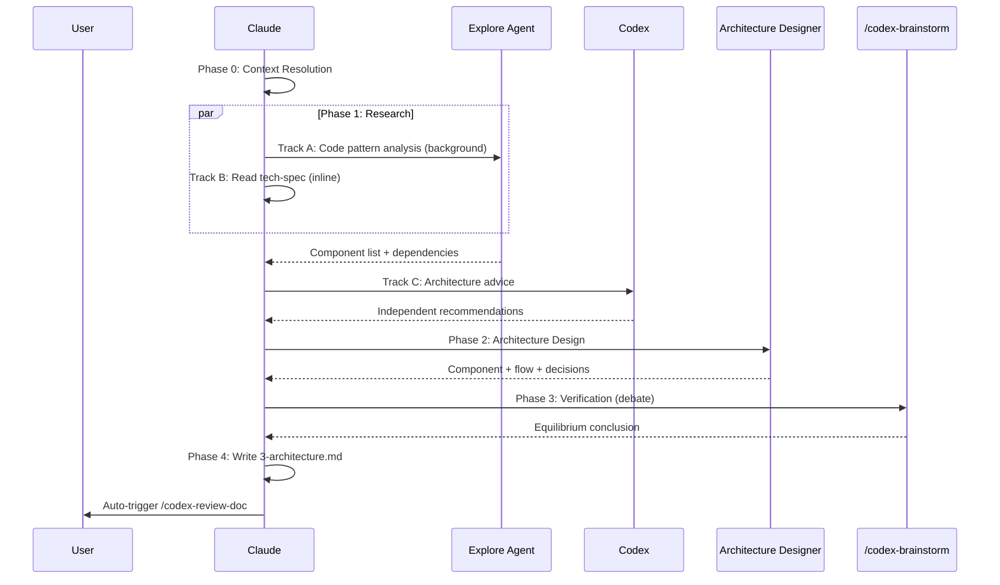

# Architecture Design Skill

## Trigger

- Keywords: architecture, architecture design, architecture doc, component diagram, 3-architecture, system design, document architecture

## When NOT to Use

- Tech spec writing (use `/tech-spec`)
- Code implementation (use `/feature-dev`)
- Architecture consulting only (use `/codex-architect`)
- Implementation roadmap (use `/deep-analyze`)

## Usage

```bash
/architecture                          # Auto-detect feature, create/update
/architecture <feature-keyword>        # Specify feature
/architecture --skip-debate            # Skip Phase 3 adversarial debate
```

## Workflow



## Phase 0: Context Resolution

Detect the target feature using the 5-level cascade.

See `@skills/create-request/references/feature-context-resolution.md` for the full algorithm.

```bash
# The wrapper, not the CLI directly: it owns the failure payload, so the full shape with
# `scan_error: true` arrives however the CLI fails — nonzero exit, signal, partial write, or a
# payload that is not the agreed shape. (Not when `node` itself is unavailable: nothing running
# under node survives that.) `|| echo '{}'` would produce a payload the gate cannot see as failure.
node scripts/resolve-feature.js
```

> **`scan_error` gate.** Gate on **`scan_error !== false`**, not on `scan_error === true`. When it
> is not exactly `false` the four source sets are **unknown, not empty** — the corpus could not be
> enumerated (unreadable directory, broken taxonomy, no repository), *or* the resolver never ran
> and a shell fallback supplied a payload with no such field at all. `{}` is the shape that made
> the stricter test useless: it has no `scan_error`, so `=== true` is false and the gate passes a
> payload that contains nothing. Do not proceed as though the feature has no authority documents —
> report and take the ⚠️ Need Human exit. A `key` may still be present, so a non-null `key` is not
> evidence the sets are complete.

| State | Mode |
|-------|------|
| `3-architecture.md` exists | Update (incremental) |
| `3-architecture.md` absent + a tech spec resolves | Create (tech-spec-informed) |
| `3-architecture.md` absent + no tech spec resolves | Create (code-only research) |
| Feature not resolved | Gate: Need Human |

"A tech spec resolves" means `design_records` holds an entry of `type: tech-spec` — the same
resolution Track B uses.

**`design_records` is an array, and more than one entry can be a tech spec**, so "the entry" needs a
rule rather than an assumption. `docs/features/auto-loop-evolution/` is the live case: a split spec
contributes `2-tech-spec/2-tech-spec.md` **and** its sub-document `2-tech-spec/1-phase-d-hook-hardening.md`,
both `type: tech-spec` design records. Select in this order, and stop at the first that answers:

**Filter first, then choose — every later rule reads the filtered list, never the whole set.**
Candidates are the `design_records` entries whose `type` is `tech-spec`; a requirements or
architecture record is not a candidate at any step, and a rule phrased over "entries" rather than
over candidates will select one. `docs/features/codex-review-spec/` and
`docs/features/harness-engineering-rebrand/` are the live proof: neither has a tech-spec design
record, each has exactly one canonical requirements record, and a canonicality test applied to the
unfiltered set picks it.

| # | Candidates (`design_records` where `type: tech-spec`) | Result |
|---|---------------------------------------------------|--------|
| 1 | none | **No tech spec resolves** — the ordinary code-only row of the table above. Not an exit: a feature that has not been specced is a normal state, and Track C is given `(none — do not read a spec)` |
| 2 | exactly one | that one |
| 3 | two or more, exactly one with `is_canonical: true` | that one — a split spec's main file keeps the canonical filename, which is what makes it the main file |
| 4 | two or more, and none or several canonical | **Gate: Need Human**, naming the candidates |

Rows 1 and 4 are different answers and must not be collapsed: "there is no spec" is a fact the skill
acts on, "there are two and I cannot tell which" is an ambiguity it must not resolve by picking. **The set decides, and the set also names the file.** `canonical_docs` is
role-blind: it selects the tech spec from `doc_inventory` whatever role that document resolves to,
so a spec that has declared itself `History record` or `Work record` is still non-null there while
being absent from `design_records`. Reading the alias as evidence of design authority is exactly the
confusion the source sets replace — and it is no better as a *path* selector: it is chosen across
the whole inventory by type and canonicality, so a historical canonical `2-tech-spec.md` beside a
design-record variant `2-tech-spec-v2.md` makes the set and the alias name different files. Take
both the decision and the path from the `design_records` entry's own `file`; do not rejoin through
the alias for either. Testing for the literal filename
`2-tech-spec.md` would read a split spec (`2-tech-spec/2-tech-spec.md`) or a variant
(`2-tech-spec-v2.md`) as "no tech spec" and silently drop to code-only mode.

### Scope Gate

For small features (tech-spec WBS has only 1 task, or no tech-spec and < 3 related files), suggest keeping architecture in tech-spec Section 3 instead of creating a separate document. Use AskUserQuestion to confirm.

## Phase 1: Architecture Research (parallel)

Launch research tracks. Tracks A and B run in parallel; Track C runs after both complete.

### Track A: Code Pattern Analysis (background)

```
Agent({
  description: "Analyze architecture patterns for <feature>",
  subagent_type: "Explore",
  run_in_background: true,
  prompt: "Analyze the codebase architecture for feature <key>:
    1. Trace execution paths of related modules
    2. Map component dependencies (imports, calls)
    3. Identify integration points with other features
    4. Read docs/architecture.md for global context
    Output: component list + dependency graph + integration points"
})
```

Fallback: `subagent_type: "general-purpose"` if Explore unavailable.

### Track B: Tech-spec Extraction (inline)

The tech spec is a **design record** (`design_records` in the resolver output), which is exactly
what this track wants: the intent, not the current behaviour. Track A supplies what the code
actually does, and where the two disagree the code wins and the disagreement is worth stating in
the architecture doc.

Resolve the file from `design_records` rather than assuming the name — a split spec lives at
`2-tech-spec/2-tech-spec.md` and a variant may be `2-tech-spec-v2.md`, both of which the resolver
classifies and a hard-coded filename misses. Use that entry's own `file` — do not rejoin through
`canonical_docs`. The alias is selected independently from the whole inventory by type and
canonicality (`scripts/lib/doc-classifier.js` § `pickCanonicalDocs`), so with a historical
canonical `2-tech-spec.md` beside a design-record variant `2-tech-spec-v2.md` the set returns the
variant and the alias returns the historical file. Filtering by role and then resolving the path
through the alias silently swaps one for the other.

If a tech spec is present:
- Read Section 3 (Technical Solution) — architecture diagram, data model, API design
- Read Section 4 (Risks) — constraints, dependencies
- Read Section 7 (Open Questions) — unresolved design decisions

If no tech-spec: skip (code-only mode).

### Track C: Codex Architecture Advice (after A+B)

```
mcp__codex__codex({
  prompt: <from references/codex-prompt.md>,
  sandbox: 'read-only',
  'approval-policy': 'never',
})
```

Provide feature context metadata only — never feed Claude's conclusions (per `@rules/codex-invocation.md`).

Save `threadId` for potential follow-up.

Graceful degradation: Codex unavailable → proceed without (warn in output).

## Phase 2: Architecture Design

Dispatch architecture-designer agent with merged research results:

```
Agent({
  description: "Design architecture for <feature>",
  subagent_type: "architecture-designer",
  prompt: `Design the architecture for <feature>.

  ## Input Context
  ${TECH_SPEC_SUMMARY}
  ${CODE_ANALYSIS}
  ${CODEX_ADVICE}

  ## Required Output
  Follow the output template at @skills/architecture/references/template.md:
  1. Component diagram (Mermaid flowchart)
  2. Component responsibility table
  3. Data flow (Mermaid sequence diagram)
  4. Integration points with existing systems
  5. Architecture decisions (AD-N: context → options → decision → rationale)
  6. Deployment considerations (if applicable)

  ## Constraints
  - Follow @rules/docs-writing.md conventions
  - Reference actual code (file:line, not invented)
  - Mark assumptions explicitly
  - Redact credentials/secrets per @rules/security.md`
})
```

Fallback: if architecture-designer agent unavailable, use `solution-architect` agent.

## Phase 3: Verification (conditional)

Invoke `/codex-brainstorm` via Skill tool:

```
Skill("codex-brainstorm", `Evaluate the proposed architecture for <feature>.

Focus: scalability, maintainability, integration complexity, testability.

Constraints:
- Component diagram from Phase 2
- Tech-spec constraints from Phase 1
- Known risks`)
```

Must produce: threadId + equilibrium conclusion.

### Skip Conditions

| Condition | Action |
|-----------|--------|
| `--skip-debate` flag | Skip Phase 3 |
| Scope gate triggered (small feature) | Skip Phase 3 |
| Update mode (incremental change) | Skip Phase 3 |

Graceful degradation: `/codex-brainstorm` timeout → record timeout in Verification section, still output document.

## Phase 4: Output

Write `docs/features/<key>/3-architecture.md` using the output template.

See `references/template.md` for the full template.

### Cross-References

Auto-insert links:
- `> **Source**: [Tech Spec](./<design_records tech-spec entry .file>)` — that entry's own `file`,
  never `canonical_docs`, and not the
  literal `2-tech-spec.md`; a split spec lives one directory deeper and the hard-coded link is dead
- `> **Request**: [Request](./requests/YYYY-MM-DD-*.md)` (if active request found)

### Auto-Trigger

After Write completes, auto-trigger `/codex-review-doc` per `@rules/auto-loop.md`.

## Arguments

| Argument | Default | Description |
|----------|---------|-------------|
| `<feature-keyword>` | auto-detect | Target feature |
| `--skip-debate` | false | Skip Phase 3 adversarial debate |

## Verification

- [ ] Feature context resolved (create/update mode determined)
- [ ] Research completed (code + tech-spec + Codex)
- [ ] Architecture design includes all required sections
- [ ] Mermaid diagrams are valid
- [ ] Architecture decisions use AD-N format with rationale
- [ ] Cross-references to tech-spec and request docs included
- [ ] `/codex-review-doc` passed (auto-triggered)
- [ ] No `git add/commit/push` executed

## References

- `references/template.md` — Output template for `3-architecture.md`
- `references/codex-prompt.md` — Codex independent architecture research prompt
- `@skills/create-request/references/feature-context-resolution.md` — 5-level feature detection

## Examples

```
Input: /architecture
Action: Auto-detect feature → research (code + spec + Codex) → design → debate → write 3-architecture.md → /codex-review-doc

Input: /architecture statusline-config
Action: Resolve "statusline-config" → read tech-spec → research code → design → write → review

Input: /architecture --skip-debate
Action: Auto-detect → research → design → skip debate → write → review
```
