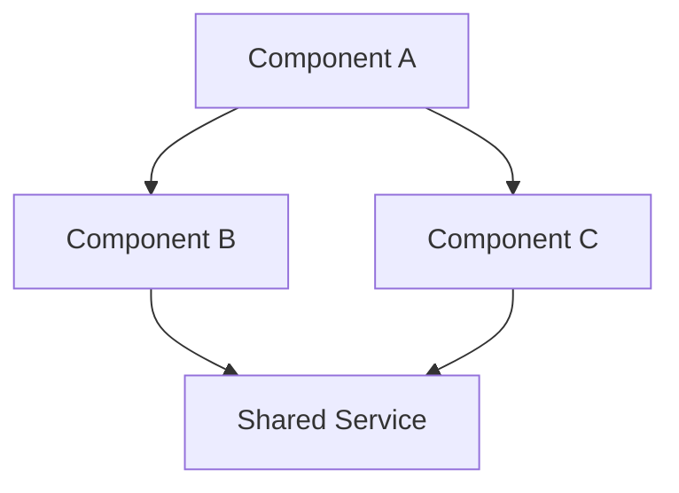
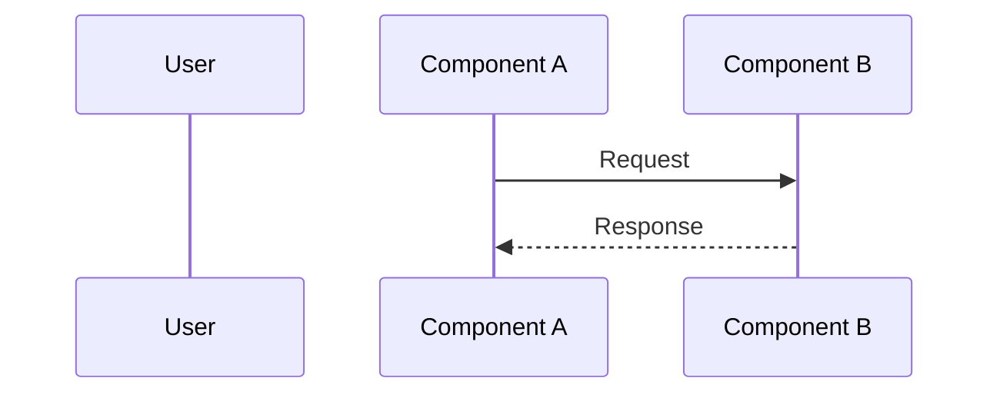

# Architecture Document Template

Output template for `3-architecture.md`. Generated by `/architecture` skill.

## Template

````markdown
# <Feature> Architecture Design

> **Source**: [Tech Spec](./<design_records tech-spec entry .file>) (omit if no tech spec resolves) | **Generated**: <date>

## 1. Architecture Overview

{Mermaid component diagram — show major components and their relationships}



## 2. Component Responsibilities

| Component | Responsibility | Key Files |
|-----------|---------------|-----------|
| Component A | Brief description | `path/to/file.ts` |
| Component B | Brief description | `path/to/file.ts` |

## 3. Data Flow

{Mermaid sequence diagram — primary execution flow}



## 4. Integration Points

| Integration | Direction | Protocol | Notes |
|------------|-----------|----------|-------|
| External API | Outbound | REST/gRPC | Rate limited |
| Message Queue | Bidirectional | Event | Async |

## 5. Architecture Decisions

### AD-1: <Decision Title>

- **Context**: Why this decision was needed
- **Options**: What was considered
- **Decision**: What was chosen
- **Rationale**: Why, citing tech-spec constraints or debate conclusion

### AD-2: ...

## 6. Deployment & Configuration

{Optional — only include when applicable (infrastructure, env vars, scaling)}

| Config | Default | Description |
|--------|---------|-------------|
| `ENV_VAR` | `value` | Purpose |

## 7. Verification

- **Debate threadId**: <from Phase 3, or "skipped">
- **Debate conclusion**: <equilibrium summary, or "N/A">
- **Key consensus**: What both perspectives agreed on
- **Open divergences**: Unresolved disagreements (if any)

## 8. Cross-References

- Tech Spec: [<design_records tech-spec entry .file>](./<design_records tech-spec entry .file>) (omit if no tech spec resolves)
- Request: [requests/YYYY-MM-DD-*.md](./requests/)

```

Both `<design_records tech-spec entry .file>` placeholders are substituted from the `file` of the
`design_records` entry the skill resolved — never from `canonical_docs`, which is selected across
the whole inventory by type and canonicality and can therefore name a different document than the
role-filtered set returned. Never
from the literal filename: a split spec lives at `2-tech-spec/2-tech-spec.md` and a variant may be
`2-tech-spec-v2.md`, so a hard-coded `./2-tech-spec.md` emits a dead link. A set entry carries
`{file, type, namespace, confidence, is_canonical, role}` and **no `path`** — `file` is both the
display name and the link target, already relative to the feature directory, including a split
path such as `2-tech-spec/2-tech-spec.md`. Substituting a `.path` that does not exist emits
`undefined`.

## Section Requirements

| # | Section | Required | Content |
|---|---------|----------|---------|
| 1 | Architecture Overview | Yes | Mermaid component diagram |
| 2 | Component Responsibilities | Yes | Table with component, responsibility, key files |
| 3 | Data Flow | Yes | Mermaid sequence diagram |
| 4 | Integration Points | Yes | Table (may be empty if no integrations) |
| 5 | Architecture Decisions | Yes | At least 1 AD-N entry |
| 6 | Deployment & Configuration | No | Only when applicable |
| 7 | Verification | Yes | Debate result or "skipped" |
| 8 | Cross-References | Yes | Links to related docs |

## Architecture Decision Format

Each decision follows the AD-N pattern:

```

### AD-N: <Title>

- **Context**: <situation that creates the need for a decision>
- **Options**: <viable alternatives considered>
- **Decision**: <the chosen approach>
- **Rationale**: <why this option was selected, with evidence>

````
