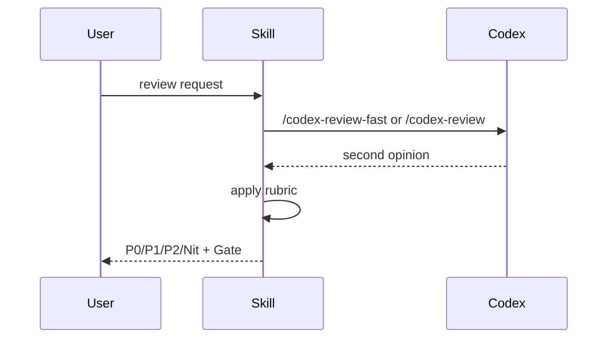

# Codex Code Review

## Trigger

- Keywords: review, PR, bug, security, performance, test coverage, audit, check

## When NOT to Use

- Just want to understand code functionality (use Explore)
- Need to implement fixes (use feature-dev)
- Document review (use doc-review)

## Workflow



## Verification

- Each issue tagged with severity (P0/P1/P2/Nit)
- Gate is clear (Pass / Block)
- Issues include: location, description, fix suggestion

## References

- Rubric: `review_rubric.md`
- Output: `templates/review_output.md`

## Examples

```
Input: Review this PR for me
Action: /codex-review-fast -> Apply rubric -> Output P0/P1/P2/Nit + Gate
```

```
Input: Check the security of this code
Action: /codex-security -> Apply OWASP rubric -> Output security issues
```

```
Input: Any issues with this function?
Action: Read function -> Apply rubric -> Output issue list
```
