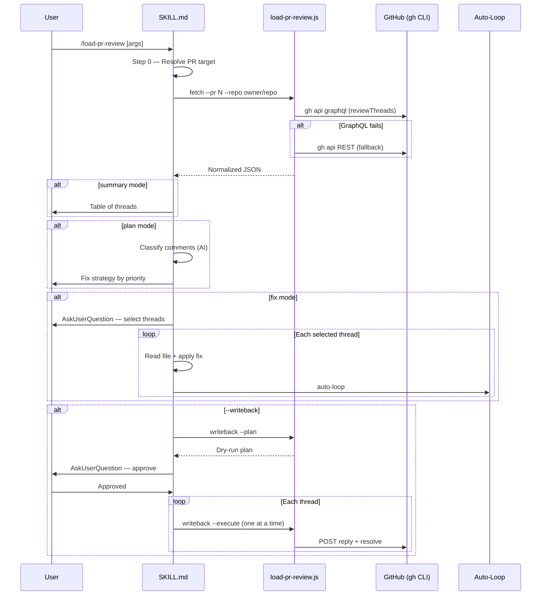

# Load PR Review

## Trigger Keywords

`load pr review`, `pr feedback`, `address review`, `review comments`, `pr comments`

## When NOT to Use

| Need | Use Instead |
|------|-------------|
| Create a code review | `/codex-review-fast` or `/codex-review` |
| Create a PR | `/create-pr` |
| PR status overview | `/pr-summary` |
| Investigate code history | `/git-investigate` |

## Core Principle

```
Load review → AI-assisted triage → optional fix → optional writeback
Data plane (JS script) handles fetch/normalize/writeback.
Control plane (this SKILL.md) handles classification, fix orchestration, auto-loop.
```

## Workflow



## Step 0: Resolve PR Target

Determine the target PR using this cascade:

1. **Explicit PR# in arguments** → use directly
2. **URL in arguments** → parse `owner/repo/number`
3. **Context block data** → `gh pr view` on current branch
4. **None found** → AskUserQuestion: ask user to provide PR# or URL

## Step 1: Fetch Review Comments

Run the data plane script:

```bash
bash scripts/run-skill.sh load-pr-review load-pr-review.js \
  fetch --pr <N> --repo <owner/repo> [--all] [--budget <N>]
```

Parse the JSON output. Check `summary.degraded` — if `true`, inform user:

> REST fallback active: thread resolution status unknown, showing all comments.

If `summary.total === 0`:

> No review comments found on this PR.

## Step 2: Present (mode-dependent)

### Summary Mode (default)

Display the thread table:

```markdown
## PR #<N>: <title>
**Review Status**: <unresolved> unresolved / <total> total threads

| # | File | Line | Reviewer | Comment (truncated) |
|---|------|------|----------|---------------------|
| 1 | src/foo.ts | 42 | alice | Use early return... |

Use `--mode plan` to get fix strategy, or `--mode fix` to start fixing.
```

### Plan Mode

Classify each thread using AI judgment (not script — requires semantic understanding):

| Category | Description | Priority |
|----------|-------------|----------|
| `code_change` | Code modification suggestion | 1 — Fix |
| `doc_update` | Documentation/comment update | 2 — Fix |
| `question` | Question needing explanation | 3 — Reply |
| `disagree` | Design disagreement | 4 — Discuss |
| `nit` | Style/naming nitpick | 5 — Optional |

Present grouped by priority:

```markdown
## Fix Strategy

### Priority 1: Code Changes (N threads)
| # | File | Reviewer | Summary | Effort |
|---|------|----------|---------|--------|

### Priority 2: Documentation (N threads)
...

### Priority 3: Questions (N threads)
...

### Needs Discussion (N threads)
(disagree items — require user decision via AskUserQuestion)
```

### Fix Mode

1. Show plan first (as in plan mode)
2. AskUserQuestion: which threads to fix?
3. For each selected thread:
   a. Read the file at `thread.path` around `thread.line`
   b. Understand the review comment
   c. Apply the fix
   d. **Auto-loop**: code changes → `/codex-review-fast` → `/precommit`; doc changes → `/codex-review-doc`
4. After all fixes complete, suggest `--writeback` to close the loop

## Step 3: Writeback (optional, gated)

Only when `--writeback` is specified.

### Dry-run (default)

```bash
bash scripts/run-skill.sh load-pr-review load-pr-review.js \
  writeback --plan --input <json-path> --threads <IDs>
```

Show the plan table to user. Ask for approval via AskUserQuestion.

### Execute (after approval)

For each approved thread, one at a time:

```bash
bash scripts/run-skill.sh load-pr-review load-pr-review.js \
  writeback --execute --thread <ID> --reply "<message>" \
  --replyTargetId <databaseId> --repo <owner/repo> --pr <N> [--resolve]
```

**Safety rules** (see `references/writeback-guardrails.md`):
- Must use `replyTargetId` (first comment's `databaseId`)
- Body transmitted via `jq` + `--input -` (no shell interpolation)
- Missing `replyTargetId` → degrade to plan-only, warn user
- Each thread processed independently; failure does not abort others

## Output Format

### JSON (default from script)

```json
{
  "pr": { "number": 42, "title": "...", "url": "...", "head": "feat/x", "base": "main" },
  "summary": { "total": 15, "unresolved": 8, "outdated": 3, "loaded": 8, "truncated": 7, "degraded": false },
  "threads": [
    {
      "id": "PRRT_...",
      "path": "src/foo.ts",
      "line": 42,
      "isResolved": false,
      "isOutdated": false,
      "replyTargetId": 12345,
      "comments": [
        { "id": "PRRC_...", "databaseId": 12345, "author": "reviewer", "body": "...", "createdAt": "..." }
      ]
    }
  ]
}
```

### Markdown (with `--markdown`)

Human-readable table for direct display.

## Verification Checklist

- [ ] PR target resolves correctly (explicit, URL, current branch)
- [ ] GraphQL fetch returns normalized threads
- [ ] REST fallback activates when GraphQL fails
- [ ] Token budget truncation works (default 30, --all 200)
- [ ] Summary/plan/fix modes produce correct output
- [ ] Writeback dry-run shows plan without executing
- [ ] Writeback execute posts reply + optional resolve
- [ ] Auto-loop triggers after fix mode edits

## References

- `references/api-contract.md` — GraphQL query + REST fallback specification
- `references/token-budget.md` — Truncation strategy + budget rules
- `references/writeback-guardrails.md` — Writeback safety rules + jq pattern
