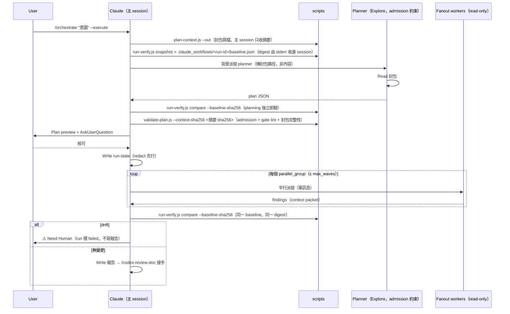

# Orchestrate Skill（v1 report-only）

宣告式意圖 → planner agent 推導隨 repo 狀態變動的 workflow 計畫 → 預覽人核 → read-only fanout → pre/post 無變更驗證 → 報告走既有 doc review loop。Control plane（`.claude_workflows/`）與 hook 獨佔的 safety plane（`.claude_review_state.json`）完全分離：**orchestrator 對 safety plane 只讀，永不寫**。

## Trigger

- Keywords: orchestrate, workflow orchestration, 編排, plan this workflow, audit the repo for, 自動編排

## When NOT to Use

- 執行會改檔的步驟（v1 一律輸出為 `proposed-manual`，交人走正常流程）
- 單一 skill 就能完成的任務（直接呼叫該 skill）
- Code review（`/codex-review-fast`）、doc review（`/codex-review-doc`）
- 既有固定形狀的深度探索（`/deep-explore`）或研究（`/deep-research`）——orchestrate 是跨 skill 的編排層，不取代它們

## Flags

| Flag | 行為 |
|------|------|
| （無）/ `--dry-run` | 規劃 + 預覽即止（plan preview = 預設交付物） |
| `--execute` | 預覽 + **AskUserQuestion 核可後**執行 read-only fanout → verify → 報告 |
| `--budget S\|M\|L` | Budget tier（default M）；超量 fail-closed，見 `scripts/plan-context.js` |
| （內部）`plan-context.js --out` | 封包一律寫檔、只回摘要（含 `sha256`）；主 session 不得持有完整封包（~81 KB × 2 → ~0.5 KB），見 `references/planner-prompt.md` |
| `--resume <run-id>` | 以**原 baseline** compare：無 drift → 續跑 pending 步驟；**有 drift → run 標 `needs_human` 並停**（不得重拍 baseline 洗白；要繼續只能開新 run = 新 baseline + 新核可）。baseline **本體**留在 `.claude_workflows/<run-id>/baseline.json`，跨 session 仍在；但 **`baseline_sha256` 只活在主 session 的 context**，run-state 刻意不存它（存在 baseline 旁邊等於沒綁定）。因此 resume 的實際限制是 digest 而非檔案：脈絡遺失／換 session → 不可 resume，開新 run |
| `--backend dw\|agent` | 強制 fanout 後端；預設 auto（`Workflow` 工具可用則用，否則 background `Agent` ≤3 並行）——admission 同一套 |

## Workflow



### Baseline 時序不變量（hard rule）

`run-verify.js snapshot` 必須**先於任何 agent 派發**（含 planner）——否則 planner 期間的 mutation 會被併入 baseline，report-only 證明失效。snapshot 的 **stdout（baseline 本體）一律導向 `.claude_workflows/<run-id>/baseline.json`**，兩次 compare 都以 `--baseline <該路徑>` 讀取；主 session 不留 baseline 內容（它含全樹 content hash，逐字帶在 context 裡既昂貴又會被 compact 丟掉）。**digest 走另一條路**：只存在主 session 的 context，絕不寫進 `.claude_workflows/`。這個「本體落在磁碟、digest 留在 session」的拆法正是綁定本身——baseline 檔案對 worker 沒有價值，因為它偽造不出主 session 手上的 digest；把 digest 存到 baseline 旁邊則等於沒綁定。planner 與 fanout worker 受**同一** admission allowlist 約束（planner = `Explore`，名單內唯一具研究能力者）。planning 結束、preview 之前先 compare 一次（早期攔截）；execute 結束後以**同一 baseline** 再 compare 一次（最終攔截）。

兩次 compare 都**必須**帶 `--baseline-sha256`，值取自 `snapshot` 印在 stderr 的 `baseline_sha256=…`。沒有這個綁定，compare 證明的只是「我拿到的這份檔案與 repo 相符」——而 worker 在改動後重跑一次 `snapshot` 就能造出這樣一份檔案，drift 於是讀成 `ok: true`。digest 由主 session 在**任何派發之前**取得、也由主 session 傳回，worker 全程碰不到，因此能擋住 worker 平面的替換；它**擋不住**已被接管的主 session——該層沒有任何機制能擋，因為兩個參數都由它決定。與 `validate-plan.js --context-sha256` 同一條信任鏈。

### Admission（deny-by-default）

Fanout 候選一律比對 `references/admission-allowlist.json`（v1 僅 `Explore` + `performance-optimizer`；`coverage-analyst` / `git-investigator` 為明確排除，理由見檔內）。不在名單 = 拒絕，不論其 `allowed-tools` 宣告——`allowed-tools` 不可信任為 read-only 判據。名單變更必過 review + 重審 `run-verify.js` 驗證面涵蓋性。

**Report-only 強制機制（非能力層阻擋，盡力而為的 fail-closed 縱深）**：report-only **不依賴**能力層阻擋 `Skill` 工具——兩條看似可行的能力路徑都不適用。v1 的 report-only 是 **admission allowlist（只收 curated 唯讀導向 worker）、驗證層 drift 偵測、行為層契約** 三者的**盡力而為 fail-closed 組合**，**非**對抗 admitted Bash-capable worker 的絕對保證——admitted `Explore` 具 Bash，可觸發下表驗證層列所載的殘餘 bypass（如 `assume-unchanged` index 隱藏），故 v1 report-only 的強度實際倚賴 admission 名單的 curation，殘餘 bypass 明確 defer v2（見下表與段末）：

| 層 | 機制 | 保證 | 限制／原因 |
|----|------|------|-----------|
| 能力層 | 省略 `allowed-tools` 中的 `Skill` | 無硬阻擋 | 依 Claude Code，`allowed-tools` 僅為**預先核可**清單；未列的工具仍可在使用者一般權限下被呼叫 |
| 能力層 | `disallowed-tools: Skill` | 硬阻擋，但**刻意不用** | 依 Claude Code 現行行為，持續到下一則使用者訊息才解除；會連帶封殺同一輪的 `/codex-review-doc` 交接（同走 `Skill` 工具），令 run 永遠無法抵達 Mergeable/`done` |
| 驗證層 | `run-verify.js` 的 snapshot／compare 原語（SC-2） | 對 **git 監測面**（porcelain + tracked／untracked／ignored 內容 hash + tracked mode + untracked／ignored 目錄節點 + refs／config／worktree／stash）的 repo 狀態變更提供 fail-closed drift 證據（drift → `exit 1`） | **非** hard sequencing guarantee：呼叫順序、run-state 轉移、報告抑制由 `SKILL.md` 派發流程與 `references/execution-policy.md` 行為契約負責；且有殘餘風險（`node_modules/`、`.venv/`、`build/`、`dist/`、repo 外寫入、`assume-unchanged`／`skip-worktree` index 隱藏等，見 `admission-allowlist.json` 的 `residual_risk`）；`.claude_workflows/` 控制面為 by-design 排除（orchestrator 自身寫 run-state，非監測面） |
| 行為層 | planner／executor 契約 | v1 不執行 main-skill | **mutating** 構想一律轉 `kind: proposed-manual`（`mutating: true`）；非 mutating `main-skill` 仍為 `kind: main-skill` 受 `validate-plan.js` A4 target 驗證，但 v1 executor 不派發 |

派發順序上，`run-verify.js snapshot` 於**任何 agent 派發之前**取 baseline，execute 後以同一 baseline `compare`；落在受監測 git-scoped 面的任何 drift → run 標 `failed`、**不寫報告**（見 `references/execution-policy.md` fail-closed 矩陣）。v2 若要開放 main-skill **執行**，前提是 `skill_candidates` 帶 mutation flag 讓 mutating 目標在 A4 先被拒 + reviewed read-only allowlist（見 `validate-plan.js` A4 註解），而非解除任何 Skill 能力阻擋。

### Run-state 管理

| 規則 | 內容 |
|------|------|
| 路徑 | `.claude_workflows/<run-id>.json`（gitignored；`run-id` = `<UTC yyyymmdd-HHMMSS>-<intent-slug>`） |
| 寫入工具 | 主 session `Write`（`.json` 不觸發 change flag——control plane 對 safety plane 惰性） |
| Redaction | 寫入磁碟前過 `scripts/security-redact.js` 完整 contract：`scanHighConfidence` truthy → **abort fail-closed**（不寫檔、run 標 `needs_human`、提示改寫意圖）；medium → mask 後寫入 |
| FIFO | 保留最近 10 個 run，超過刪最舊。**兩者一起算、一起刪**：`<run-id>.json`（run-state）與同名的 `<run-id>/` 目錄（封包 + plan + baseline）。只清 `.json` 會讓 `plan-context.json`（~81 KB／run）無限累積在 gitignored 目錄裡；封包已含完整 catalog 與 repo signals，過期後留著只是垃圾與洩漏面。**執行方式**（規範路徑，非能力邊界：本 skill 未預先核可 `Bash(rm:*)`，但預先核可的 `Bash(node:*)` 同樣涵蓋 `node -e 'fs.rmSync(…)'`，沒有機制強制刪除走這支腳本；containment 只在走這條路時成立）：<br>`node "${CLAUDE_PLUGIN_ROOT}/skills/orchestrate/scripts/prune-runs.js"`（先跑 `--dry-run` 看清單）。**路徑必須是 plugin root 絕對路徑**，與本 skill 呼叫 `plan-context.js`／`validate-plan.js` 的形式一致：skill 執行時的 cwd 是**目標 repo**，不是 plugin 目錄，所以 repo 相對路徑只在本 repo 內開發時碰巧可用，部署到任何其他專案都是 `MODULE_NOT_FOUND`——retention 於是從未執行，而 `.claude_workflows/` 以每 run ~81 KB 持續累積，正好是這支腳本要擋的洩漏。腳本自行從目錄讀取 run-id、拒絕非 `.claude_workflows` 的 root 與 symlink、認不得的檔名一律保留並回報 |
| 封包提前刪除（建議） | `validate-plan.js` 通過、plan 進入執行後，`<run-id>/plan-context.json` 已無用途——可立即刪除，只留 `<run-id>/plan.json` 供事後稽核。digest 已在驗證當下比對完畢，事後保留封包不會增加任何保證 |
| 終態 | `done` 的**唯一路徑** = 報告之 doc review 回 Mergeable gate；回 blocked / degraded / 無法判定 → `needs_human`（不得呈現為完成） |

### 輸出隔離契約

`/orchestrate` 自身輸出**禁止**出現 hook-parsed gate sentinels（gate 標頭行、bare Ready / Mergeable / Blocked / All-Pass 記號）——run 總結使用 `## Orchestrate Run Summary` + `[ORCHESTRATE_RUN] run_id=… status=…` 結構行（純行為層標記，無 hook 解析）。報告寫入後的 doc gate sentinel 由 `/codex-review-doc` 自己輸出（合法路徑）。

## Verification Checklist

- [ ] snapshot 先於任何 agent 派發，且 stdout 導向 `.claude_workflows/<run-id>/baseline.json`；planning 後 + execute 後各 compare 一次（同一 baseline 檔）
- [ ] `baseline_sha256` 只留在主 session context，未寫入 `.claude_workflows/` 任何檔案
- [ ] 兩次 compare 都帶 `--baseline-sha256`（值取自 snapshot stderr 的 `baseline_sha256=`）；未帶或不符會 exit 1
- [ ] 計畫經 `validate-plan.js` 全規則通過（A1-A4 / G1-G2 / O1 / B1 / S1 / SCHEMA）
- [ ] `validate-plan.js` 帶入 `--context-sha256`（值取自 `plan-context.js --out` 摘要的 `sha256`）；**未帶 digest 一律 exit 1，`--context -`（stdin）也不例外**——綁定的是 digest 走過 worker 碰不到的通道，不是 bytes 從哪個 fd 進來
- [ ] 執行前經 AskUserQuestion 人核
- [ ] run 終態正確：drift → `failed`；doc gate 未過 → `needs_human`；Mergeable → `done`
- [ ] 無任何 git 狀態變更操作（add / commit / push / stash / tag / config / checkout / reset 等——`allowed-tools` 僅開放唯讀 git 指令，mutation 由 `run-verify.js` compare 兜底）；safety plane 零寫入

## Bundled References

| File | Purpose |
|------|---------|
| [planner-prompt.md](references/planner-prompt.md) | Planner 獨立推導契約（不餵 Claude 預擬步驟） |
| [plan-schema.md](references/plan-schema.md) | Plan JSON schema 正典（含 lint 規則對照） |
| [execution-policy.md](references/execution-policy.md) | Backend 選擇、波次、fail-closed 矩陣 |
| [admission-allowlist.json](references/admission-allowlist.json) | Fanout allowlist（curated + 排除記錄） |

## Examples

```
Input: /orchestrate "audit 全 repo hook 的 fail-open 路徑" --execute
Action: context → snapshot → planner → lint → preview → 核可 → 3× Explore fanout → compare → 報告 → doc review
```

```
Input: /orchestrate "完成 feature X 並確保品質"
Action: 規劃 + 預覽即止——mutating 步驟以 proposed-manual 列出（含 code-review + precommit gate），交人走正常流程
```
