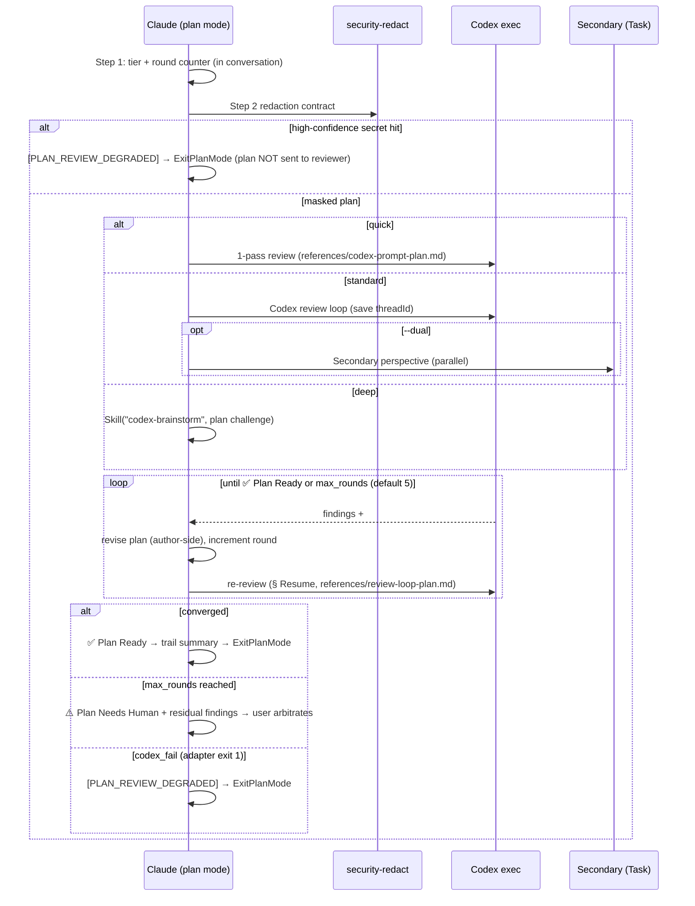

# Plan Review Skill

Adversarial review gate for plan-mode drafts: the plan is challenged by an independent reviewer and revised until convergence **before** `ExitPlanMode` presents it to the user.

## Trigger

- Keywords: plan review, review plan, plan-review, pre-ExitPlanMode review
- Self-invoke: in plan mode, before calling `ExitPlanMode`, when the project opts in via `@rules/auto-loop-project.md ## Plan Review: enabled` or the user asks for plan review

## When NOT to Use

- Reviewing `.md` files on disk (use `/codex-review-doc` — different artifact: filesystem path vs in-context plan text)
- Reviewing lifecycle specs `1-requirements.md` / `2-tech-spec.md` (use `/review-spec`)
- Code review (use `/codex-review-fast`)
- Not in plan mode / no plan draft exists

## Boundary Contract (v1 Acceptance Scope)

- Review gate applies **only when this skill is actually invoked** (A1 skill-driven; enabled-but-unexecuted detection is v2).
- Analysis-only: the reviewer surfaces findings; **Claude revises the plan** — the skill never rewrites or deletes plan content itself.
- Review pass ≠ execution approval: the user still arbitrates the final plan after `ExitPlanMode` (FR-14 Won't).
- **Fully behaviour-layer**: no hook parses plan-review output and no state file records the loop. The skill counts its own rounds in conversation, and the sentinels below are prose contracts the model and the human read — nothing mechanical routes on them (hook-lightweighting § 3.3).

## Arguments

| Arg | Behavior |
|-----|----------|
| (none) | tier = `standard` — Codex alone, with the fix → re-review loop |
| `--quick` | Single Codex pass, no loop |
| `--dual` | Adds a secondary reviewer in parallel. **Off unless passed** — for a release or a security-sensitive plan, not routine planning |
| `--deep` | Delegate to `/codex-brainstorm` (Nash equilibrium debate; attack/defense built-in) |
| `--skip-review` | Immediate bypass: emit `[PLAN_REVIEW_SKIPPED]`, present raw plan |
| `--verbose` | Round-by-round trail (default: summary only) |

User escape (NFR-5): any explicit "skip review" / "直接看 plan" instruction — detected at skill entry **and** before each re-review round — exits within ≤1 round, emits `[PLAN_REVIEW_SKIPPED]`, and presents the current plan.

## Workflow



### Step 1: Tier + round budget

Determine tier (`standard` default; `--quick` / `--deep` explicit) and the round cap: read
`## Plan Review Max Rounds` from `rules/auto-loop-project.md` directly (unset → **5**). The round
counter lives **in this conversation** — state the current round in each re-review dispatch
("round 2/5") so the count survives in the transcript. There is no state file to open and no
script to run: the loop's bookkeeping is the skill's own.

### Step 2: Secret redaction (NFR-8, fail-closed)

Apply the contract from `scripts/security-redact.js` (verified API — `scanHighConfidence` returns `{name, fingerprint} | null`, it does NOT throw):

```js
const { scanHighConfidence, maskMediumConfidence } = require('./scripts/security-redact.js');
const high = scanHighConfidence(planText);   // {name, fingerprint} | null
if (high) {
  // fail-closed: plan is NOT sent to any reviewer
  // → output [PLAN_REVIEW_DEGRADED]; plan still delivered to user via ExitPlanMode
} else {
  send(maskMediumConfidence(planText));      // medium-confidence → [REDACTED] before send
}
```

Run via `node -e` against the plan text, feeding the text through **stdin with a quoted heredoc — never as an argv literal**:

```bash
node -e '...' <<'PLAN_EOF_<random-hex>'
<plan text>
PLAN_EOF_<random-hex>
```

> `<random-hex>` is a **placeholder to be generated**, not a value to copy. It is written this way
> deliberately: the rationale below is that "a fixed delimiter makes the attack a copy-paste", and
> an example carrying a concrete literal reinstates exactly that for anyone who copies rather than
> generates. Substitute a fresh suffix on every invocation, per the table that follows.

**The delimiter must be freshly randomized per invocation, and you must verify it does not collide.** Before emitting the command:

| Step | Action |
|------|--------|
| 1 | Generate a new random suffix (≥8 hex chars) → `PLAN_EOF_<suffix>` |
| 2 | Scan the plan text for any line whose **entire content** (after stripping trailing whitespace) equals that delimiter |
| 3 | On collision → regenerate and re-check. Never emit a command whose delimiter appears in the body |

Rationale: argv leaks the un-redacted plan into system-wide process listings (`ps`); heredoc stdin never appears in argv. The quoted delimiter prevents shell *interpolation* of plan content — but quoting does **not** stop the plan from **terminating** the heredoc. A plan containing a bare line `PLAN_EOF` ends the here-document early, and every line after it is handed to the shell as commands under this skill's `Bash` permission. That is arbitrary command execution driven by plan text, which in this skill is frequently drafted from untrusted material (issue bodies, PR descriptions, pasted logs). A fixed delimiter makes the attack a copy-paste; a randomized-and-checked one makes it unreachable.

The plan draft already exists in the session transcript (it is in-context text), so the heredoc adds no new exposure surface — and handing this step its input through a file is not available, because the `Write` tool is what plan mode withholds. Step 3 writes the transport's `prompt.md` by *this same heredoc* for *this same reason*: an application of the reasoning here, not an exception to it. Forbidden anti-pattern: judging high-confidence via `redact(text, {abortOnHigh: false})` return value (high is already masked, indistinguishable from medium).

### Step 3: Review dispatch (tier ladder)

| Tier | Reviewer | Loop |
|------|----------|------|
| quick | Codex exec ×1 | 1-pass |
| **standard** (default) | Codex exec | fix → re-review (§ Resume) |
| deep | `Skill("codex-brainstorm", ...)` | brainstorm termination (Nash attack/defense) |

- First Codex call: dispatch per `@skills/codex-code-review/references/codex-transport.md` § Start with `references/codex-prompt-plan.md` — the transport pins the sandbox and approval policy, so no call site chooses them. **Save the threadId.**
- **`prompt.md` is written by heredoc here, not by the Write tool** — this skill runs before
  `ExitPlanMode`, where Write is unavailable, so the transport reference names this skill as its one
  exemption and carries the two-command recipe (`@skills/codex-code-review/references/codex-transport.md`
  § Files), along with every file-lifecycle guarantee that goes with it. Follow it there; **no other**
  lifecycle guarantee is restated here — only that this skill writes the prompt by heredoc rather
  than by Write, which its own plan-mode workflow turns on.
- **The delimiter is generated per § Redaction's table but checked against a different payload**:
  that step scans the plan text, while this heredoc carries the whole rendered prompt — template
  sections and plan together. Scan the exact bytes going into `prompt.md`.
- **What is rendered into it is the redaction step's output, never `planText`.** Under the MCP
  envelope the redaction boundary and the send were the same act; the prompt file is now an artifact
  that lands on disk before the dispatch, so it is the boundary. A high-confidence hit is decided in
  Step 2, **before anything is allocated** — so nothing is written, there is no scratch directory to
  clean up, and the run degrades straight through the existing `[PLAN_REVIEW_DEGRADED]` path.
- Re-review rounds: dispatch per `@skills/codex-code-review/references/codex-transport.md` § Resume with `references/review-loop-plan.md`.
- Secondary — **only under `--dual`**: Task agent (`Explore` or `strict-reviewer`), prompt follows the same independent-research mandate; runs in background, does not block the Codex gate; a late secondary P0/P1 re-opens the loop. Without the flag there is no secondary and Codex is the gate.
- **`codex_fail` → fallback carries the gate** (adapter **exit 1** only — `@skills/codex-code-review/references/codex-transport.md` § Completion state machine: a pending or unknown completion keeps the gate **open** with no fallback, exit 2 is a configuration error, and an `alloc`/`cleanup` failure is a lifecycle error) (`@rules/auto-loop.md` § Review Dispatch): decide via `scripts/lib/review-dispatch.js` (`contract:'plan'`), record `[REVIEWER_FALLBACK] plane=plan from=codex to=contract-neutral-reviewer reason=<…> | <ISO8601>`, dispatch `contract-neutral-reviewer` via Task with `references/codex-prompt-plan.md` as the governing template (P3 = one retry on a fresh instance), and validate the raw report fail-closed with `node scripts/validate-family-sentinel.js plan` before adopting its verdict. Only when **every** carrier is exhausted does the run degrade: emit `[PLAN_REVIEW_DEGRADED]` and hand the plan to the user — that marker means "no validated verdict exists", never "a fallback reviewed it".
- The plan text is handed over as a **candidate artifact to attack** — never as "Claude's conclusion to confirm" (per `rules/codex-invocation.md`).

### Step 4: Convergence (independent budget)

Decision table applied to the conversation's own round count (never the code/doc review budget):

| # | Condition | Action |
|---|-----------|--------|
| 1 | `current_round >= max_rounds` (default 5; `@rules/auto-loop-project.md ## Plan Review Max Rounds`) | `⚠️ Plan Needs Human` + residual findings (never silently pass) — the user arbitrates, so nothing further is owed |
| 2 | No P0/P1 findings this round | `✅ Plan Ready` → trail summary → ExitPlanMode |
| 3 | Findings remain | Revise plan → re-review (continue loop) |

Plateau/fingerprint detection is V2 (OQ-9); v1 relies on the hard cap only.

### Step 5: Trail summary (FR-9 / NFR-4)

Default output before ExitPlanMode (3 columns minimum):

```markdown
## Plan Review

| Rounds | Findings | Modified sections |
|--------|----------|-------------------|
| 2      | 3 (1 P1, 2 P2) | §Approach, §Risks |

✅ Plan Ready
```

`--verbose`: append round-by-round findings. Degraded/skipped runs include the `[PLAN_REVIEW_DEGRADED]` / `[PLAN_REVIEW_SKIPPED]` token in this block.

## Graceful Degradation (NFR-3)

| Source | Action |
|--------|--------|
| `codex_fail` — adapter **exit 1 only** (`@skills/codex-code-review/references/codex-transport.md` § Completion state machine; a pending or unknown completion keeps the gate open and dispatches nothing, exit 2 is a configuration error, an `alloc`/`cleanup` failure is a lifecycle error) | **fallback dispatch first** (Step 3: `contract-neutral-reviewer` + `references/codex-prompt-plan.md`, validated via `validate-family-sentinel.js plan`); only with every carrier exhausted → output `[PLAN_REVIEW_DEGRADED]` → proceed to ExitPlanMode |
| High-confidence secret in plan (Step 2) | NO reviewer send → output `[PLAN_REVIEW_DEGRADED]` → proceed to ExitPlanMode |

Degradation never blocks plan mode: the plan is always delivered to the user in the same turn, with a grep-able degradation marker.

## Sentinel Namespace (prose contracts)

| Sentinel | Meaning |
|----------|---------|
| `## Plan Review` | Section discriminator — MUST precede every plan verdict |
| `✅ Plan Ready` | Converged, no P0/P1 |
| `⛔ Plan Blocked` | P0/P1 present, loop continues |
| `⚠️ Plan Needs Human` | max_rounds reached without convergence |
| `[PLAN_REVIEW_DEGRADED]` | Reviewer unavailable or secret-detected (fail-closed) |
| `[PLAN_REVIEW_SKIPPED]` | User-intent bypass (≠ degraded) |

**No hook parses these.** They are behaviour-layer signals: grep-able in the transcript, read by the model on resume and by the human arbitrating. That is exactly why the namespace still matters —

**Forbidden**: plan-review output must NEVER contain bare `✅ Ready` / `✅ Mergeable` / `## Gate:` / bare `⛔ Blocked`. Those sentinels belong to the code/doc review planes (`rules/auto-loop.md` § Gate Sentinels), and a plan that quotes one publishes a verdict a later reader can mistake for a code or doc gate result. The prompt templates repeat this constraint to the reviewer.

**Verdict precedence when reading reviewer output**: check the machine tokens (`[PLAN_REVIEW_DEGRADED]` / `[PLAN_REVIEW_SKIPPED]`) before verdict markers — degraded/skipped output quoting a verdict in prose must not lose its flags; then `⛔ Plan Blocked` before `✅ Plan Ready`, so output containing both verdict markers reads as blocked.

## Verification

- [ ] Tier and round cap stated before first dispatch (round counter in conversation)
- [ ] Plan text passed redaction contract before any reviewer send
- [ ] Codex prompt used `references/codex-prompt-plan.md` (independent research mandate, candidate-artifact framing)
- [ ] Exactly one terminal sentinel in the final output (Ready / Needs Human / DEGRADED / SKIPPED)
- [ ] Trail summary present in final plan output
- [ ] No bare code/doc sentinels emitted

## References

- Codex first-pass prompt: `references/codex-prompt-plan.md`
- Re-review loop prompt: `references/review-loop-plan.md`
- Rules: @rules/codex-invocation.md, @rules/auto-loop.md (Gate Sentinels)
- Spec: `docs/features/plan-review-loop/2-tech-spec.md`

## Examples

```
Input: /plan-review
Action: tier standard, cap 5 → redact → Codex review → loop → ✅ Plan Ready → trail summary → ExitPlanMode

Input: /plan-review --quick
Action: tier quick → redact → single Codex pass → verdict → ExitPlanMode

Input: /plan-review --deep
Action: tier deep → redact → Skill("codex-brainstorm", plan challenge) → equilibrium → verdict

Input: user says "skip review, show me the plan"
Action: [PLAN_REVIEW_SKIPPED] → raw plan → ExitPlanMode
```
