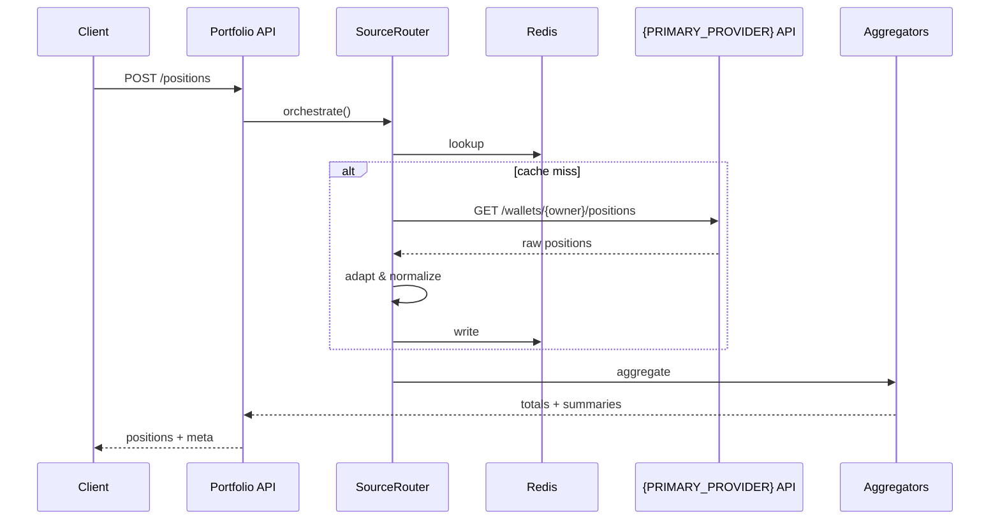

# Portfolio Architecture

## System Flow



## Layer Architecture

```
┌─────────────────────────────────────────────────────┐
│                  PortfolioController                │
│  ├─ 驗證特性開關                                    │
│  ├─ 解析貨幣（三層策略）                            │
│  └─ 調用 Provider                                   │
└─────────────────────────────────────────────────────┘
                          ↓
┌─────────────────────────────────────────────────────┐
│               SourceRouter Facade                   │
│  ├─ 解析路由策略                                    │
│  ├─ Planner → 選擇提供者                            │
│  └─ Executor → 執行計畫                             │
└─────────────────────────────────────────────────────┘
                          ↓
┌─────────────────────────────────────────────────────┐
│                   {PRIMARY_PROVIDER}Client                      │
│  ├─ 檢查緩存（Redis）                               │
│  ├─ 構建查詢（networkId → chain slug）              │
│  ├─ 調用 {PRIMARY_PROVIDER} API                                 │
│  └─ 熔斷器管理                                      │
└─────────────────────────────────────────────────────┘
                          ↓
┌─────────────────────────────────────────────────────┐
│                   {PRIMARY_PROVIDER}Adapter                     │
│  ├─ 按 group_id 分組                                │
│  ├─ 標準化到 Position[]                             │
│  └─ 合併 LP positions                               │
└─────────────────────────────────────────────────────┘
                          ↓
┌─────────────────────────────────────────────────────┐
│                    Aggregators                      │
│  ├─ TotalsAggregator → PortfolioTotals              │
│  └─ ProtocolAggregator → ProtocolSummary[]          │
└─────────────────────────────────────────────────────┘
```

## Routing Strategy

| 策略   | 主數據源 | 回退               |
| ------ | -------- | ------------------ |
| 預設   | {PRIMARY_PROVIDER}   | DeBank（複雜位置） |
| Solana | {PRIMARY_PROVIDER}   | Step Finance       |

**配置位置**：`src/service/portfolio/routing/routing-strategy.profiles.ts`

## Cache Strategy

### Key Pattern

```
portfolio:{provider}:positions:{owner}:v2:{filterHash}
portfolio:{provider}:positions:{owner}:v2:{filterHash}:stale
```

### TTL

| 場景     | Fresh | Stale |
| -------- | ----- | ----- |
| 多鏈查詢 | 90s   | 300s  |
| 單鏈查詢 | 60s   | 180s  |

**SWR**：過期後可返回 stale 數據，標記 `meta.cached=true`

## Fallback Flow

```
{PRIMARY_PROVIDER} 成功 → 返回新鮮數據
    ↓ 失敗
重試 2 次（指數退避）
    ↓ 失敗
返回緩存 (如有)
    ↓ 無緩存
返回 summaryOnly
    ↓ 失敗
混合回退（DeBank/Step）
```
