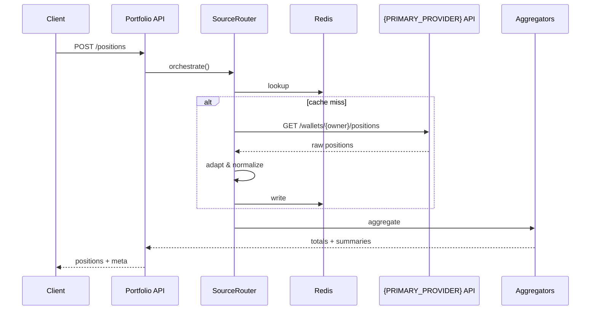

# Portfolio Architecture

## System Flow



## Layer Architecture

```
┌─────────────────────────────────────────────────────┐
│                  PortfolioController                │
│  ├─ Validate feature toggle                        │
│  ├─ Resolve currency (3-tier strategy)             │
│  └─ Call Provider                                  │
└─────────────────────────────────────────────────────┘
                          ↓
┌─────────────────────────────────────────────────────┐
│               SourceRouter Facade                   │
│  ├─ Resolve routing strategy                       │
│  ├─ Planner -> Select providers                    │
│  └─ Executor -> Execute plan                       │
└─────────────────────────────────────────────────────┘
                          ↓
┌─────────────────────────────────────────────────────┐
│                   {PRIMARY_PROVIDER}Client                      │
│  ├─ Check cache (Redis)                            │
│  ├─ Build query (networkId -> chain slug)          │
│  ├─ Call {PRIMARY_PROVIDER} API                                │
│  └─ Circuit breaker management                     │
└─────────────────────────────────────────────────────┘
                          ↓
┌─────────────────────────────────────────────────────┐
│                   {PRIMARY_PROVIDER}Adapter                     │
│  ├─ Group by group_id                              │
│  ├─ Normalize to Position[]                        │
│  └─ Merge LP positions                             │
└─────────────────────────────────────────────────────┘
                          ↓
┌─────────────────────────────────────────────────────┐
│                    Aggregators                      │
│  ├─ TotalsAggregator -> PortfolioTotals            │
│  └─ ProtocolAggregator -> ProtocolSummary[]        │
└─────────────────────────────────────────────────────┘
```

## Routing Strategy

| Strategy | Primary Source | Fallback                    |
| -------- | -------------- | --------------------------- |
| Default  | {PRIMARY_PROVIDER}     | DeBank (complex positions)  |
| Solana   | {PRIMARY_PROVIDER}     | Step Finance                |

**Config location**: `src/service/portfolio/routing/routing-strategy.profiles.ts`

## Cache Strategy

### Key Pattern

```
portfolio:{provider}:positions:{owner}:v2:{filterHash}
portfolio:{provider}:positions:{owner}:v2:{filterHash}:stale
```

### TTL

| Scenario      | Fresh | Stale |
| ------------- | ----- | ----- |
| Multi-chain   | 90s   | 300s  |
| Single-chain  | 60s   | 180s  |

**SWR**: After expiry, stale data can be returned, marked with `meta.cached=true`

## Fallback Flow

```
{PRIMARY_PROVIDER} success -> Return fresh data
    | failure
Retry 2 times (exponential backoff)
    | failure
Return cache (if available)
    | no cache
Return summaryOnly
    | failure
Mixed fallback (DeBank/Step)
```
