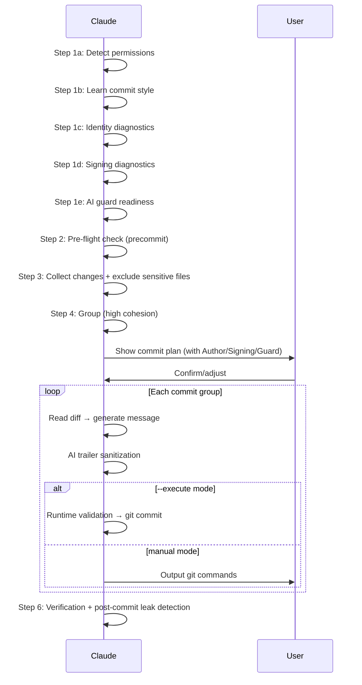

# Smart Commit

Analyze uncommitted changes → group by cohesion → generate commit messages → output git commands (or execute directly with `--execute`).

## Workflow



### Git Environment Policy (applies to every step below)

Every git command **this skill runs itself** — read or write, either mode, including ones it
delegates to a helper — carries the `GIT_ENV` prefix **and** `-C "$REPO_ROOT"`, both defined in
[git-environment.md](references/git-environment.md) § 1 and re-derived in every fenced block
(each block is a separate shell). What the skill **prints** is governed by § 2 of that file.

### Step 1: Detect Permissions + Learn Style

**1a. Permission Detection**

Read CLAUDE.md and `.claude/rules/git-workflow.md` to determine mode:

| Mode | Condition | Behavior |
|------|-----------|----------|
| manual | No `--execute` flag (default) | Output commands only |
| execute | `--execute` flag passed | Execute directly (with user approval via AskUserQuestion) |

Default to **manual mode**. Direct execution requires explicit `--execute` flag regardless of project git restrictions.

**`--execute` mode**: When `--execute` is passed, use `AskUserQuestion` to show the full commit plan and get explicit user approval before executing. This is a skill-level exception to git-workflow rules (same pattern as `/push-ci`).

**1b. Learn Commit Style**

```bash
GIT_ENV="env -u GIT_DIR -u GIT_WORK_TREE -u GIT_COMMON_DIR -u GIT_INDEX_FILE -u GIT_OBJECT_DIRECTORY -u GIT_ALTERNATE_OBJECT_DIRECTORIES -u GIT_NAMESPACE -u GIT_CEILING_DIRECTORIES -u GIT_GLOB_PATHSPECS -u GIT_ICASE_PATHSPECS -u GIT_NOGLOB_PATHSPECS -u GIT_LITERAL_PATHSPECS -u GIT_CONFIG -u GIT_CONFIG_PARAMETERS -u GIT_CONFIG_COUNT -u GIT_IMPLICIT_WORK_TREE -u GIT_GRAFT_FILE -u GIT_SHALLOW_FILE -u GIT_PREFIX -u GIT_NO_REPLACE_OBJECTS -u GIT_REPLACE_REF_BASE -u ALLOW_AI_COAUTHOR"
REPO_ROOT=$($GIT_ENV git rev-parse --show-toplevel && printf .) || { echo "⚠️ could not resolve the repository root — aborting" >&2; exit 1; }
REPO_ROOT=${REPO_ROOT%.}; REPO_ROOT=${REPO_ROOT%$'\n'}
$GIT_ENV git -C "$REPO_ROOT" log --oneline -15
```

Infer format, type vocabulary, subject conventions (capitalization/tense/ticket ID), and language from recent commits.

**1c. Identity Diagnostics**

**Shared diagnostic (preferred path)**:

```bash
GIT_ENV="env -u GIT_DIR -u GIT_WORK_TREE -u GIT_COMMON_DIR -u GIT_INDEX_FILE -u GIT_OBJECT_DIRECTORY -u GIT_ALTERNATE_OBJECT_DIRECTORIES -u GIT_NAMESPACE -u GIT_CEILING_DIRECTORIES -u GIT_GLOB_PATHSPECS -u GIT_ICASE_PATHSPECS -u GIT_NOGLOB_PATHSPECS -u GIT_LITERAL_PATHSPECS -u GIT_CONFIG -u GIT_CONFIG_PARAMETERS -u GIT_CONFIG_COUNT -u GIT_IMPLICIT_WORK_TREE -u GIT_GRAFT_FILE -u GIT_SHALLOW_FILE -u GIT_PREFIX -u GIT_NO_REPLACE_OBJECTS -u GIT_REPLACE_REF_BASE -u ALLOW_AI_COAUTHOR"
REPO_ROOT=$($GIT_ENV git rev-parse --show-toplevel && printf .) || { echo "⚠️ could not resolve the repository root — aborting" >&2; exit 1; }
REPO_ROOT=${REPO_ROOT%.}; REPO_ROOT=${REPO_ROOT%$'\n'}
$GIT_ENV bash -p -- "$REPO_ROOT/scripts/run-skill.sh" git-profile git-profile.sh doctor --json
```

The prefix goes on the **delegation**, not inside the helper: `git-profile.sh` runs its own
git commands, and stripping at the boundary is what makes it and the fallback below agree.

If the script succeeds, parse the JSON output:
- `status: "ok"` → silent continue, use `effective_identity` and `signing` fields
- `status: "warn"` → display warnings from `issues[]`, continue
- `status: "halt"` → display halt issues, stop with guidance

If the script fails (not found, parse error, non-zero exit), **fall back** to the inline diagnostics below. Infrastructure failure = warn-only; never halt on fallback path itself.

**Inline fallback**:

```bash
# Read effective identity + origin
GIT_ENV="env -u GIT_DIR -u GIT_WORK_TREE -u GIT_COMMON_DIR -u GIT_INDEX_FILE -u GIT_OBJECT_DIRECTORY -u GIT_ALTERNATE_OBJECT_DIRECTORIES -u GIT_NAMESPACE -u GIT_CEILING_DIRECTORIES -u GIT_GLOB_PATHSPECS -u GIT_ICASE_PATHSPECS -u GIT_NOGLOB_PATHSPECS -u GIT_LITERAL_PATHSPECS -u GIT_CONFIG -u GIT_CONFIG_PARAMETERS -u GIT_CONFIG_COUNT -u GIT_IMPLICIT_WORK_TREE -u GIT_GRAFT_FILE -u GIT_SHALLOW_FILE -u GIT_PREFIX -u GIT_NO_REPLACE_OBJECTS -u GIT_REPLACE_REF_BASE -u ALLOW_AI_COAUTHOR"
REPO_ROOT=$($GIT_ENV git rev-parse --show-toplevel && printf .) || { echo "⚠️ could not resolve the repository root — aborting" >&2; exit 1; }
REPO_ROOT=${REPO_ROOT%.}; REPO_ROOT=${REPO_ROOT%$'\n'}
$GIT_ENV git -C "$REPO_ROOT" config --show-origin --show-scope --get-all user.name
$GIT_ENV git -C "$REPO_ROOT" config --show-origin --show-scope --get-all user.email
# Check environment variable overrides
printf "GIT_AUTHOR_NAME=%s\nGIT_AUTHOR_EMAIL=%s\nGIT_COMMITTER_NAME=%s\nGIT_COMMITTER_EMAIL=%s\n" \
  "${GIT_AUTHOR_NAME:-}" "${GIT_AUTHOR_EMAIL:-}" \
  "${GIT_COMMITTER_NAME:-}" "${GIT_COMMITTER_EMAIL:-}"
```

Decision logic:

| Condition | Behavior |
|-----------|----------|
| `user.name` and `user.email` resolve to single values | Silent continue, record identity for commit plan |
| `git config --get user.name` returns nothing | **HALT** — output `git config --local user.name "..."` setup guidance |
| `git config --get user.email` returns nothing | **HALT** — output `git config --local user.email "..."` setup guidance |
| `GIT_AUTHOR_*` or `GIT_COMMITTER_*` env vars set | Warn: env vars will override config; commit plan shows `(env override)` |
| `--get-all` returns multiple different values | **AskUserQuestion**: list candidate profiles, user selects once |
| Conflict + `CI=true` env var | **HALT** (fail-closed) — output fix guidance, do not silently inherit |

Design principles:
- **Diagnostic, not override**: Do not use `git -c user.name=...` to override. Respect `includeIf` settings.
- **Interrupt only on anomaly**: Normal identity resolution produces no prompt.
- **Conflict ≠ multiple sources**: `includeIf` producing multiple config sources that resolve to the same value = normal.

**1d. Signing Diagnostics**

```bash
GIT_ENV="env -u GIT_DIR -u GIT_WORK_TREE -u GIT_COMMON_DIR -u GIT_INDEX_FILE -u GIT_OBJECT_DIRECTORY -u GIT_ALTERNATE_OBJECT_DIRECTORIES -u GIT_NAMESPACE -u GIT_CEILING_DIRECTORIES -u GIT_GLOB_PATHSPECS -u GIT_ICASE_PATHSPECS -u GIT_NOGLOB_PATHSPECS -u GIT_LITERAL_PATHSPECS -u GIT_CONFIG -u GIT_CONFIG_PARAMETERS -u GIT_CONFIG_COUNT -u GIT_IMPLICIT_WORK_TREE -u GIT_GRAFT_FILE -u GIT_SHALLOW_FILE -u GIT_PREFIX -u GIT_NO_REPLACE_OBJECTS -u GIT_REPLACE_REF_BASE -u ALLOW_AI_COAUTHOR"
REPO_ROOT=$($GIT_ENV git rev-parse --show-toplevel && printf .) || { echo "⚠️ could not resolve the repository root — aborting" >&2; exit 1; }
REPO_ROOT=${REPO_ROOT%.}; REPO_ROOT=${REPO_ROOT%$'\n'}
$GIT_ENV git -C "$REPO_ROOT" config --show-origin --get commit.gpgsign 2>/dev/null || echo "unset"
$GIT_ENV git -C "$REPO_ROOT" config --show-origin --get user.signingkey 2>/dev/null || echo "unset"
$GIT_ENV git -C "$REPO_ROOT" config --show-origin --get gpg.format 2>/dev/null || echo "gpg"
```

Decision logic:

| Condition | Behavior |
|-----------|----------|
| `commit.gpgsign=true` + key exists | Display `Signing: enabled (<gpg.format>)` |
| `commit.gpgsign=true` + key missing | ⚠️ Warning: signing enabled but key not configured |
| `commit.gpgsign` unset | Display `Signing: not configured (inherit)` |
| `--execute` mode signing failure | **Immediate stop** + fix guidance |

Post-commit visibility (`--execute` mode):

```bash
GIT_ENV="env -u GIT_DIR -u GIT_WORK_TREE -u GIT_COMMON_DIR -u GIT_INDEX_FILE -u GIT_OBJECT_DIRECTORY -u GIT_ALTERNATE_OBJECT_DIRECTORIES -u GIT_NAMESPACE -u GIT_CEILING_DIRECTORIES -u GIT_GLOB_PATHSPECS -u GIT_ICASE_PATHSPECS -u GIT_NOGLOB_PATHSPECS -u GIT_LITERAL_PATHSPECS -u GIT_CONFIG -u GIT_CONFIG_PARAMETERS -u GIT_CONFIG_COUNT -u GIT_IMPLICIT_WORK_TREE -u GIT_GRAFT_FILE -u GIT_SHALLOW_FILE -u GIT_PREFIX -u GIT_NO_REPLACE_OBJECTS -u GIT_REPLACE_REF_BASE -u ALLOW_AI_COAUTHOR"
REPO_ROOT=$($GIT_ENV git rev-parse --show-toplevel && printf .) || { echo "⚠️ could not resolve the repository root — aborting" >&2; exit 1; }
REPO_ROOT=${REPO_ROOT%.}; REPO_ROOT=${REPO_ROOT%$'\n'}
$GIT_ENV git -C "$REPO_ROOT" log -1 --format='%G?' # N=unsigned, G=good, U=good-untrusted, etc.
```

**Signing override flags** (`--sign` / `--no-sign`):

| Flag | Effect | Git flag |
|------|--------|----------|
| `--sign` | Force signing for this batch | `-S` on each `git commit` |
| `--no-sign` | Disable signing for this batch | `--no-gpg-sign` on each `git commit` |
| Both | **Error** — mutually exclusive | Halt with error message |
| Neither | Inherit from `commit.gpgsign` config | (default behavior) |

When `--sign` or `--no-sign` is used, **AskUserQuestion** to confirm the override and warn about potential branch protection / CI policy conflicts.

**1e. AI Guard Readiness**

```bash
# `--git-path hooks/…` already honours core.hooksPath, including `~` and `%(prefix)`
# expansion, and resolves linked worktrees — so it is asked, not second-guessed.
GIT_ENV="env -u GIT_DIR -u GIT_WORK_TREE -u GIT_COMMON_DIR -u GIT_INDEX_FILE -u GIT_OBJECT_DIRECTORY -u GIT_ALTERNATE_OBJECT_DIRECTORIES -u GIT_NAMESPACE -u GIT_CEILING_DIRECTORIES -u GIT_GLOB_PATHSPECS -u GIT_ICASE_PATHSPECS -u GIT_NOGLOB_PATHSPECS -u GIT_LITERAL_PATHSPECS -u GIT_CONFIG -u GIT_CONFIG_PARAMETERS -u GIT_CONFIG_COUNT -u GIT_IMPLICIT_WORK_TREE -u GIT_GRAFT_FILE -u GIT_SHALLOW_FILE -u GIT_PREFIX -u GIT_NO_REPLACE_OBJECTS -u GIT_REPLACE_REF_BASE -u ALLOW_AI_COAUTHOR"
REPO_ROOT=$($GIT_ENV git rev-parse --show-toplevel && printf .) || { echo "⚠️ could not resolve the repository root — aborting" >&2; exit 1; }
REPO_ROOT=${REPO_ROOT%.}; REPO_ROOT=${REPO_ROOT%$'\n'}
# It answers relative to ITS OWN cwd, which `-C "$REPO_ROOT"` has already pinned to the
# root — so a relative answer is root-relative: no version flag, no extra process, no
# line-splitting. The `printf .` sentinel above is what keeps a REPO_ROOT whose last
# component ends in a newline intact — `$( )` strips every trailing newline, and
# `--show-toplevel` has no -z form. Derivation and measurement:
# skills/smart-commit/references/git-environment.md §1.
HOOK_FILE=$($GIT_ENV git -C "$REPO_ROOT" rev-parse --git-path hooks/commit-msg 2>/dev/null)
case "$HOOK_FILE" in
  ""|/*) ;;
  *) HOOK_FILE="${REPO_ROOT}/${HOOK_FILE}" ;;
esac
if   [ -x "$HOOK_FILE" ];                       then echo "guard:installed"
elif [ -f "$HOOK_FILE" ];                       then echo "guard:not-executable"
else                                                 echo "guard:missing"; fi
```

Decision logic:

| Condition | Behavior |
|-----------|----------|
| Hook installed + executable | Display `AI guard: active` |
| Hook not installed | ⚠️ Warning (non-blocking): suggest install (`/install-scripts commit-msg-guard` then `cp .claude/scripts/commit-msg-guard.sh <hooks-path>/commit-msg && chmod +x <hooks-path>/commit-msg`) |
| Hook exists but not executable | ⚠️ Warning: suggest `chmod +x <hook-path>` |

**Important**: Hook installation is NOT a blocker for `--execute` mode — runtime validation (Step 5c) is an independent safety layer.

### Step 2: Pre-flight Check

Check precommit status by change type — structural `.md` under `skills/` has test coverage (`skills-schema.test.js`) that catches reference errors CI would find.

| Change Type | Required Check | Rationale |
|-------------|---------------|-----------|
| Code files (`.ts/.js/.py/.go/.rs` etc.) | `/precommit` or `/precommit-fast` passed | Code correctness + lint |
| Structural `.md` (`skills/**`) | `/precommit-fast` passed | Schema/ref tests cover SKILL.md structure |
| Other `.md` (README, docs/) | `/codex-review-doc` passed (per CLAUDE.md) | No structural tests; doc review sufficient |
| Comments / trivial whitespace | Skip allowed | No test coverage expected |

| Status | Action |
|--------|--------|
| Required check passed **in current session after last edit** | Continue |
| Not run, stale, or uncertain | **Halt** — ask user to run the required check first |

**Freshness**: A "passed" result is only valid if it ran after the most recent file edits in this session. Stale results from earlier in the session do not count.

**Policy note**: Deliberately stricter than `@rules/auto-loop.md`, which requires only `/codex-review-doc` for `.md`. This is the last gate before commit, and the structural tests above catch reference errors a doc review cannot.

**Fast vs full**: `/precommit-fast` runs `test:fast`; CI runs `test:ci`. Deletions (skills, scripts) can leave orphaned test files that only fail in CI, so when only `/precommit-fast` ran, output: `⚠️ Only fast tests ran. If you deleted files, consider /precommit (full suite) to catch orphaned imports before commit.`

### Step 3: Collect Changes

```bash
GIT_ENV="env -u GIT_DIR -u GIT_WORK_TREE -u GIT_COMMON_DIR -u GIT_INDEX_FILE -u GIT_OBJECT_DIRECTORY -u GIT_ALTERNATE_OBJECT_DIRECTORIES -u GIT_NAMESPACE -u GIT_CEILING_DIRECTORIES -u GIT_GLOB_PATHSPECS -u GIT_ICASE_PATHSPECS -u GIT_NOGLOB_PATHSPECS -u GIT_LITERAL_PATHSPECS -u GIT_CONFIG -u GIT_CONFIG_PARAMETERS -u GIT_CONFIG_COUNT -u GIT_IMPLICIT_WORK_TREE -u GIT_GRAFT_FILE -u GIT_SHALLOW_FILE -u GIT_PREFIX -u GIT_NO_REPLACE_OBJECTS -u GIT_REPLACE_REF_BASE -u ALLOW_AI_COAUTHOR"
REPO_ROOT=$($GIT_ENV git rev-parse --show-toplevel && printf .) || { echo "⚠️ could not resolve the repository root — aborting" >&2; exit 1; }
REPO_ROOT=${REPO_ROOT%.}; REPO_ROOT=${REPO_ROOT%$'\n'}
# -C from here on: `git status --short` reports paths relative to the CURRENT directory, so
# collecting from a subdirectory would print pathspecs that `-C <REPO_ROOT>` then resolves
# against the wrong base. Collect root-relative and the printed commands need no rewriting.
$GIT_ENV git -C "$REPO_ROOT" status --short
$GIT_ENV git -C "$REPO_ROOT" diff --stat
$GIT_ENV git -C "$REPO_ROOT" diff --cached --stat
```

**Classify changes**:

| Type | Description |
|------|-------------|
| staged | Already `git add`-ed |
| modified | Tracked but unstaged |
| untracked | New files (decide whether to include) |
| deleted | Deleted files |

**Exclusion rules** (warn user, do not include):

```
.env* | *.pem | *.key | *.p12 | id_rsa* | .aws/credentials | *.secret
credentials.json | .npmrc | token.txt | node_modules/ | dist/ | .cache/ | .gitignore'd
```

**Partial-staged detection**: If a file has both staged and unstaged changes (`MM` in `git status`), warn user and ask them to resolve first.

**`--scope` filtering**: When `--scope <path>` is specified, only include changes under that path. Apply after collecting all changes:

```bash
GIT_ENV="env -u GIT_DIR -u GIT_WORK_TREE -u GIT_COMMON_DIR -u GIT_INDEX_FILE -u GIT_OBJECT_DIRECTORY -u GIT_ALTERNATE_OBJECT_DIRECTORIES -u GIT_NAMESPACE -u GIT_CEILING_DIRECTORIES -u GIT_GLOB_PATHSPECS -u GIT_ICASE_PATHSPECS -u GIT_NOGLOB_PATHSPECS -u GIT_LITERAL_PATHSPECS -u GIT_CONFIG -u GIT_CONFIG_PARAMETERS -u GIT_CONFIG_COUNT -u GIT_IMPLICIT_WORK_TREE -u GIT_GRAFT_FILE -u GIT_SHALLOW_FILE -u GIT_PREFIX -u GIT_NO_REPLACE_OBJECTS -u GIT_REPLACE_REF_BASE -u ALLOW_AI_COAUTHOR"
REPO_ROOT=$($GIT_ENV git rev-parse --show-toplevel && printf .) || { echo "⚠️ could not resolve the repository root — aborting" >&2; exit 1; }
REPO_ROOT=${REPO_ROOT%.}; REPO_ROOT=${REPO_ROOT%$'\n'}
$GIT_ENV git -C "$REPO_ROOT" status --short -- ":(literal)${SCOPE_PATH}"
```

Exclude changes outside the scope path. `--scope` takes a **path, never a glob**: every operand
carries `:(literal)`, so `*.ts` matches a file literally named `*.ts` and nothing else. If no
changes remain after filtering → report "No changes under `<path>`" and stop.

If no changes → report "No uncommitted changes" and stop.

**Session-aware filtering** (default, disable with `--all`):

After collecting changes and applying exclusion/scope rules above, filter by session commit scope:

1. Read `.claude_review_state.json` field `session_commit_scope`
2. Validate `session_commit_scope.session_id` matches the state file's root `session_id` (internal consistency — the root value is kept current by the session-init hook, so a mismatch means the scope is stale from an earlier session)
3. If `--all` flag passed, or scope is unavailable/invalid → skip filtering (legacy behavior)
4. Otherwise, classify remaining files:

| Condition | Result | Display |
|-----------|--------|---------|
| Already staged (passed safety checks) | **Include** | Normal |
| Unstaged/untracked + in `touched_files` + NOT in `baseline_dirty_files` | **Include** | Normal |
| Unstaged/untracked + in `touched_files` + in `baseline_dirty_files` | **Include** | ⚠️ Warning badge |
| Unstaged/untracked + NOT in `touched_files` | **Exclude** | Show in "Excluded" section |

If all unstaged files are excluded and nothing is staged → report "No session changes to commit. Use `--all` to include pre-existing changes." and stop.

### Step 4: Group (High Cohesion)

Each group should form a semantically complete commit.

**Grouping strategy** (priority order):

1. **Already staged changes**: Respect user intent — separate group (no `git add`, just `git commit`)
2. **Same feature/module**: Group by path prefix + filename semantics
   - Same directory changes (e.g. `src/service/xxx/`)
   - Flat files by name prefix
   - Controller + Service + Test = complete feature
3. **Same type**: Pure tests → `test:`, pure docs → `docs:`, pure config → `chore:`
4. **Related changes**: `src/xxx.ts` + `test/unit/xxx.test.ts` in same group
5. **Remaining scattered files**: Merge into misc commit or ask user

**Group limit**: No more than 15 files per commit.

**Ticket ID**: If `{TICKET_PATTERN}` is configured, extract ticket ID from branch name:

```bash
GIT_ENV="env -u GIT_DIR -u GIT_WORK_TREE -u GIT_COMMON_DIR -u GIT_INDEX_FILE -u GIT_OBJECT_DIRECTORY -u GIT_ALTERNATE_OBJECT_DIRECTORIES -u GIT_NAMESPACE -u GIT_CEILING_DIRECTORIES -u GIT_GLOB_PATHSPECS -u GIT_ICASE_PATHSPECS -u GIT_NOGLOB_PATHSPECS -u GIT_LITERAL_PATHSPECS -u GIT_CONFIG -u GIT_CONFIG_PARAMETERS -u GIT_CONFIG_COUNT -u GIT_IMPLICIT_WORK_TREE -u GIT_GRAFT_FILE -u GIT_SHALLOW_FILE -u GIT_PREFIX -u GIT_NO_REPLACE_OBJECTS -u GIT_REPLACE_REF_BASE -u ALLOW_AI_COAUTHOR"
REPO_ROOT=$($GIT_ENV git rev-parse --show-toplevel && printf .) || { echo "⚠️ could not resolve the repository root — aborting" >&2; exit 1; }
REPO_ROOT=${REPO_ROOT%.}; REPO_ROOT=${REPO_ROOT%$'\n'}
$GIT_ENV git -C "$REPO_ROOT" rev-parse --abbrev-ref HEAD
```

Show grouping plan and ask user to confirm. Include identity, signing, and AI guard metadata from Step 1c/1d/1e:

```
## Commit Plan

**Selection mode**: session-aware (default)
**Author**: Jane Doe <jane@company.com> (local config)
**Signing**: enabled (GPG, key: ABCD1234)
**AI guard**: active (commit-msg hook installed)

| # | Type | Files | Summary |
|---|------|-------|---------|
| 1 | fix  | 3     | Fix circuit breaker logic |
| 2 | test | 2     | Add RPC client unit tests |
| 3 | docs | 4     | Update performance audit docs |

### Excluded — pre-existing uncommitted (not touched this session)
| File | Status | Reason |
|------|--------|--------|
| src/legacy.ts | M | Not touched in this session |
| config/dev.json | M | Not touched in this session |

⚠️ `src/config.ts` was already dirty before this session and was edited during this session. Pre-existing changes will be included.

> To include all uncommitted changes: rerun with `--all`

Adjust grouping?
```

### Step 5: Generate Commits (Loop)

**5a. Read diff**

```bash
GIT_ENV="env -u GIT_DIR -u GIT_WORK_TREE -u GIT_COMMON_DIR -u GIT_INDEX_FILE -u GIT_OBJECT_DIRECTORY -u GIT_ALTERNATE_OBJECT_DIRECTORIES -u GIT_NAMESPACE -u GIT_CEILING_DIRECTORIES -u GIT_GLOB_PATHSPECS -u GIT_ICASE_PATHSPECS -u GIT_NOGLOB_PATHSPECS -u GIT_LITERAL_PATHSPECS -u GIT_CONFIG -u GIT_CONFIG_PARAMETERS -u GIT_CONFIG_COUNT -u GIT_IMPLICIT_WORK_TREE -u GIT_GRAFT_FILE -u GIT_SHALLOW_FILE -u GIT_PREFIX -u GIT_NO_REPLACE_OBJECTS -u GIT_REPLACE_REF_BASE -u ALLOW_AI_COAUTHOR"
REPO_ROOT=$($GIT_ENV git rev-parse --show-toplevel && printf .) || { echo "⚠️ could not resolve the repository root — aborting" >&2; exit 1; }
REPO_ROOT=${REPO_ROOT%.}; REPO_ROOT=${REPO_ROOT%$'\n'}
# Literal here too: diffing `report1.md` while staging `report[1].md` would describe
$GIT_ENV git -C "$REPO_ROOT" diff -- ':(literal)<path>' …          # one file, commit another
$GIT_ENV git -C "$REPO_ROOT" diff --cached -- ':(literal)<path>' … # staged
```

**5b. Generate commit message** (following Step 1b inferred style)

- Subject focuses on "what was done", not "which files changed"
- If project convention includes scope → `<type>(<scope>): <subject>`
- If project convention includes ticket ID → append `[TICKET-ID]`
- **`--type` override**: When `--type <type>` is specified, use that type for all commit groups instead of inferring from changes. Takes precedence over inferred type.

**AI trailer sanitization** (mandatory, before outputting any commit command):

Scan the generated message for forbidden patterns and **strip them silently** unless `--ai-co-author` was explicitly passed:

| Forbidden Pattern | Regex (ERE with `\b`, `grep -Ei`) |
|-------------------|------|
| Co-Authored-By AI | `Co-Authored-By:.*(Claude\|Anthropic\|\bAI\b\|GPT\|OpenAI\|Copilot\|Codex\|Gemini\|noreply@anthropic)` |
| Generated-by tag | `Generated[ -](by\|with).*(Claude\|Anthropic\|\bAI\b\|GPT\|OpenAI\|Copilot\|Codex\|Gemini)` |
| Emoji robot tag | `🤖.*(Claude\|Anthropic\|\bAI\b\|GPT\|OpenAI\|Copilot\|Codex\|Gemini)` |

> **Note**: `\|` in the table above is Markdown table escaping. Actual ERE uses unescaped `|`. Only `AI` is `\b`-bounded — it keeps bare `AI` from matching inside ordinary words ("maintainer", "domain") under `-i`. `GPT` and `OpenAI` are intentionally left unbounded so they still match inside `ChatGPT` / `GPT-4` (no English word contains "gpt").
> **Canonical regex source**: `scripts/commit-msg-guard.sh` (ERE, `grep -Ei`)

If any pattern matches and `--ai-co-author` was **not** passed → remove the matching line(s) from the message before output/execute.

**`--ai-co-author` narrow whitelist** (enforced by the guard, in both places it runs): When `--ai-co-author` is passed, only the exact line `Co-Authored-By: Claude <noreply@anthropic.com>` is permitted. All other AI patterns (`Generated by`, `🤖`, variant Co-Authored-By formats) remain blocked even with `--ai-co-author`. Note: `ALLOW_AI_COAUTHOR=1` no longer bypasses the commit-msg hook wholesale. The hook removes exactly the permitted line and holds the remainder to the full pattern set, so `Generated by …`, a 🤖 tag and variant `Co-Authored-By` forms are still rejected with the flag set. The narrow whitelist is therefore enforced in **both** places by the **same script**: runtime validation in Step 5c runs `scripts/commit-msg-guard.sh` itself rather than a second copy of the patterns, so the two cannot disagree. The guard enforces the whitelist's *content*; it cannot verify that `--ai-co-author` was actually passed, which is why only that branch sets `ALLOW_AI_COAUTHOR=1`.

**5c. Output or execute commands**

**Manual mode** — output copy-pasteable commands:

**Repository coherence**: every printed command is self-contained —
`<PREFIX> git -C '<REPO_ROOT>' <subcommand> … -- ':(literal)<path>' …`. The form, the two
independent protection layers it needs (shell quoting *and* per-operand `:(literal)`), and the
scope of what the prefix does not claim are defined once in
[git-environment.md](references/git-environment.md) § 2 — emit exactly that form.

> **Heredoc delimiter**: `SD0X_MSG_EOF`, not `EOF`. A heredoc ends at the first line equal to its
> delimiter, so a message containing a bare `EOF` line terminates it early and the rest is pasted
> into the user's shell as commands. Check each message for such a line before emitting and
> reword it. (`--execute` uses no heredoc — the message goes to a file via the Write tool.)

Already staged group (no `git add` needed):

````markdown
### Commit 1/3: fix: Fix circuit breaker timeout logic

```bash
env -u GIT_DIR -u GIT_WORK_TREE -u GIT_COMMON_DIR -u GIT_INDEX_FILE -u GIT_OBJECT_DIRECTORY -u GIT_ALTERNATE_OBJECT_DIRECTORIES -u GIT_NAMESPACE -u GIT_CEILING_DIRECTORIES -u GIT_GLOB_PATHSPECS -u GIT_ICASE_PATHSPECS -u GIT_NOGLOB_PATHSPECS -u GIT_LITERAL_PATHSPECS -u GIT_CONFIG -u GIT_CONFIG_PARAMETERS -u GIT_CONFIG_COUNT -u GIT_IMPLICIT_WORK_TREE -u GIT_GRAFT_FILE -u GIT_SHALLOW_FILE -u GIT_PREFIX -u GIT_NO_REPLACE_OBJECTS -u GIT_REPLACE_REF_BASE -u ALLOW_AI_COAUTHOR git -C '<REPO_ROOT>' commit -m "$(cat <<'SD0X_MSG_EOF'
fix: Fix circuit breaker timeout logic

SD0X_MSG_EOF
)"
```
````

Unstaged group (needs `git add` first):

````markdown
### Commit 2/3: test: Add RPC client unit tests

```bash
env -u GIT_DIR -u GIT_WORK_TREE -u GIT_COMMON_DIR -u GIT_INDEX_FILE -u GIT_OBJECT_DIRECTORY -u GIT_ALTERNATE_OBJECT_DIRECTORIES -u GIT_NAMESPACE -u GIT_CEILING_DIRECTORIES -u GIT_GLOB_PATHSPECS -u GIT_ICASE_PATHSPECS -u GIT_NOGLOB_PATHSPECS -u GIT_LITERAL_PATHSPECS -u GIT_CONFIG -u GIT_CONFIG_PARAMETERS -u GIT_CONFIG_COUNT -u GIT_IMPLICIT_WORK_TREE -u GIT_GRAFT_FILE -u GIT_SHALLOW_FILE -u GIT_PREFIX -u GIT_NO_REPLACE_OBJECTS -u GIT_REPLACE_REF_BASE -u ALLOW_AI_COAUTHOR git -C '<REPO_ROOT>' add -- \
  ':(literal)test/unit/provider/clients/basic-json-rpc-client.test.ts' ':(literal)test/unit/utils/concurrence-as-one.test.ts'
env -u GIT_DIR -u GIT_WORK_TREE -u GIT_COMMON_DIR -u GIT_INDEX_FILE -u GIT_OBJECT_DIRECTORY -u GIT_ALTERNATE_OBJECT_DIRECTORIES -u GIT_NAMESPACE -u GIT_CEILING_DIRECTORIES -u GIT_GLOB_PATHSPECS -u GIT_ICASE_PATHSPECS -u GIT_NOGLOB_PATHSPECS -u GIT_LITERAL_PATHSPECS -u GIT_CONFIG -u GIT_CONFIG_PARAMETERS -u GIT_CONFIG_COUNT -u GIT_IMPLICIT_WORK_TREE -u GIT_GRAFT_FILE -u GIT_SHALLOW_FILE -u GIT_PREFIX -u GIT_NO_REPLACE_OBJECTS -u GIT_REPLACE_REF_BASE -u ALLOW_AI_COAUTHOR git -C '<REPO_ROOT>' commit -m "$(cat <<'SD0X_MSG_EOF'
test: Add RPC client unit tests

SD0X_MSG_EOF
)"
```
````

**Execute mode** (`--execute`) — run commands directly:

1. Use `AskUserQuestion` to show the full commit plan (all groups) and get approval once
2. For each approved commit group, execute `$GIT_ENV git -C "$REPO_ROOT" add -- ':(literal)<path>' …` (if needed) — same prefix **and same `-C`** as every other command, so staging cannot target a different repository, index or path base than the commit
3. **Runtime validation and commit** — do not assemble this from bash. Allocate the message file, write the sanitized message into it **with the Write tool** (not a heredoc — see below), then hand it to the checked-in script, which validates against the canonical guard and commits in one process:

   Each call below is **one tool call, so one shell**. A variable set while allocating is gone by the time the commit runs — the Write tool sits between them — so every fence carries its own locator. Substituting the absolute path the locator resolved to is equally acceptable, and is the same thing written out; what is not acceptable is `"$EXECUTE"` in a shell that never assigned it, which invokes `bash` with an empty script path or with a value the caller chose.

   **Fence 1 — allocate.** The locator is repo-relative, installed copy first: the same order and the same reason as the guard, since no variable may name the thing that enforces policy.

   ```bash
   GIT_ENV="env -u GIT_DIR -u GIT_WORK_TREE -u GIT_COMMON_DIR -u GIT_INDEX_FILE -u GIT_OBJECT_DIRECTORY -u GIT_ALTERNATE_OBJECT_DIRECTORIES -u GIT_NAMESPACE -u GIT_CEILING_DIRECTORIES -u GIT_GLOB_PATHSPECS -u GIT_ICASE_PATHSPECS -u GIT_NOGLOB_PATHSPECS -u GIT_LITERAL_PATHSPECS -u GIT_CONFIG -u GIT_CONFIG_PARAMETERS -u GIT_CONFIG_COUNT -u GIT_IMPLICIT_WORK_TREE -u GIT_GRAFT_FILE -u GIT_SHALLOW_FILE -u GIT_PREFIX -u GIT_NO_REPLACE_OBJECTS -u GIT_REPLACE_REF_BASE -u ALLOW_AI_COAUTHOR"
   REPO_ROOT=$($GIT_ENV git rev-parse --show-toplevel && printf .) || { echo "❌ not in a git repository" >&2; exit 1; }
   REPO_ROOT=${REPO_ROOT%.}; REPO_ROOT=${REPO_ROOT%$'\n'}
   EXECUTE="$REPO_ROOT/.claude/scripts/smart-commit-execute.sh"
   [ -f "$EXECUTE" ] || EXECUTE="$REPO_ROOT/skills/smart-commit/scripts/smart-commit-execute.sh"
   [ -f "$EXECUTE" ] || { echo "❌ smart-commit-execute.sh not found — run /install-scripts --skill smart-commit, then retry" >&2; exit 1; }
   /bin/bash -p -- "$EXECUTE" alloc
   ```

   **Then Write** the sanitized message into the path that printed — with the Write tool, not a heredoc.

   **Fence 2 — commit.** A separate tool call is a separate shell: `$EXECUTE` from fence 1 no longer exists, so the locator is repeated in full. This is not redundancy to be tidied away; deleting it leaves `bash` running an empty script path, or one the caller exported.

   ```bash
   GIT_ENV="env -u GIT_DIR -u GIT_WORK_TREE -u GIT_COMMON_DIR -u GIT_INDEX_FILE -u GIT_OBJECT_DIRECTORY -u GIT_ALTERNATE_OBJECT_DIRECTORIES -u GIT_NAMESPACE -u GIT_CEILING_DIRECTORIES -u GIT_GLOB_PATHSPECS -u GIT_ICASE_PATHSPECS -u GIT_NOGLOB_PATHSPECS -u GIT_LITERAL_PATHSPECS -u GIT_CONFIG -u GIT_CONFIG_PARAMETERS -u GIT_CONFIG_COUNT -u GIT_IMPLICIT_WORK_TREE -u GIT_GRAFT_FILE -u GIT_SHALLOW_FILE -u GIT_PREFIX -u GIT_NO_REPLACE_OBJECTS -u GIT_REPLACE_REF_BASE -u ALLOW_AI_COAUTHOR"
   REPO_ROOT=$($GIT_ENV git rev-parse --show-toplevel && printf .) || { echo "❌ not in a git repository" >&2; exit 1; }
   REPO_ROOT=${REPO_ROOT%.}; REPO_ROOT=${REPO_ROOT%$'\n'}
   EXECUTE="$REPO_ROOT/.claude/scripts/smart-commit-execute.sh"
   [ -f "$EXECUTE" ] || EXECUTE="$REPO_ROOT/skills/smart-commit/scripts/smart-commit-execute.sh"
   [ -f "$EXECUTE" ] || { echo "❌ smart-commit-execute.sh not found — run /install-scripts --skill smart-commit, then retry" >&2; exit 1; }
   /bin/bash -p -- "$EXECUTE" commit <msg-file> [--ai-co-author] [--sign|--no-sign]
   ```

   Substituting the absolute path the locator resolved to, in place of `"$EXECUTE"`, is equally acceptable — it is the same thing written out. What is not acceptable is `"$EXECUTE"` in a shell that never assigned it.

   **`/bin/bash -p`, both halves.** `-p` because handing a script to bash as an *argument* bypasses its `#!/bin/bash -p` shebang, and `$BASH_ENV` is then sourced before its first line: measured, `BASH_ENV=<file containing exit 0>` made the invocation return status **0 having run nothing at all**, which the workflow reads as a successful commit. And the **absolute path**, because a bare `bash` is resolved by the caller's shell — measured, both an exported `bash` function and a `bash` shim earlier on `PATH` answered the entire command with status 0 before the policy script ever started, and either could have run `git commit` itself with an attribution-bearing message. `-p` protects what runs; the absolute path decides *what* runs. `create-pr` pins its own entrypoints the same way and for the same reason.

   Anchored to `$REPO_ROOT` for the same reason Step 1c is — a relative `scripts/…` resolves against wherever the shell happens to be. **No `$GIT_ENV` prefix on the script itself**, and that is not an omission: it unsets the same list process-wide at its own first lines, so prefixing it would apply one policy twice rather than adding a second. The prefix on `git rev-parse` above is a different matter — that call is deriving `$REPO_ROOT`, and `GIT_DIR` would otherwise decide the answer.

   The script fails closed when the guard cannot be located, removes the message file once it starts consuming it (a usage error returns first and leaves it for you to reuse), and **verifies the commits it created before returning**. Exit statuses and what each one means: [execute-mode.md](references/execute-mode.md).
4. After each commit, verify with `$GIT_ENV git -C "$REPO_ROOT" log --oneline -1` to confirm success
5. If any commit fails or runtime validation fails, stop and report the error (do not continue to next group)

With `--ai-co-author` the commit is the same self-contained command, with the assignment placed
**after** the prefix (never before it — the prefix strips the variable) and one trailer line
appended byte-exact as the last line of the message:

````markdown
```bash
env -u GIT_DIR -u GIT_WORK_TREE -u GIT_COMMON_DIR -u GIT_INDEX_FILE -u GIT_OBJECT_DIRECTORY -u GIT_ALTERNATE_OBJECT_DIRECTORIES -u GIT_NAMESPACE -u GIT_CEILING_DIRECTORIES -u GIT_GLOB_PATHSPECS -u GIT_ICASE_PATHSPECS -u GIT_NOGLOB_PATHSPECS -u GIT_LITERAL_PATHSPECS -u GIT_CONFIG -u GIT_CONFIG_PARAMETERS -u GIT_CONFIG_COUNT -u GIT_IMPLICIT_WORK_TREE -u GIT_GRAFT_FILE -u GIT_SHALLOW_FILE -u GIT_PREFIX -u GIT_NO_REPLACE_OBJECTS -u GIT_REPLACE_REF_BASE -u ALLOW_AI_COAUTHOR ALLOW_AI_COAUTHOR=1 git -C '<REPO_ROOT>' commit -m "$(cat <<'SD0X_MSG_EOF'
fix: Fix circuit breaker timeout logic

Co-Authored-By: Claude <noreply@anthropic.com>
SD0X_MSG_EOF
)"
```
````

`ALLOW_AI_COAUTHOR=1` is what lets the commit-msg hook accept that one line; it widens nothing
else and replaces no part of the prefix.

**5d. Continue to next group** — manual mode: output all groups' commands at once, prompt the
user to execute in order. Execute mode: proceed to the next group after a successful commit.

### Step 6: Verification

**Execute mode**:

```bash
GIT_ENV="env -u GIT_DIR -u GIT_WORK_TREE -u GIT_COMMON_DIR -u GIT_INDEX_FILE -u GIT_OBJECT_DIRECTORY -u GIT_ALTERNATE_OBJECT_DIRECTORIES -u GIT_NAMESPACE -u GIT_CEILING_DIRECTORIES -u GIT_GLOB_PATHSPECS -u GIT_ICASE_PATHSPECS -u GIT_NOGLOB_PATHSPECS -u GIT_LITERAL_PATHSPECS -u GIT_CONFIG -u GIT_CONFIG_PARAMETERS -u GIT_CONFIG_COUNT -u GIT_IMPLICIT_WORK_TREE -u GIT_GRAFT_FILE -u GIT_SHALLOW_FILE -u GIT_PREFIX -u GIT_NO_REPLACE_OBJECTS -u GIT_REPLACE_REF_BASE -u ALLOW_AI_COAUTHOR"
REPO_ROOT=$($GIT_ENV git rev-parse --show-toplevel && printf .) || { echo "⚠️ could not resolve the repository root — aborting" >&2; exit 1; }
REPO_ROOT=${REPO_ROOT%.}; REPO_ROOT=${REPO_ROOT%$'\n'}
$GIT_ENV git -C "$REPO_ROOT" status --short
```

- Still has unhandled changes (committable files in included set) → return to Step 4
- Only excluded files remain (sensitive files, or session-excluded pre-existing files) → stop with warning summary listing excluded files
- All clear → output summary table

After each commit, run **post-commit AI trailer detection** (hard stop on leak):

```bash
# Same locator as Step 5c.3 — this is a separate shell, so nothing carries over.
GIT_ENV="env -u GIT_DIR -u GIT_WORK_TREE -u GIT_COMMON_DIR -u GIT_INDEX_FILE -u GIT_OBJECT_DIRECTORY -u GIT_ALTERNATE_OBJECT_DIRECTORIES -u GIT_NAMESPACE -u GIT_CEILING_DIRECTORIES -u GIT_GLOB_PATHSPECS -u GIT_ICASE_PATHSPECS -u GIT_NOGLOB_PATHSPECS -u GIT_LITERAL_PATHSPECS -u GIT_CONFIG -u GIT_CONFIG_PARAMETERS -u GIT_CONFIG_COUNT -u GIT_IMPLICIT_WORK_TREE -u GIT_GRAFT_FILE -u GIT_SHALLOW_FILE -u GIT_PREFIX -u GIT_NO_REPLACE_OBJECTS -u GIT_REPLACE_REF_BASE -u ALLOW_AI_COAUTHOR"
REPO_ROOT=$($GIT_ENV git rev-parse --show-toplevel && printf .) || { echo "❌ not in a git repository" >&2; exit 1; }
REPO_ROOT=${REPO_ROOT%.}; REPO_ROOT=${REPO_ROOT%$'\n'}
EXECUTE="$REPO_ROOT/.claude/scripts/smart-commit-execute.sh"
[ -f "$EXECUTE" ] || EXECUTE="$REPO_ROOT/skills/smart-commit/scripts/smart-commit-execute.sh"
[ -f "$EXECUTE" ] || { echo "❌ smart-commit-execute.sh not found — run /install-scripts --skill smart-commit, then retry" >&2; exit 1; }

/bin/bash -p -- "$EXECUTE" verify-last [<commit-ish>] [--ai-co-author]
```

At most **one** commit-ish: a second operand is a usage error (exit 2), not a silent decision about which commit to check.

This is a **secondary** convergence check. The primary one already ran: `commit` verifies the commits it created before it returns, in the same process, against their exact OIDs — deferring detection to a later call would read whatever is at the tip by then, and a post-commit hook controls that. Reproduced: a commit-msg hook injecting a trailer plus a post-commit hook stacking a clean commit made the deferred check report 0 while the trailer sat in history.

Exit 0 is clean; **exit 4 means a commit this invocation provably made carries AI attribution** → immediately stop all remaining groups. Exit 3 or 7 means UNVERIFIED, which is also a stop. See [execute-mode.md § On a leak](references/execute-mode.md). **Do NOT auto-amend** — amending is a destructive git operation reserved for the developer.

**Read the OID before offering amend guidance.** Exit 4 names the offending commit, and it is *not* always the one at HEAD: a `post-commit` hook can park the attribution-bearing commit on a side ref and rebuild the branch on top of a clean one, and the hook's work is attributed to this operation because it inherits the run's reflog marker. Amend guidance is correct only when the named OID **is** HEAD; when it is not, the commit is still reachable and still pushable, and the developer needs to be shown *where* it is rather than told to amend something else. Exit 7 never carries amend guidance at all. It is the script's single **UNVERIFIED** status and covers more than ownership: the message could not be read back (or read back empty), the ref space could not be listed, a **graft or shallow** file was present, or a trailer-bearing commit appeared in the window that no reflog entry ties to this invocation. Replace refs are *not* a status-7 cause — they are neutralized by `--no-replace-objects` on every verification read rather than refused, so a masked leak surfaces as exit 4. What they share is that the script cannot state what was recorded — so the instruction is to inspect, and the diagnostic says which of these it was.

**Manual mode**:

In manual mode, Step 6 outputs a post-execution checklist (Claude has NOT executed any commands):

```
## Post-Execution Checklist
After running the commands above:
1. env -u GIT_DIR -u GIT_WORK_TREE -u GIT_COMMON_DIR -u GIT_INDEX_FILE -u GIT_OBJECT_DIRECTORY -u GIT_ALTERNATE_OBJECT_DIRECTORIES -u GIT_NAMESPACE -u GIT_CEILING_DIRECTORIES -u GIT_GLOB_PATHSPECS -u GIT_ICASE_PATHSPECS -u GIT_NOGLOB_PATHSPECS -u GIT_LITERAL_PATHSPECS -u GIT_CONFIG -u GIT_CONFIG_PARAMETERS -u GIT_CONFIG_COUNT -u GIT_IMPLICIT_WORK_TREE -u GIT_GRAFT_FILE -u GIT_SHALLOW_FILE -u GIT_PREFIX -u GIT_NO_REPLACE_OBJECTS -u GIT_REPLACE_REF_BASE -u ALLOW_AI_COAUTHOR git -C '<REPO_ROOT>' status --short  (verify all changes committed)
2. env -u GIT_DIR -u GIT_WORK_TREE -u GIT_COMMON_DIR -u GIT_INDEX_FILE -u GIT_OBJECT_DIRECTORY -u GIT_ALTERNATE_OBJECT_DIRECTORIES -u GIT_NAMESPACE -u GIT_CEILING_DIRECTORIES -u GIT_GLOB_PATHSPECS -u GIT_ICASE_PATHSPECS -u GIT_NOGLOB_PATHSPECS -u GIT_LITERAL_PATHSPECS -u GIT_CONFIG -u GIT_CONFIG_PARAMETERS -u GIT_CONFIG_COUNT -u GIT_IMPLICIT_WORK_TREE -u GIT_GRAFT_FILE -u GIT_SHALLOW_FILE -u GIT_PREFIX -u GIT_NO_REPLACE_OBJECTS -u GIT_REPLACE_REF_BASE -u ALLOW_AI_COAUTHOR git -C '<REPO_ROOT>' log -3 --format='%H%n%B%n----'
   (no AI trailers — except, under `--ai-co-author`, exactly `Co-Authored-By: Claude <noreply@anthropic.com>`)
```

Do NOT run `git status` convergence loops or `git log -1` trailer detection in manual mode — the commands have not been executed yet.

## AI Co-Author Attribution

**Off by default** — the developer owns the commit. Without `--ai-co-author` no `Co-Authored-By`
trailer is added; with it, exactly one is: `Co-Authored-By: Claude <noreply@anthropic.com>`.

## Prohibited

- **No AI signatures by default**: Never add `Co-Authored-By`, `Generated by`, or any AI attribution trailer unless `--ai-co-author` is explicitly passed
- **No guessing**: If uncertain about file grouping, ask user
- **No merging unrelated changes**: Better an extra commit than sacrificing cohesion
- **No omissions**: Must `git status` verify after completion
- **No secrets**: Sensitive files must be warned about, never included
- **No unauthorized execution**: Without `--execute` flag, **never** directly execute git add/commit
- **No silent execution**: In `--execute` mode, must use `AskUserQuestion` for approval before executing commits
- **No silent inclusion of pre-existing changes**: Without `--all`, do not silently include unstaged files that were not touched in this session

## Bundled References

| File | Purpose | When |
|------|---------|------|
| [execute-mode.md](references/execute-mode.md) | What `scripts/smart-commit-execute.sh` does, its exit statuses, and why validation invokes the canonical `commit-msg-guard.sh` instead of re-implementing it | `--execute` mode |
| [git-environment.md](references/git-environment.md) | Why `GIT_ENV` exists, what the prefix does and does not claim, and the self-contained form of printed commands | Both modes |

## Bundled Scripts

| File | Purpose |
|------|---------|
| `scripts/smart-commit-execute.sh` | The `--execute` implementation: `alloc`, `commit`, `verify-last` |
| `scripts/smart-commit-dispatch.sh` | The single external-execution entry point; permits only `bash git mktemp rm` |

Both basenames carry the skill name because `/install-scripts` flattens every skill's `scripts/*` into one `.claude/scripts/` directory — a future skill shipping `execute.sh` would otherwise overwrite the script that enforces the attribution anchor.

> **Note**: `--execute` runs the script above; it is not a procedure Claude assembles from bash in a reference document. That is why this skill needs no `Bash(mktemp:*)` or `Bash(rm:*)` grant — the only shell command it issues for `--execute` is `/bin/bash -p -- "$EXECUTE" …`, where `$EXECUTE` was assigned by the locator **in that same fence**. Both halves of the interpreter spelling are load-bearing: `-p` because passing a script to bash as an argument bypasses its `#!/bin/bash -p` shebang and `$BASH_ENV` would run before its first line; the absolute path because a bare `bash` is whatever the caller's shell resolves it to, and a shim or an exported function answers with status 0 without the script ever starting.

## Examples

| Input | Action |
|-------|--------|
| "Help me commit these changes" | Manual mode → pre-flight → analyze 20 changes → group into 4 → output 4 sets of commands |
| `/smart-commit` | Manual mode → pre-flight → 5 changes, all one feature → 1 commit |
| `/smart-commit --execute` | Execute mode → pre-flight → group → AskUserQuestion approval → `git add` + `git commit` per group → `git status` verify |
| `/smart-commit --execute --ai-co-author` | As above, plus the one permitted `Co-Authored-By` trailer |
