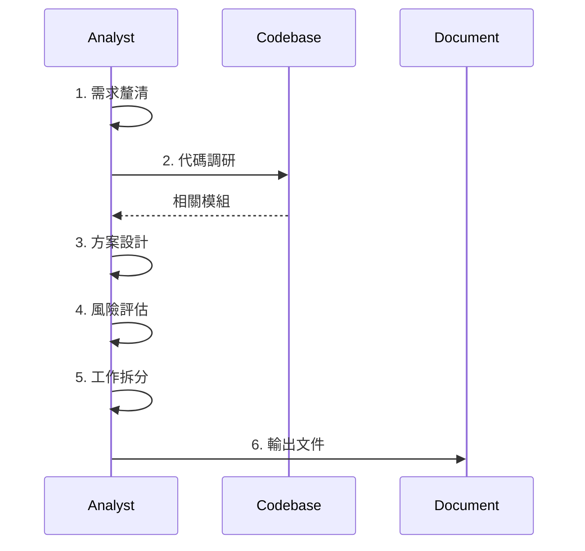

# Tech Spec Skill

## Trigger

- Keywords: 技術方案, tech spec, 方案審核, review spec, 需求分析, 功能設計

## When NOT to Use

- 需求單建立（用 /create-request）
- 代碼實作（用 feature-dev）
- 架構諮詢（用 /codex-architect）

## Commands

| Command         | Purpose         | When         |
| --------------- | --------------- | ------------ |
| `/tech-spec`    | 產出技術方案    | 從零開始     |
| `/deep-analyze` | 深化方案+路線圖 | 有初步想法後 |
| `/review-spec`  | 審核技術方案    | 方案確認     |

## Workflow



## Spec Structure

1. 需求摘要（問題 + 目標 + 範圍）
2. 現有代碼分析
3. 技術方案（架構 + 資料模型 + API + 核心邏輯）
4. 風險與依賴
5. 工作拆分
6. 測試策略
7. 開放問題

## Verification

- 方案覆蓋所有需求點
- 架構圖使用 Mermaid
- 風險有緩解策略
- 工作可拆分為可追蹤項目

## References

- `references/template.md` - 方案模板 + 審核維度

## File Location

```
docs/features/{feature}/
├── tech-spec.md      # 技術方案
├── requests/         # 需求單
└── README.md         # 功能說明
```

## Examples

```
輸入：/tech-spec "實作用戶資產快照功能"
動作：需求釐清 → 代碼調研 → 方案設計 → 輸出文件
```

```
輸入：/review-spec docs/features/xxx/tech-spec.md
動作：讀取 → 調研 → 審核 → 輸出報告 + Gate
```
