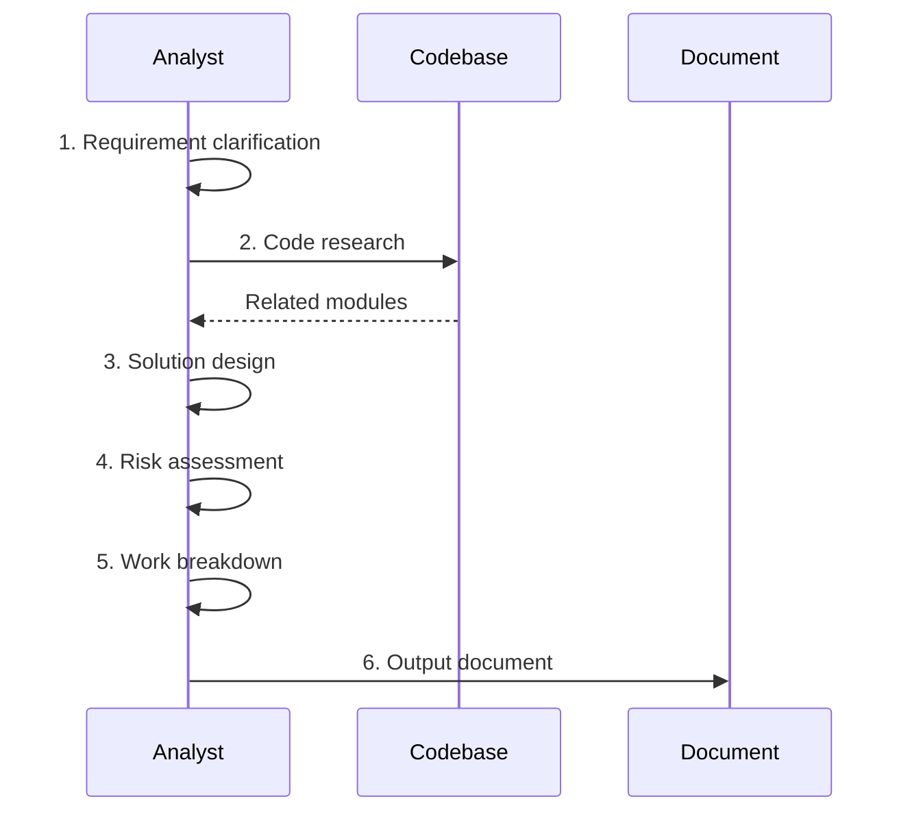

# Tech Spec Skill

## Trigger

- Keywords: tech spec, technical specification, spec review, review spec, requirement analysis, feature design

## When NOT to Use

- Creating request documents (use /create-request)
- Code implementation (use feature-dev)
- Architecture consulting (use /codex-architect)

## Commands

| Command         | Purpose              | When                    |
| --------------- | -------------------- | ----------------------- |
| `/tech-spec`    | Produce tech spec    | Starting from scratch   |
| `/deep-analyze` | Deepen spec + roadmap | After initial concept   |
| `/review-spec`  | Review tech spec     | Spec confirmation       |

## Workflow



## Spec Structure

1. Requirement summary (problem + goals + scope)
2. Existing code analysis
3. Technical solution (architecture + data model + API + core logic)
4. Risks and dependencies
5. Work breakdown
6. Testing strategy
7. Open questions

## Verification

- Solution covers all requirement points
- Architecture diagrams use Mermaid
- Risks have mitigation strategies
- Work can be broken into trackable items

## References

- `references/template.md` - Spec template + review dimensions

## File Location

```
docs/features/{feature}/
├── tech-spec.md      # Technical spec
├── requests/         # Request documents
└── README.md         # Feature description
```

## Examples

```
Input: /tech-spec "Implement user asset snapshot feature"
Action: Requirement clarification -> Code research -> Solution design -> Output document
```

```
Input: /review-spec docs/features/xxx/tech-spec.md
Action: Read -> Research -> Review -> Output report + Gate
```
