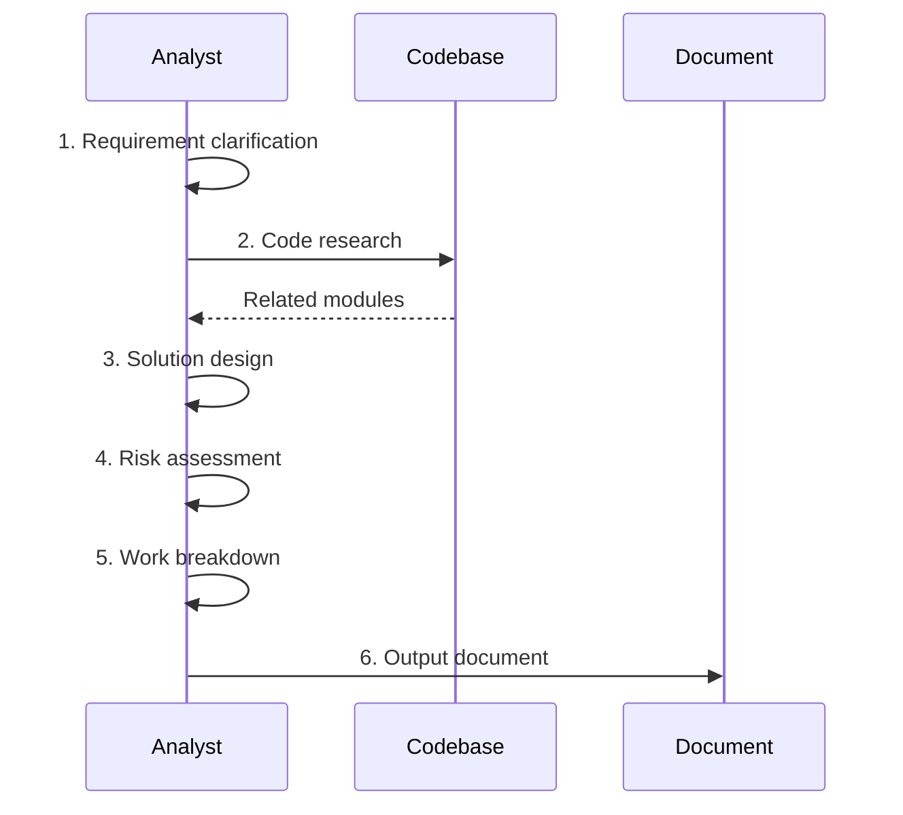

# Tech Spec Skill

## Trigger

- Keywords: tech spec, technical specification, spec review, review spec, feature design

## When NOT to Use

- Creating request documents (use /create-request)
- Code implementation (use feature-dev)
- Architecture consulting (use /codex-architect)

## Commands

| Command         | Purpose              | When                    |
| --------------- | -------------------- | ----------------------- |
| `/tech-spec`    | Create or update tech spec | Auto-detects create/update from filesystem state |
| `/deep-analyze` | Deepen spec + roadmap | After initial concept   |
| `/review-spec`  | Review tech spec     | Spec confirmation       |

## Context-Aware Mode (Upsert)

When invoked without a full requirement description, the skill auto-detects the target feature using
the cascade in `references/native-feature-resolution.md` — this skill's own reference, and
deliberately command-free.

This skill grants `Bash(git:*)` and not `Bash(node:*)`, so the resolver script is not a command it
may run — and it does not link the shared reference that teaches it, because a file of unrunnable
commands inside this skill's reachable graph is the defect, not the annotation on it. The cascade
needs nothing beyond `$ARGUMENTS`, `git branch --show-current`, `git diff --name-only HEAD` and a
`Glob` over `docs/features/*`. What that does **not** produce is the four document source sets or
`scan_error` — this skill consumes neither. A skill that needs the sets (`/architecture`,
`/tech-brief`, `/runbook`, `/ask`) grants `Bash(node:*)` and reads the shared reference itself.

**Canonical discovery is still owed, and testing one literal path does not deliver it.** The spec
may have been split into a folder or may carry a variant name, and `docs/features/auto-loop-evolution/2-tech-spec/2-tech-spec.md`
in this repo is the live proof. Resolve it with a `Glob` over `docs/features/<key>/`, in this
order — the first hit wins:

| # | Glob | Meaning |
|---|------|---------|
| 1 | `docs/features/<key>/2-tech-spec.md` | Unsplit canonical spec |
| 2 | `docs/features/<key>/2-tech-spec/2-tech-spec.md` | Split spec — the folder keeps the lifecycle prefix, the main file keeps the canonical filename (`@rules/docs-numbering.md` § Size Limit) |
| 3 | `docs/features/<key>/2-tech-spec*.md`, **minus** any hit matching `-fp-brief.md` or `-tech-brief.md` | A variant (`2-tech-spec-v2.md`). The two suffixes are excluded because they are not specs: `scripts/config/doc-taxonomy.json` carries the same `exclude_pattern` for the same reason, and `docs/features/seek-verdict/` holds a live `2-tech-spec-fp-brief.md` that this glob would otherwise return as the canonical spec. **Two or more remaining hits is ambiguity, not a match** — report and take the Need Human exit rather than picking one |

Requirements docs (`1-requirements.md`) resolve the same three ways, **without** the suffix
exclusion — `doc-taxonomy.json` carries `exclude_pattern` on the `tech-spec` type only, and copying
it to requirements here would put this skill out of step with the classifier rather than in step. A `Glob` that errors, or a
`<key>` that resolved with `low` confidence and matches nothing, is **not** the same as "no spec
exists" — say which of the two it was; do not silently drop into create mode.

A fourth lookup resolves the **intent artifact**: exactly `intent-<key>.md` in the feature
directory — the exact name, never a wildcard pick. A separate `Glob intent-*.md` only surfaces
strays or wrong-key files (report them; never adopt one as the intent).

| Filesystem State | Action |
|-----------------|--------|
| Canonical discovery finds exactly one spec | **Update mode**: read that file — at the path discovery returned, not at the literal `2-tech-spec.md` — research code changes since last update, incrementally update changed sections |
| All three globs empty | **Create mode**: generate new spec from template at `docs/features/<key>/2-tech-spec.md` |
| Glob 3 returns two or more | Gate: Need Human — ambiguous canonical spec, name the candidates |
| Feature not resolved | Gate: Need Human |

In **create mode**, if `intent-<key>.md` is absent, write it first from the intent template
bundled with `/req-analyze` — distilled from the requirement clarification step (constraints
only, ≤60 lines) — then write the spec. If present, read it before designing.

In **update mode**, focus on sections affected by recent code changes (use `git diff` to identify). Preserve unchanged sections. If `intent-<key>.md` is absent, create it exactly as in
create mode (projecting from `1-requirements.md` §§ 1–2 when present, else from the spec's
requirement summary) — this is what lets the `next-step` advisory converge on features whose
spec predates the intent mechanism. When it exists, read it: every spec section that contradicts
an `INV-*` or Non-goal is a **conflict to surface to the user, not to paper over** — and never
rewrite intent to match a spec; amending intent is a human re-decision.

## Workflow


```mermaid
sequenceDiagram
    participant A as Analyst
    participant C as Codebase
    participant D as Document

    A->>A: 1. Requirement clarification
    A->>C: 2. Code research
    C-->>A: Related modules
    A->>A: 3. Solution design
    A->>A: 4. Risk assessment
    A->>A: 5. Work breakdown
    A->>D: 6. Output document
```

## Spec Structure

1. Requirement summary (problem + goals + scope)
2. Existing code analysis
3. Technical solution (architecture + data model + API + core logic)
4. Risks and dependencies
5. Work breakdown
6. Testing strategy
7. Open questions

## Write-Time Budget

A spec is cheapest to keep short while it is being written. Enforcing length afterwards means either
a split or a prune, and both cost a review round that writing to budget would have avoided.

| Lines (`wc -l`) | At write time |
|-----------------|---------------|
| ≤ 300 | The target. Aim here |
| 301–400 | Acceptable — trim before adding more |
| > 400 | **State the cohesion exception in the document itself**, or prune / split before it is written. "I ran out of room" is not the exception |

The exception is a sentence in the spec naming why these sections are one argument that does not
read better apart. Unstated, a spec over 400 lines is over budget, and `@rules/docs-numbering.md`
§ Size Limit takes it from there — prune first, then merge, then split.

What to leave out: alternatives considered and rejected (one line each, not a section), history of how
the design changed (that belongs in a record), and anything the code will state more precisely than
prose can.

In **update mode**, a section the code made obsolete is pruned, not annotated. Rewriting it in place
keeps the spec current-authority; layering "previously..." notes turns it into a record it is not.

## Output

Numbered tech spec document with sections: Overview, Requirements, Architecture, Implementation plan, Work breakdown, Testing strategy, Open questions.

## Verification

- Solution covers all requirement points
- Architecture diagrams use Mermaid
- Risks have mitigation strategies
- Work can be broken into trackable items
- Within the write-time budget, or the cohesion exception is stated in the document

## References

- `references/template.md` - Spec template + review dimensions

## File Location

```
docs/features/{feature}/
├── 2-tech-spec.md    # Technical spec (numbered per docs-numbering rule)
├── requests/         # Request documents
└── README.md         # Feature description
```

## Examples

```
Input: /tech-spec "Implement user asset snapshot feature"
Action: Requirement clarification -> Code research -> Solution design -> Output document
```

```
Input: /review-spec docs/features/xxx/2-tech-spec.md
Action: Read -> Research -> Review -> Output report + Gate
```
